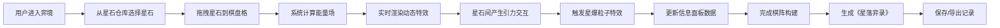

## 1. 产品概述

"星落棋局·弈境"是一款融合浩渺星空与赛博科技风格的互动式棋阵构建应用。用户扮演星际棋手，通过拖拽五种属性星石（引力、光、暗、时、空）构建棋阵，系统实时计算并渲染动态能量特效。

- 主要用途：沉浸式星阵构建与可视化体验
- 目标用户：科幻爱好者、策略游戏玩家、视觉艺术欣赏者
- 产品价值：将抽象的能量交互具象化为可视化的星阵艺术，提供兼具策略性与观赏性的互动体验

## 2. 核心功能

### 2.1 功能模块

1. **棋盘工作区**：Three.js渲染的3D动态棋盘，支持星石放置、引力场、光晕、暗影等实时特效
2. **星石仓库**：左侧网格展示五类星石，带有属性标签和稀有度标识
3. **信息面板**：右侧显示当前棋阵属性、能量值、历史记录
4. **交互系统**：拖拽放置、点击查看详情、长按调出能量面板
5. **特效系统**：引力吸引/排斥、星爆粒子、音效反馈
6. **弈录系统**：自动生成《星落弈录》，包含棋阵名称、属性、评分

### 2.2 页面详情

| 页面名称 | 模块名称 | 功能描述 |
|---------|---------|---------|
| 主界面 | 棋盘工作区 | Three.js 3D渲染棋格，支持星石放置与实时特效渲染 |
| 主界面 | 星石仓库 | 网格展示引力/光/暗/时/空五类星石，显示属性和稀有度 |
| 主界面 | 信息面板 | 显示棋阵属性面板、能量值、历史弈录列表 |
| 主界面 | 控制按钮 | 保存棋阵、重置棋盘、导出弈录记录 |
| 弹窗 | 星石详情 | 点击星石显示属性详情、数值、背景故事 |
| 弹窗 | 能量交互 | 长按棋格调出能量交互面板，调节能量参数 |

## 3. 核心流程

**主要用户流程：**
1. 用户从左侧星石仓库拖拽星石至中央棋盘
2. 系统实时计算引力场范围、光晕扩散、暗影侵蚀
3. 星石之间根据属性产生吸引或排斥效果
4. 点击已放置的星石查看详细属性
5. 长按棋格可调出能量交互面板进行参数调节
6. 构建完成后可保存棋阵、重置或导出弈录记录

## 4. 用户界面设计

### 4.1 设计风格

- **主色调**：深空蓝 `#0b0f2a`、星云紫 `#7b2ff7`
- **特效色**：金色 `#ffd700`（粒子）、银白 `#f0f0f0`（光晕）
- **字体**：采用具有科技感的无衬线字体，标题使用锐利的显示字体，正文使用清晰易读的正文字体
- **按钮样式**：渐变色填充 + 发光边框，悬停时有缩放和亮度增强效果
- **布局风格**：三栏式布局（左仓库/中棋盘/右信息），底部功能按钮栏
- **视觉元素**：棋盘格采用渐变半透明材质，星石为发光球体，背景为动态星空粒子

### 4.2 页面设计概述

| 页面名称 | 模块名称 | UI元素 |
|---------|---------|--------|
| 主界面 | 棋盘工作区 | 8x8渐变半透明棋格、发光星石、动态星空背景、粒子特效层 |
| 主界面 | 星石仓库 | 卡片式网格布局，每张卡片含发光球体预览、属性标签、稀有度徽章 |
| 主界面 | 信息面板 | 能量数值仪表盘、属性雷达图、弈录历史列表 |
| 主界面 | 控制按钮 | 保存/重置/导出按钮，发光边框+渐变背景 |
| 弹窗 | 星石详情 | 360°星石预览、属性数值面板、背景故事 |
| 弹窗 | 能量交互 | 能量调节滑块、交互参数设置、预览按钮 |

### 4.3 3D场景指导

**环境与氛围：**
- 背景：动态星空粒子场，缓慢流动的星云效果
- HDRI：深空环境贴图，营造宇宙沉浸感

**光照设置：**
- 主光源：柔和环境光模拟宇宙背景
- 点光源：每个星石自发光，根据属性呈现不同颜色
- 聚光灯：照亮棋盘中心区域

**相机设置：**
- 初始视角：45°俯视角，可缩放和旋转
- 交互：鼠标滚轮缩放，右键拖拽旋转视角
- 平滑过渡：所有相机移动使用缓动动画

**交互与动画：**
- 星石放置：弹跳缩放过渡动画
- 引力效果：星石间产生可见的引力光线
- 光晕扩散：光属性星石产生脉动光晕
- 暗影侵蚀：暗属性星石产生扩散暗影
- 星爆特效：能量交互时触发金色粒子爆发

**后处理效果：**
- Bloom泛光效果增强发光质感
- 轻微色差模拟赛博科技感
- 胶片颗粒增添复古未来感

**性能预算：**
- 稳定60fps渲染
- 粒子系统控制在200-300个活动粒子
- 星石数量上限64个（8x8棋盘）

### 4.4 响应式设计

- **设计原则**：桌面端优先，确保大屏沉浸式体验
- **移动端适配**：在屏幕宽度小于1024px时，转为上下布局（上棋盘、下仓库+信息面板）
- **触控优化**：移动端支持触控拖拽、长按手势，优化按钮尺寸便于触控
