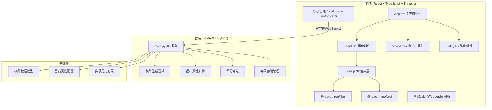
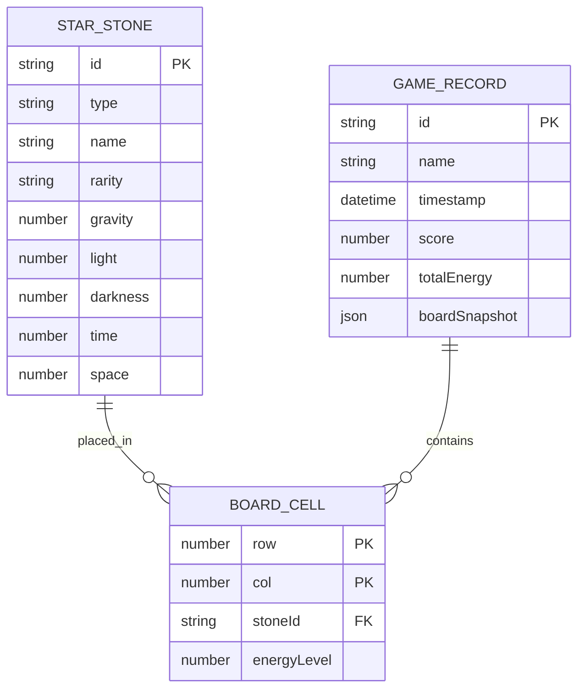

## 1. 架构设计



## 2. 技术描述

### 前端技术栈
- **核心框架**：React 18 + TypeScript 5
- **构建工具**：Vite 5
- **3D渲染**：Three.js + @react-three/fiber + @react-three/drei
- **样式方案**：TailwindCSS 3 + CSS Variables
- **状态管理**：React Context + useReducer
- **音效**：Web Audio API

### 后端技术栈
- **Web框架**：FastAPI 0.109.x
- **API文档**：Swagger UI (自动生成)
- **CORS支持**：全域名开发环境

### 初始化方案
- 前端：`npm create vite@latest` 创建React+TypeScript项目
- 后端：直接创建FastAPI单文件应用

## 3. 项目结构

```
星落棋局·弈境/
├── package.json
├── tsconfig.json
├── vite.config.ts
├── index.html
├── src/
│   ├── App.tsx
│   ├── main.tsx
│   ├── index.css
│   ├── components/
│   │   ├── Board.tsx          # 棋盘3D组件
│   │   ├── Sidebar.tsx        # 星石仓库+信息面板
│   │   ├── Dialog.tsx         # 属性/交互弹窗
│   │   ├── StarStone.tsx      # 星石3D组件
│   │   ├── Cell.tsx           # 棋格3D组件
│   │   └── Particles.tsx      # 粒子特效组件
│   ├── store/
│   │   └── GameContext.tsx    # 游戏状态管理
│   ├── types/
│   │   └── index.ts           # TypeScript类型定义
│   ├── utils/
│   │   ├── audio.ts           # 音效工具
│   │   └── api.ts             # API请求封装
│   └── config/
│       └── stones.ts          # 星石配置数据
└── backend/
    ├── main.py                # FastAPI主文件
    └── requirements.txt       # Python依赖
```

## 4. 路由定义

| 路由 | 用途 |
|-----|------|
| `/` | 主应用界面（唯一页面） |
| `/api/health` | 后端健康检查 |
| `/api/board/generate` | 生成新棋盘 |
| `/api/board/calculate` | 计算棋阵能量场 |
| `/api/stone/attributes` | 获取星石属性 |
| `/api/record/save` | 保存弈录 |
| `/api/record/list` | 获取历史记录 |
| `/api/record/export` | 导出弈录 |
| `/api/score/calculate` | 计算棋阵评分 |

## 5. API 定义

### TypeScript 类型定义

```typescript
// 星石属性类型
type StoneType = 'gravity' | 'light' | 'dark' | 'time' | 'space';

interface StarStone {
  id: string;
  type: StoneType;
  name: string;
  rarity: 'common' | 'rare' | 'epic' | 'legendary';
  attributes: {
    gravity: number;      // 引力值
    light: number;        // 光度值
    darkness: number;     // 暗影值
    time: number;         // 时间流
    space: number;        // 空间力
  };
  position: { row: number; col: number } | null;
}

// 棋格类型
interface Cell {
  row: number;
  col: number;
  stone: StarStone | null;
  energyLevel: number;
}

// 棋阵状态
interface BoardState {
  cells: Cell[][];
  gravityField: number[][];
  lightSpread: number[][];
  darkErosion: number[][];
  totalEnergy: number;
}

// 弈录记录
interface GameRecord {
  id: string;
  name: string;
  timestamp: number;
  boardState: BoardState;
  score: number;
  attributes: Record<string, number>;
}

// API响应
interface ApiResponse<T> {
  success: boolean;
  data?: T;
  error?: string;
}
```

### 请求/响应示例

**POST /api/board/calculate**
```typescript
// Request
{
  stones: Array<{
    type: StoneType;
    position: { row: number; col: number };
    attributes: StoneAttributes;
  }>;
}

// Response
{
  success: true,
  data: {
    gravityField: number[][],      // 8x8引力场矩阵
    lightSpread: number[][],       // 8x8光晕扩散矩阵
    darkErosion: number[][],       // 8x8暗影侵蚀矩阵
    interactions: Array<{
      from: string;
      to: string;
      type: 'attract' | 'repel';
      strength: number;
    }>,
    totalEnergy: number;
  }
}
```

## 6. 数据模型

### 6.1 ER图



### 6.2 星石属性配置

| 属性 | 引力 | 光 | 暗 | 时 | 空 |
|-----|-----|---|---|---|---|
| **引力** | 吸引 | 排斥 | 吸引 | 扰动 | 扭曲 |
| **光** | 排斥 | 增强 | 湮灭 | 加速 | 扩散 |
| **暗** | 吸引 | 湮灭 | 增强 | 停滞 | 吞噬 |
| **时** | 扰动 | 加速 | 停滞 | 共鸣 | 折跃 |
| **空** | 扭曲 | 扩散 | 吞噬 | 折跃 | 共鸣 |

### 6.3 评分算法

棋阵评分由以下因素加权计算：
- **能量总值** (30%)：所有星石属性值总和
- **属性平衡** (25%)：五种属性分布均匀度
- **交互复杂度** (25%)：星石间吸引/排斥关系数量
- **稀有度加成** (20%)：稀有星石额外加分
