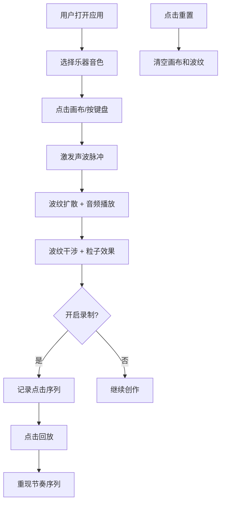

## 1. 产品概述
律动回声是一款交互式音乐节奏可视化应用，用户扮演节奏导演，通过点击或键盘按键在画布上激发不同的声波脉冲，创造沉浸式的音画同步体验。
- 主要用途：音乐创作辅助、节奏训练、视觉艺术欣赏
- 目标用户：音乐爱好者、视觉艺术家、创意工作者
- 产品价值：将抽象的音乐节奏转化为具象的视觉波纹，让用户直观感受音乐与视觉的融合之美

## 2. 核心功能

### 2.1 用户角色
| 角色 | 注册方式 | 核心权限 |
|------|----------|----------|
| 普通用户 | 无需注册 | 使用全部可视化功能、录制与回放 |

### 2.2 功能模块
1. **Canvas画布区**：中央主区域，波纹可视化渲染
2. **乐器选择器**：左上角下拉框，切换钢琴/吉他/鼓三种音色
3. **音高显示器**：左上角实时显示当前音高
4. **控制面板**：右下角BPM滑块、重置按钮、录制模式开关
5. **录制回放系统**：记录并回放最近10次点击序列
6. **音频引擎**：Web Audio API合成不同乐器音色

### 2.3 页面详情
| 页面名称 | 模块名称 | 功能描述 |
|----------|----------|----------|
| 主页面 | Canvas画布 | 响应式画布，支持点击/键盘激发脉冲，波纹扩散与干涉效果 |
| 主页面 | 乐器选择器 | 下拉切换三种乐器，波纹颜色和频率随之变化 |
| 主页面 | 控制面板 | BPM调节(60-240)、一键重置画布、录制模式开关 |
| 主页面 | 音高显示 | 实时显示当前触发音高(C4-B4等标准音名) |
| 主页面 | 录制回放 | 录制模式下保存点击序列，支持一键回放最近10次操作 |

## 3. 核心流程
用户打开应用 → 选择乐器音色 → 点击画布或按键盘(A-K键对应不同音高)激发声波脉冲 → 波纹以同心圆扩散并与其他波纹干涉 → 可开启录制模式记录创作 → 点击回放重现节奏序列 → 点击重置清空画布

## 4. 用户界面设计

### 4.1 设计风格
- 主色调：深空灰背景 #1a1a2e
- 渐变色系：
  - 钢琴：蓝紫渐变 #4a00e0 → #8e2de2
  - 吉他：橙红渐变 #f12711 → #f5af19
  - 鼓：绿青渐变 #00b09b → #96c93d
- 设计风格：极简几何 + 渐变霓虹风
- 视觉特效：波纹碰撞粒子飞散、轻微屏幕震动
- 字体：现代无衬线字体，白色半透明文字

### 4.2 页面设计概述
| 页面名称 | 模块名称 | UI元素 |
|----------|----------|--------|
| 主页面 | Canvas画布 | 全屏自适应、深色背景、霓虹渐变波纹、粒子系统、屏幕震动 |
| 主页面 | 乐器选择器 | 半透明玻璃态下拉框、圆角8px、毛玻璃效果 |
| 主页面 | 控制面板 | 右下角浮动面板、毛玻璃背景、圆角滑块、霓虹发光按钮 |
| 主页面 | 音高显示 | 左上角小型显示器、等宽字体、实时更新 |
| 主页面 | 汉堡菜单 | 移动端折叠控件、点击展开全部控制面板 |

### 4.3 响应式
- 桌面端：完整布局，左上角乐器选择+音高显示，右下角控制面板
- 移动端（<768px）：控件折叠为汉堡菜单，点击展开浮层
- 触摸优化：增加点击热区，支持多点触控同时激发多个脉冲
- 画布自适应：按窗口大小实时调整Canvas尺寸，保持绘制比例

### 4.4 性能优化
- 帧率目标：稳定60fps
- 优化策略：
  - 使用requestAnimationFrame循环
  - 波纹生命周期管理（自动移除超出画布的波纹）
  - 对象池复用波纹和粒子对象
  - 减少重绘区域，使用脏矩形优化
  - 限制最大同时存在波纹数量（64条）
