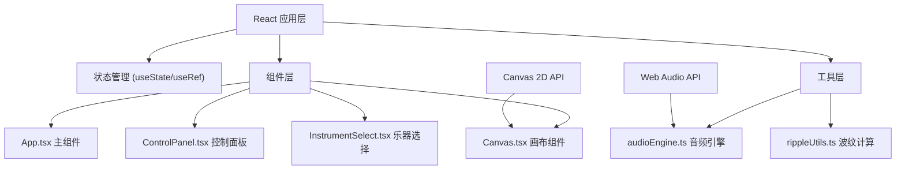

## 1. 架构设计


## 2. 技术描述
- 前端框架：React 18 + TypeScript 5
- 构建工具：Vite 5
- 状态管理：React Hooks (useState, useRef, useEffect)
- 渲染引擎：Canvas 2D API
- 音频引擎：Web Audio API (原生，无需额外库)
- 样式方案：CSS Modules + CSS Variables
- 无UI组件库，纯手工打造霓虹风格控件

### 核心依赖
- react: ^18.2.0
- react-dom: ^18.2.0
- typescript: ^5.3.0
- vite: ^5.0.0
- @types/react: ^18.2.0
- @types/react-dom: ^18.2.0

## 3. 核心类型定义

### 3.1 乐器类型
```typescript
type InstrumentType = 'piano' | 'guitar' | 'drum';

interface InstrumentConfig {
  name: string;
  gradient: [string, string];
  baseFrequency: number;
  harmonicCount: number;
  envelope: {
    attack: number;
    decay: number;
    sustain: number;
    release: number;
  };
}
```

### 3.2 波纹类型
```typescript
interface Ripple {
  id: number;
  x: number;
  y: number;
  startTime: number;
  frequency: number;
  amplitude: number;
  color: [string, string];
  instrument: InstrumentType;
  pitch: string;
  lifetime: number;
}

interface Particle {
  id: number;
  x: number;
  y: number;
  vx: number;
  vy: number;
  color: string;
  size: number;
  life: number;
  maxLife: number;
}

interface RecordedPulse {
  id: number;
  x: number;
  y: number;
  instrument: InstrumentType;
  pitch: string;
  timestamp: number;
}
```

## 4. 项目文件结构
```
/
├── index.html                 # 入口HTML
├── package.json               # 项目配置
├── tsconfig.json              # TypeScript配置
├── vite.config.js             # Vite配置
└── src/
    ├── main.tsx              # React入口
    ├── App.tsx               # 主组件（状态管理、布局）
    ├── types.ts              # 全局类型定义
    ├── components/
    │   ├── Canvas.tsx        # 画布渲染组件
    │   ├── ControlPanel.tsx  # 控制面板
    │   └── InstrumentSelect.tsx # 乐器选择器
    └── utils/
        ├── audioEngine.ts    # Web Audio音频合成
        └── rippleUtils.ts    # 波纹数学计算工具
```

## 5. 核心算法

### 5.1 波纹绘制算法
- 波纹半径随时间线性增长：`radius = speed * (currentTime - startTime)`
- 透明度随时间衰减：`alpha = 1 - (elapsed / lifetime)`
- 多波纹干涉：使用`globalCompositeOperation = 'lighter'`实现颜色叠加
- 渐变填充：`createRadialGradient`创建霓虹发光效果

### 5.2 碰撞检测算法
- 每帧计算所有波纹对的距离
- 当距离 ≈ 半径之和时，触发粒子发射
- 粒子速度方向沿两波纹圆心连线的垂直方向

### 5.3 音频合成算法
- 钢琴：正弦波 + 2/3/4次谐波，ADSR包络
- 吉他：锯齿波 + 高通滤波，快速attack，中速release
- 鼓：白噪声 + 低通滤波，极短attack，快速decay

### 5.4 录制回放算法
- 录制模式下记录每次脉冲的`{x, y, instrument, pitch, relativeTimestamp}`
- 回放时使用`setTimeout`按时间差依次触发
- 最多保留最近10条记录，FIFO队列

## 6. 性能优化策略

### 6.1 渲染优化
- Canvas离屏缓冲：创建离屏Canvas预渲染渐变
- 波纹对象池：`RipplePool`复用对象，减少GC
- 生命周期管理：波纹超出画布或超过生命周期立即回收
- 最大波纹数限制：最多64条同时存在，超出时移除最旧的

### 6.2 动画优化
- 使用`performance.now()`而非`Date.now()`获取高精度时间
- 固定时间步长更新，与帧率解耦
- 使用`transform`而非`top/left`移动DOM元素
- 被动事件监听：`{ passive: true }`优化滚动和触摸

### 6.3 内存优化
- 及时移除事件监听器
- 清除`requestAnimationFrame`回调
- 音频节点使用后立即断开并置空
- 粒子数组使用`splice`而非重新赋值
