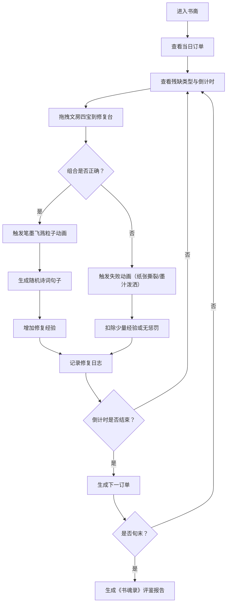

## 1. 产品概述

"墨香阁·书魂录"是一款融合中国传统水墨艺术与数字科技的古籍修复模拟web应用。用户扮演古籍修复师，在虚拟书斋中通过拖拽文房四宝（笔、墨、纸、砚）修复破损古籍，体验中华传统文化的魅力。

- **核心目标**：寓教于乐，让用户在游戏中了解古籍修复技艺，感受中华传统文化之美
- **目标用户**：对传统文化、古风游戏、休闲益智类应用感兴趣的用户
- **市场价值**：填补传统文化题材的互动web应用空白，兼具教育意义与娱乐性

## 2. 核心功能

### 2.1 用户角色
| 角色 | 注册方式 | 核心权限 |
|------|----------|----------|
| 古籍修复师 | 无需注册，直接使用 | 进行古籍修复、查看修复记录、获取评鉴报告 |

### 2.2 功能模块
1. **书斋主界面**：修复台、工具盘、订单面板、日志面板、粒子背景
2. **修复系统**：拖拽交互、组合校验、成功/失败动画、诗词生成
3. **订单系统**：每日订单生成、限时倒计时、残缺类型识别
4. **评分系统**：经验值计算、修复成功率统计、《书魂录》评鉴报告
5. **粒子特效**：笔墨飞溅动画、背景流动墨韵、拖拽荧光拖影

### 2.3 页面详情
| 页面名称 | 模块名称 | 功能描述 |
|----------|----------|----------|
| 书斋主界面 | 修复台 | 显示古籍页面和拖拽区域，接受工具放置 |
| 书斋主界面 | 工具盘 | 竖向展示文房四宝，显示图标和数量，支持拖拽 |
| 书斋主界面 | 订单面板 | 显示当前订单的残缺描述和剩余时间倒计时 |
| 书斋主界面 | 日志面板 | 滚动显示最近5次修复记录，含成功/失败状态和诗词 |
| 书斋主界面 | 粒子特效 | 笔墨飞溅动画、背景流动墨韵、交互反馈特效 |
| 评鉴报告页 | 数据统计 | 修复成功率折线图、修复数量统计、荣誉称号展示 |

## 3. 核心流程

用户进入书斋 → 查看当前订单（残缺类型+倒计时）→ 从工具盘拖拽正确组合的文房四宝到修复台 → 系统校验组合 → 成功则触发粒子动画+生成诗词+增加经验 → 失败则触发纸张撕裂/墨汁泼洒动画 → 倒计时结束后自动进入下一订单 → 每旬生成《书魂录》评鉴报告

## 4. 用户界面设计

### 4.1 设计风格
- **主色调**：米白 `#f5e6c8`、朱红 `#c0392b`
- **辅助色**：青瓷蓝 `#2e86c1`、木纹棕 `#8b7355`、墨黑 `#2c2c2c`
- **背景**：书斋木纹质感，叠加流动的墨色渐变粒子
- **字体**：标题使用书法字体（如"Ma Shan Zheng"），正文使用优雅宋体类字体
- **按钮**：青瓷蓝底色+朱红描边，悬停时微微上浮，带宣纸纹理质感
- **面板**：半透明宣纸质感背景，细朱红边框，阴影柔和
- **图标**：简笔水墨画风格，半透明水墨效果

### 4.2 页面设计概述
| 页面名称 | 模块名称 | UI元素 |
|----------|----------|--------|
| 书斋主界面 | 整体布局 | 中央修复台（60%宽度）、左侧工具盘（15%宽度）、右上订单面板、右下日志面板 |
| 书斋主界面 | 修复台 | 做旧黄纸纹理背景，破损古籍页面，高亮闪烁的拖拽区域 |
| 书斋主界面 | 工具盘 | 竖向排列4个工具卡片，每个含水墨图标、名称、数量 |
| 书斋主界面 | 订单面板 | 米白底+朱红边框，显示残缺类型图标、描述文字、大字号倒计时 |
| 书斋主界面 | 日志面板 | 宣纸质感背景，滚动列表显示修复记录，成功为朱红色、失败为灰黑色 |
| 书斋主界面 | 粒子背景 | Canvas层，流动墨色粒子，笔墨飞溅时触发大量粒子 |
| 评鉴报告页 | 报告内容 | 古籍卷轴样式，折线图，荣誉称号印章，统计数据表格 |

### 4.3 交互反馈
- **拖拽**：荧光拖影跟随鼠标，目标区域高亮闪烁
- **成功**：笔墨飞溅粒子动画+轻快古筝音效，诗词淡入显示
- **失败**：界面震动+纸张撕裂声，页面出现裂纹或墨渍效果
- **倒计时警告**：最后10秒区域变红闪烁，心跳式动画
- **悬停**：工具卡片微微放大，按钮轻微上浮

### 4.4 响应式
- 采用桌面端优先设计，最小支持1280px宽度
- 平板端自适应调整面板位置，工具盘可折叠
- 移动端保持核心功能，优化触控拖拽体验

## 5. 技术约束

- **前端**：React 18 + TypeScript + Vite
- **后端**：FastAPI + Python
- **状态管理**：Zustand
- **样式**：Tailwind CSS 3 + 自定义CSS变量
- **粒子系统**：Canvas API 实现（60fps性能要求）
- **拖拽**：原生HTML5 Drag and Drop API + 自定义鼠标跟随
- **音效**：Web Audio API
- **图表**：Chart.js 或原生Canvas实现折线图
