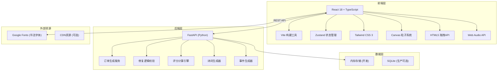
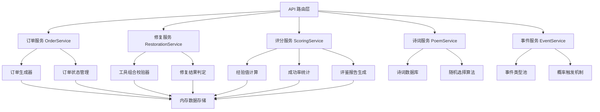

## 1. 架构设计



## 2. 技术描述

### 2.1 前端技术栈
- **核心框架**: React 18 + TypeScript 5.x
- **构建工具**: Vite 5.x
- **状态管理**: Zustand 4.x
- **样式方案**: Tailwind CSS 3.x + 自定义CSS变量
- **路由**: React Router DOM 6.x
- **图标**: Lucide React（基础图标）+ 自定义水墨SVG图标
- **图表**: 原生Canvas实现折线图（减少依赖）

### 2.2 后端技术栈
- **Web框架**: FastAPI (Python 3.11+)
- **ASGI服务器**: Uvicorn
- **数据验证**: Pydantic v2
- **CORS**: fastapi.middleware.cors
- **类型提示**: 全程使用Python类型注解

### 2.3 项目初始化
- **前端**: 使用 `npm init vite-init@latest` 选择 `react-ts` 模板
- **后端**: 手动创建 FastAPI 项目结构在 `src/backend/` 目录

## 3. 目录结构

```
auto299/
├── .trae/documents/              # 项目文档
├── src/
│   ├── components/               # React组件
│   │   ├── RestorationDesk.tsx   # 修复台组件
│   │   ├── ToolTray.tsx          # 工具盘组件
│   │   ├── OrderPanel.tsx        # 订单面板组件
│   │   ├── LogPanel.tsx          # 日志面板组件
│   │   ├── ParticleEffect.tsx    # 粒子特效组件
│   │   └── ReportModal.tsx       # 评鉴报告弹窗
│   ├── hooks/                    # 自定义Hooks
│   │   ├── useDragDrop.ts        # 拖拽逻辑Hook
│   │   ├── useCountdown.ts       # 倒计时Hook
│   │   ├── useParticleSystem.ts  # 粒子系统Hook
│   │   └── useAudio.ts           # 音效Hook
│   ├── store/                    # Zustand状态
│   │   └── useGameStore.ts       # 游戏状态管理
│   ├── types/                    # TypeScript类型定义
│   │   └── index.ts              # 类型定义入口
│   ├── utils/                    # 工具函数
│   │   ├── api.ts                # API请求封装
│   │   ├── poems.ts              # 诗词数据库
│   │   └── constants.ts          # 常量定义
│   ├── pages/                    # 页面组件
│   │   └── Study.tsx             # 书斋主页
│   ├── App.tsx                   # 根组件
│   ├── main.tsx                  # 入口文件
│   ├── index.css                 # 全局样式
│   └── backend/                  # FastAPI后端
│       ├── main.py               # FastAPI入口
│       ├── routers/              # API路由
│       │   ├── orders.py         # 订单相关路由
│       │   ├── restoration.py    # 修复相关路由
│       │   └── report.py         # 报告相关路由
│       ├── services/             # 业务逻辑
│       │   ├── order_service.py  # 订单服务
│       │   ├── restoration_service.py  # 修复服务
│       │   └── scoring_service.py      # 评分服务
│       └── models/               # 数据模型
│           └── schemas.py        # Pydantic模型
├── public/                       # 静态资源
│   ├── sounds/                   # 音效文件
│   └── images/                   # 图片资源
├── index.html                    # HTML入口
├── package.json                  # 前端依赖
├── tsconfig.json                 # TypeScript配置
├── vite.config.ts                # Vite配置
├── tailwind.config.js            # Tailwind配置
├── postcss.config.js             # PostCSS配置
├── requirements.txt              # Python依赖
└── README.md                     # 项目说明
```

## 4. 路由定义

### 4.1 前端路由
| 路由 | 页面 | 用途 |
|------|------|------|
| `/` | 书斋主页 | 核心游戏界面，包含修复台、工具盘、订单和日志面板 |
| `/report` | 评鉴报告页 | 显示《书魂录》评鉴报告，可从首页弹窗访问 |

### 4.2 后端API路由
| 路由 | 方法 | 用途 |
|------|------|------|
| `/api/orders/daily` | GET | 获取当日订单列表 |
| `/api/orders/current` | GET | 获取当前正在进行的订单 |
| `/api/orders/next` | POST | 进入下一个订单 |
| `/api/restoration/validate` | POST | 验证修复工具组合是否正确 |
| `/api/restoration/complete` | POST | 完成修复并更新经验值 |
| `/api/restoration/fail` | POST | 处理修复失败事件 |
| `/api/poem/random` | GET | 获取随机诗词句子 |
| `/api/report/ten-day` | GET | 生成《书魂录》旬度评鉴报告 |
| `/api/stats/summary` | GET | 获取修复统计数据 |
| `/api/events/random` | GET | 随机生成意外事件 |

## 5. API 类型定义

```typescript
// 工具类型
type ToolType = 'brush' | 'ink' | 'paper' | 'inkstone';

interface Tool {
  id: string;
  type: ToolType;
  name: string;
  icon: string;
  quantity: number;
  description: string;
}

// 残缺类型
type DefectType = 'missing_character' | 'worm_damage' | 'water_stain' | 'torn_edge' | 'mold_spot';

interface DefectRequirement {
  type: DefectType;
  name: string;
  description: string;
  requiredTools: ToolType[];
  icon: string;
}

// 订单
interface Order {
  id: string;
  bookTitle: string;
  pageNumber: number;
  defect: DefectRequirement;
  timeLimit: number; // 秒
  createdAt: string;
  difficulty: 'easy' | 'medium' | 'hard';
}

// 修复记录
interface RestorationLog {
  id: string;
  orderId: string;
  success: boolean;
  toolsUsed: ToolType[];
  poemGenerated?: string;
  eventTriggered?: string;
  experienceGained: number;
  timestamp: string;
}

// 验证请求
interface ValidateRestorationRequest {
  orderId: string;
  tools: ToolType[];
}

interface ValidateRestorationResponse {
  valid: boolean;
  correctTools: ToolType[];
  message: string;
}

// 完成修复请求
interface CompleteRestorationRequest {
  orderId: string;
  tools: ToolType[];
  timeRemaining: number;
}

interface CompleteRestorationResponse {
  success: boolean;
  experienceGained: number;
  poem: string;
  logId: string;
}

// 评鉴报告
interface TenDayReport {
  period: string;
  totalRestorations: number;
  successfulRestorations: number;
  successRate: number;
  totalExperience: number;
  averageTimePerRepair: number;
  successRateTrend: { day: number; rate: number }[];
  honorTitle: string;
  eventCount: { type: string; count: number }[];
}

// 游戏状态
interface GameState {
  currentOrder: Order | null;
  timeRemaining: number;
  experience: number;
  level: number;
  tools: Tool[];
  logs: RestorationLog[];
  dayCount: number;
  isWarning: boolean;
  isShaking: boolean;
  showReport: boolean;
  currentReport: TenDayReport | null;
}
```

## 6. 前端状态管理

### 6.1 Zustand Store 设计

```typescript
// src/store/useGameStore.ts
import { create } from 'zustand';
import { GameState, Order, Tool, RestorationLog, TenDayReport, ToolType } from '@/types';

interface GameActions {
  setCurrentOrder: (order: Order | null) => void;
  setTimeRemaining: (time: number) => void;
  decrementTime: () => void;
  addExperience: (amount: number) => void;
  updateToolQuantity: (type: ToolType, delta: number) => void;
  addLog: (log: RestorationLog) => void;
  setIsWarning: (warning: boolean) => void;
  setIsShaking: (shaking: boolean) => void;
  setShowReport: (show: boolean) => void;
  setCurrentReport: (report: TenDayReport | null) => void;
  incrementDay: () => void;
  resetGame: () => void;
}

export const useGameStore = create<GameState & GameActions>((set) => ({
  // 初始状态...
  // 方法实现...
}));
```

## 7. 数据模型（Pydantic）

```python
# src/backend/models/schemas.py
from pydantic import BaseModel, Field
from typing import List, Optional
from enum import Enum

class ToolType(str, Enum):
    BRUSH = "brush"
    INK = "ink"
    PAPER = "paper"
    INKSTONE = "inkstone"

class DefectType(str, Enum):
    MISSING_CHARACTER = "missing_character"
    WORM_DAMAGE = "worm_damage"
    WATER_STAIN = "water_stain"
    TORN_EDGE = "torn_edge"
    MOLD_SPOT = "mold_spot"

class DefectRequirement(BaseModel):
    type: DefectType
    name: str
    description: str
    required_tools: List[ToolType]
    icon: str

class Order(BaseModel):
    id: str
    book_title: str
    page_number: int
    defect: DefectRequirement
    time_limit: int
    created_at: str
    difficulty: str

class ValidateRestorationRequest(BaseModel):
    order_id: str
    tools: List[ToolType]

class ValidateRestorationResponse(BaseModel):
    valid: bool
    correct_tools: List[ToolType]
    message: str

class CompleteRestorationRequest(BaseModel):
    order_id: str
    tools: List[ToolType]
    time_remaining: int

class CompleteRestorationResponse(BaseModel):
    success: bool
    experience_gained: int
    poem: str
    log_id: str

class TenDayReport(BaseModel):
    period: str
    total_restorations: int
    successful_restorations: int
    success_rate: float
    total_experience: int
    average_time_per_repair: float
    success_rate_trend: List[dict]
    honor_title: str
    event_count: List[dict]
```

## 8. 性能优化要点

1. **粒子系统优化**
   - 使用 `requestAnimationFrame` 确保60fps
   - 对象池模式复用粒子对象，避免频繁GC
   - 限制最大粒子数量（如200个）
   - 使用离屏Canvas进行复杂绘制

2. **拖拽性能**
   - 使用 `transform` 而非 `top/left` 进行定位
   - 节流 `mousemove` 事件（16ms间隔）
   - 避免在拖拽期间进行重排重绘

3. **React 优化**
   - 使用 `React.memo` 包裹频繁渲染的组件
   - 使用 `useMemo` 和 `useCallback` 缓存计算值和函数
   - 合理拆分组件，避免不必要的重渲染

4. **资源优化**
   - 字体使用 `font-display: swap`
   - 音效使用 Web Audio API 预加载
   - SVG图标内联，避免额外请求

## 9. 后端服务架构



## 10. 启动方式

### 前端启动
```bash
npm install
npm run dev
```

### 后端启动
```bash
pip install -r requirements.txt
cd src/backend
uvicorn main:app --reload --host 0.0.0.0 --port 8000
```
