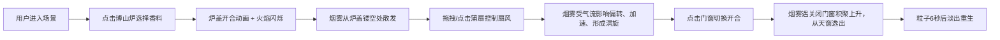

## 1. 产品概述

唐代西市香料铺熏香烟雾粒子系统是一款基于WebGL的3D交互式可视化应用，让用户以唐代香道师的身份，在虚拟的胡商香料铺中体验熏香文化。通过实时烟雾物理模拟，展现不同香料在气流作用下的烟雾扩散效果。

### 产品价值：
- 沉浸式体验中国传统熏香文化，通过交互式3D场景还原唐代西市香料铺氛围
- 真实的物理烟雾粒子系统与气流交互模拟，提供教育与娱乐价值
- 高精度的实时物理模拟技术展示WebGL的强大渲染能力

## 2. 核心功能

### 2.1 用户角色

| 角色 | 注册方式 | 核心权限 |
|------|---------|---------|
| 香道师 | 无需注册 | 自由探索场景、选择香料、控制扇风、观察烟雾 |

### 2.2 功能模块

1. **3D主场景**：香料铺内部环境，包含博山炉、蒲扇、门窗、墙壁、地板、天窗等元素
2. **香料选择**：点击博山炉盖切换沉香、檀香、龙脑三种香料
3. **扇风控制**：拖拽蒲扇调整方向，点击切换档位（0-3档）
4. **烟雾粒子系统**：基于物理的烟雾粒子模拟，支持气流交互、碰撞反弹、涡旋效果
5. **门窗交互**：点击切换门窗开合状态，影响烟雾扩散
6. **性能监控**：实时显示粒子数、帧率、扇风档位

### 2.3 页面详情

| 页面名称 | 模块名称 | 功能描述 |
|-----------|-----------|----------|
| 主页面 | 3D场景渲染 | 中央90%视口高度的Three.js Canvas，渲染香料铺全景 |
| 主页面 | 侧边控制面板 | 右侧200px固定宽度，显示香料、档位、门窗状态、性能数据 |
| 主页面 | 移动端适配 | 移动端侧边栏折叠为底部横条，点击展开 |

## 3. 核心流程

## 4. 用户界面设计

### 4.1 设计风格

**设计定位：古雅温馨，唐代西市胡商香料铺

**色彩体系**：
- 背景色：`#1a1a1a`（深黑）
- 主色调：暖棕色系
  - 地板：`#6b5b4b`（夯土色）
  - 墙壁：`#7a8a7a`（青砖色）
  - 木构件：`#6b4e3a`（深木色）
  - 博山炉：`#5d3a1a` 至 `#8b4513`（铜色渐变）
- 香料色：
  - 沉香：`#3a2a1a`
  - 檀香：`#4a3a2a`
  - 龙脑：`#e6e6d4`
- 蒲扇：`#d4a76a` 至 `#c47e3a`

**字体**：
- 主标题：书法风格衬线字体，营造古典气息
- 正文：优雅的无衬线字体，确保可读性
- 数字显示：等宽字体，性能数据清晰

**按钮风格**：
- 圆角8px，毛玻璃效果（backdrop-filter: blur(4px)）
- 半透明深色背景（`#1a1a1a`，透明度0.85）
- 悬停时微亮效果，过渡0.3秒平滑动画

**布局**：
- 桌面端：中央Canvas占90%视口高度，右侧固定200px侧边栏
- 移动端：底部横条（高度60px），点击展开侧边栏

### 4.2 页面设计概述

| 页面名称 | 模块名称 | UI元素 |
|-----------|-----------|---------|
| 主页面 | 3D场景 | Three.js Canvas，实时渲染烟雾粒子与场景元素 |
| 主页面 | 侧边栏 | 毛玻璃面板，香料名称、档位指示、门窗状态、性能监控 |
| 主页面 | 交互元素 | 可点击的博山炉、可拖拽的蒲扇、可点击的门窗 |

### 4.3 响应式设计

- **桌面优先**：默认桌面端布局，中央Canvas + 右侧侧边栏
- **平板适配**：侧边栏宽度自适应，保持良好比例
- **移动端**：侧边栏折叠为底部横条（高度60px），显示关键信息，点击展开全屏侧边栏
- **触摸优化**：增大触控热区，支持触摸拖拽和点击

### 4.4 3D场景设计

**环境与氛围**：
- 深色背景（`#1a1a1a`），营造夜晚烛光氛围
- 暖色调点光源模拟烛火效果，柔和阴影
- 青砖纹理墙壁，夯土地面纹理
- 柔和的环境光补光，确保场景可见度

**光照设置**：
- 主光源：点光源位于博山炉内，模拟烛火，颜色暖黄色，强度随火焰闪烁变化
- 环境光：半球光，天空色偏暖，地面色偏暗
- 补光：两盏方向光，分别从左右两侧补充照明，突出场景层次感

**相机设置**：
- 初始位置：场景正前方，略高于视平线，角度略微俯视
- 控制：OrbitControls，限制旋转角度，防止穿透场景
- 视场角：45度，适中的透视效果

**场景构图**：
- 视觉中心：博山炉位于场景中央偏下位置
- 蒲扇位于炉子右侧，便于用户交互
- 门窗位于左侧和后方墙壁
- 天窗位于正上方屋顶

**交互与动画**：
- 博山炉盖开合动画（0.2秒），使用Three.js动画循环
- 蒲扇摆动动画，根据档位调整速度和幅度
- 门窗旋转动画（0.3秒过渡），围绕铰链轴旋转0-90度
- 烟雾粒子动画，基于物理模拟，每帧更新
- 蒲扇扇风时从扇面边缘飞出细小木屑粒子特效

**后处理效果**：
- 轻微的泛光效果（Bloom），增强烛光氛围
- 烟雾粒子使用加法混合，营造柔和烟雾感

**性能预算**：
- 最大粒子数：5000
- 目标帧率：30FPS以上
- 粒子更新逻辑在requestAnimationFrame中高效计算
