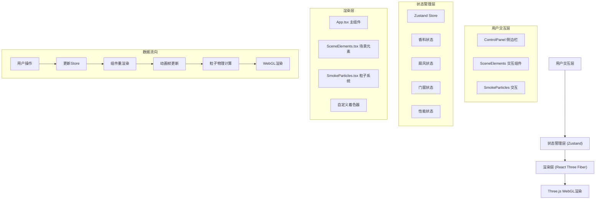
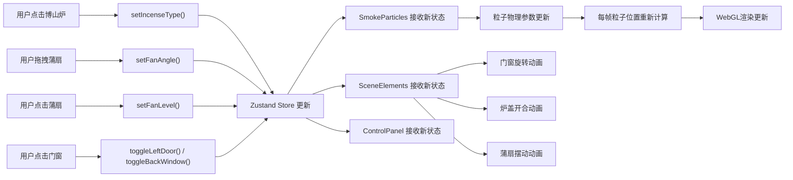

## 1. 架构设计



## 2. 技术描述

**前端技术栈**：
- **框架**: React@18 + TypeScript
- **构建工具**: Vite@5
- **3D渲染**: Three.js@0.160 + @react-three/fiber@8 + @react-three/drei@9
- **状态管理**: Zustand@4
- **动画库**: framer-motion@11
- **样式**: Tailwind CSS@3
- **图标**: lucide-react

**项目初始化**：
- 使用 `vite-init` 脚手架创建 React + TypeScript 项目
- 配置别名 `@` 指向 `src` 目录
- 开发服务器端口：5173

**无后端服务**：纯前端应用，所有逻辑在浏览器端执行

## 3. 目录结构

```
src/
├── App.tsx                 # 主场景组件，组装各模块
├── main.tsx                # 应用入口
├── index.css               # 全局样式
├── components/
│   ├── SceneElements.tsx   # 静态场景元素（博山炉、门窗、墙壁等）
│   ├── SmokeParticles.tsx  # 烟雾粒子系统
│   ├── ControlPanel.tsx    # 侧边控制面板
│   ├── BoshanStove.tsx     # 博山炉组件
│   ├── Fan.tsx             # 蒲扇组件
│   └── DoorWindow.tsx      # 门窗组件
├── store/
│   └── useIncenseStore.ts  # Zustand状态管理
├── shaders/
│   ├── smokeVertex.glsl    # 烟雾顶点着色器
│   └── smokeFragment.glsl  # 烟雾片元着色器
├── types/
│   └── index.ts            # TypeScript类型定义
├── utils/
│   ├── physics.ts          # 物理计算工具函数
│   └── constants.ts        # 常量定义
└── hooks/
    ├── useFPS.ts           # FPS监控Hook
    └── useAnimationLoop.ts # 动画循环Hook
```

## 4. 状态管理设计

### 4.1 Zustand Store 定义

```typescript
// 香料类型
type IncenseType = 'chenxiang' | 'tanxiang' | 'longnao'

// 扇风档位
type FanLevel = 0 | 1 | 2 | 3

// 门窗状态
interface DoorWindowState {
  leftDoor: boolean    // 左侧门：true=打开, false=关闭
  backWindow: boolean  // 后窗：true=打开, false=关闭
}

// 扇风状态
interface FanState {
  level: FanLevel      // 档位 0-3
  angle: number        // 扇风方向角度（-45到+45度）
}

// Store 接口
interface IncenseStore {
  // 状态
  incenseType: IncenseType
  fan: FanState
  doorWindow: DoorWindowState
  particleCount: number
  fps: number
  
  // 操作
  setIncenseType: (type: IncenseType) => void
  setFanLevel: (level: FanLevel) => void
  setFanAngle: (angle: number) => void
  toggleLeftDoor: () => void
  toggleBackWindow: () => void
  setParticleCount: (count: number) => void
  setFPS: (fps: number) => void
}
```

### 4.2 数据流向



## 5. 核心模块设计

### 5.1 SmokeParticles 粒子系统

**核心技术**：
- Three.js `Points` + 自定义 `ShaderMaterial`
- GPU粒子系统，使用顶点着色器计算粒子大小和透明度
- 粒子数据存储在 `Float32Array` 中，每帧更新

**粒子属性**：
- 位置：三维向量 (x, y, z)
- 速度：三维向量 (vx, vy, vz)
- 生命值：0.0 - 1.0（6秒生命周期）
- 大小：2-6px，根据香料类型调整
- 透明度：随生命值变化，淡入淡出

**物理计算**：
- 初始速度：0.2单位/秒，方向随机偏转±30度
- 重力：轻微向上浮力（烟雾特性）
- 扇风加速度：根据档位和方向计算（微风0.5倍，强风2倍）
- 碰撞检测：与墙壁、门窗、地面碰撞，反弹系数0.3
- 涡旋效果：基于风扇附近的涡流算法

**性能优化**：
- 粒子数超过3000时，生成速率降低80%
- 最大粒子数限制5000
- 使用 `InstancedBufferAttribute` 批量更新

### 5.2 着色器设计

**顶点着色器 (smokeVertex.glsl)**：
```glsl
attribute float aLife;
attribute float aSize;
attribute float aAlpha;

varying float vLife;
varying float vAlpha;

void main() {
  vLife = aLife;
  vAlpha = aAlpha;
  
  vec4 mvPosition = modelViewMatrix * vec4(position, 1.0);
  gl_PointSize = aSize * (300.0 / -mvPosition.z);
  gl_Position = projectionMatrix * mvPosition;
}
```

**片元着色器 (smokeFragment.glsl)**：
```glsl
uniform vec3 uColor;
varying float vLife;
varying float vAlpha;

void main() {
  // 圆形粒子
  vec2 center = gl_PointCoord - 0.5;
  float dist = length(center);
  if (dist > 0.5) discard;
  
  // 柔和边缘
  float alpha = (1.0 - dist * 2.0) * vAlpha;
  
  // 颜色渐变：白到灰
  vec3 color = mix(uColor, vec3(0.3), vLife * 0.5);
  
  gl_FragColor = vec4(color, alpha);
}
```

### 5.3 SceneElements 场景元素

**博山炉 (BoshanStove)**：
- 三足铜炉，使用 `CylinderGeometry` + `TorusGeometry` 组合
- 炉盖镂空，使用 `RingGeometry` 配合 alphaMap
- 炉内火焰：`PointLight` + `SphereGeometry`，使用 `@keyframes` 动画闪烁
- 可点击，点击后触发香料切换动画

**蒲扇 (Fan)**：
- 扇形平面，使用 `ShapeGeometry` 创建
- 可拖拽：使用 `@react-three/drei` 的 `DragControls`
- 点击切换档位：0-3档
- 摆动动画：根据档位调整速度和幅度
- 扇风特效：从扇面边缘发射细小木屑粒子

**门窗 (DoorWindow)**：
- 木质门和窗，使用 `BoxGeometry`
- 可点击切换开合状态
- 旋转动画：围绕铰链轴旋转0-90度
- 关闭时阻挡烟雾，打开时允许烟雾通过

**墙壁与地板**：
- 四面墙壁 + 地板 + 天花板，使用 `PlaneGeometry`
- 青砖纹理墙壁：程序化生成噪声纹理
- 夯土地面：程序化生成纹理
- 天窗：天花板上的圆形孔洞，烟雾可从此逸出

## 6. 性能优化策略

### 6.1 渲染优化
- 烟雾粒子使用 `AdditiveBlending` 减少绘制调用
- 静态场景元素使用 `frustumCulled` 视锥裁剪
- 合理设置 `pixelRatio`，避免过高分辨率渲染

### 6.2 计算优化
- 粒子物理计算使用 `Float32Array` 批量处理
- 碰撞检测简化为AABB包围盒检测
- 涡旋计算仅在风扇附近区域执行
- 使用 `requestAnimationFrame` 同步更新

### 6.3 内存优化
- 粒子对象池复用，避免频繁创建销毁
- 及时释放不再使用的Geometry和Material
- 纹理资源复用，避免重复加载

## 7. 动画系统设计

### 7.1 Three.js 动画循环
- 使用 `useFrame` Hook（@react-three/fiber）
- 每帧更新：粒子物理、风扇摆动、火焰闪烁
- 时间增量 `delta` 控制动画速度一致性

### 7.2 过渡动画
- 炉盖开合：0.2秒，使用 `useSpring` (framer-motion)
- 门窗旋转：0.3秒，使用 `useSpring`
- 档位切换：蒲扇幅度渐变，0.3秒过渡
- 所有动画支持缓动函数：`easeInOutCubic`

### 7.3 特效动画
- 火焰闪烁：正弦波 + 随机噪声调制
- 扇风特效：扇动到极限位置时触发木屑粒子发射
- 烟雾粒子：淡入淡出效果，基于生命值

## 8. 模块调用关系

```
App.tsx
├── IncenseStore (Zustand)
│   ├── ControlPanel.tsx (订阅状态)
│   ├── SceneElements.tsx (订阅状态)
│   └── SmokeParticles.tsx (订阅状态)
├── Canvas (@react-three/fiber)
│   ├── SceneElements.tsx
│   │   ├── BoshanStove.tsx (调用 setIncenseType)
│   │   ├── Fan.tsx (调用 setFanLevel, setFanAngle)
│   │   └── DoorWindow.tsx (调用 toggleLeftDoor, toggleBackWindow)
│   └── SmokeParticles.tsx (读取 incenseType, fan, doorWindow)
└── ControlPanel.tsx (只读展示)

utils/
├── physics.ts (被 SmokeParticles.tsx 调用)
└── constants.ts (全局常量，各模块共享)

hooks/
├── useFPS.ts (被 App.tsx 调用，更新 store.fps)
└── useAnimationLoop.ts (被各动画组件调用)

shaders/
├── smokeVertex.glsl (被 SmokeParticles.tsx 引用)
└── smokeFragment.glsl (被 SmokeParticles.tsx 引用)
```

## 9. 常量定义

```typescript
// src/utils/constants.ts

export const SCENE_CONSTANTS = {
  ROOM_WIDTH: 10,
  ROOM_HEIGHT: 6,
  ROOM_DEPTH: 10,
  STOVE_POSITION: [0, 0, 0] as [number, number, number],
  FAN_POSITION: [2, 0.5, 0] as [number, number, number],
  SKYLIGHT_RADIUS: 0.5,
} as const

export const PARTICLE_CONSTANTS = {
  MAX_PARTICLES: 5000,
  THROTTLE_THRESHOLD: 3000,
  PARTICLE_LIFETIME: 6, // 秒
  INITIAL_SPEED: 0.2,
  BOUNCE_FACTOR: 0.3,
  MIN_SIZE: 2,
  MAX_SIZE: 6,
  SPAWN_POINTS: 5, // 炉盖镂空点数量
} as const

export const FAN_CONSTANTS = {
  LEVELS: {
    0: { speed: 0, amplitude: 0, acceleration: 0 },
    1: { speed: 10, amplitude: 10, acceleration: 0.5 },
    2: { speed: 20, amplitude: 20, acceleration: 1.0 },
    3: { speed: 30, amplitude: 30, acceleration: 2.0 },
  },
  MIN_ANGLE: -45,
  MAX_ANGLE: 45,
} as const

export const INCENSE_COLORS = {
  chenxiang: '#3a2a1a',
  tanxiang: '#4a3a2a',
  longnao: '#e6e6d4',
} as const

export const INCENSE_NAMES = {
  chenxiang: '沉香',
  tanxiang: '檀香',
  longnao: '龙脑',
} as const
```
