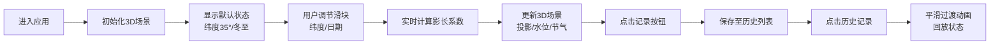

## 1. 产品概述

宋代天文观测台3D交互模拟应用，用户扮演宋代司天监保章正，通过调节日晷倾角、地理纬度和日期，实时观测晷针投影变化，推算节气与漏刻刻度。

- 核心目标：提供沉浸式的古代天文历法推演体验，将抽象的天文知识转化为直观的3D交互
- 目标用户：天文爱好者、历史文化学习者、教育工作者

## 2. 核心功能

### 2.1 用户角色

| 角色 | 注册方式 | 核心权限 |
|------|---------|---------|
| 普通用户 | 无需注册 | 使用所有交互功能、记录历史数据、回放观测记录 |

### 2.2 功能模块

1. **3D观星台场景**：宋代天文观测台环境，包括青灰色地砖、汉白玉日晷基座、铜制晷针、青铜水漏壶
2. **影长计算系统**：根据纬度、日期实时计算晷针投影长度与方向
3. **节气推演系统**：根据影长系数自动匹配11个节气区间，显示中文字样与漏刻刻度
4. **水漏联动动画**：水位随节气变化动态升降，水面波纹动画
5. **历史记录与回放**：支持保存最多20条观测记录，点击回放平滑过渡至保存状态

### 2.3 页面详情

| 页面名称 | 模块名称 | 功能描述 |
|---------|---------|---------|
| 主页面 | 3D场景渲染 | 构建观星台环境、日晷、水漏壶，实时更新投影和水位 |
| 主页面 | 控制面板 | 纬度滑块(20-55°)、日期滑块(1-365天)、影长显示、节气标签、记录/重置按钮 |
| 主页面 | 历史记录列表 | 展示保存的观测记录，支持点击回放，最多20条 |

## 3. 核心流程

用户进入应用后，首先看到宋代观星台的3D场景，默认显示北纬35度冬至日的状态。通过拖拽控制面板的纬度和日期滑块，实时观察晷针投影变化和节气转换。点击记录按钮可保存当前状态至右侧历史列表，点击历史记录可平滑回放。

## 4. 用户界面设计

### 4.1 设计风格

- **主色调**：宋代青绿山水配色，天际线渐变#87ceeb至#4682b4，地面灰绿色#6b7b6b
- **辅色调**：汉白玉#f0e6d3、铜色#b87333、青铜色#6b4423、朱红色#cc0000
- **字体**：宋体，灰黑色#2a1a0a，体现宋代书卷气息
- **按钮风格**：微交互设计，悬停放大110%，按下凹陷95%
- **滑块风格**：朱红色描边，拖动时有颗粒感阻尼反馈

### 4.2 页面设计概述

| 页面名称 | 模块名称 | UI元素 |
|---------|---------|--------|
| 主页面 | 整体布局 | 横向三栏布局，左侧控制面板、中央3D场景、右侧历史记录 |
| 主页面 | 控制面板 | 米黄色#f5deb3衬底，竖排滑块控件，朱红色描边，宋体文字 |
| 主页面 | 3D场景 | 全屏Canvas，天光+环境光照明，可鼠标旋转观察 |
| 主页面 | 历史记录 | 木色#8b7355边框，每条记录金边#d4a76a高亮 |

### 4.3 响应式设计

- **桌面端(768px以上)**：三栏横向布局，控制面板280px，历史记录240px，3D场景自适应
- **平板端(480-767px)**：上下两部分，3D场景在上占60%高度，控制面板和历史记录在下各占50%宽度
- **移动端(480px以下)**：3D场景全屏，控制面板为浮动层，可滑动呼出/隐藏

### 4.4 3D场景指导

- **环境与氛围**：宋代观星台，青灰色地砖铺地，背景为淡蓝色天空渐变，营造古雅宁静的观测氛围
- **光照设置**：半球光模拟天光（天空色#87ceeb，地面色#6b7b6b），方向光模拟太阳光，随日期变化角度
- **相机设置**：初始位置(0, 3, 6)，看向原点，允许轨道控制旋转、缩放，限制最小距离3，最大距离12
- **焦点元素**：日晷位于场景中心，水漏壶位于右侧，投影线为视觉重点，实时变化
- **交互与动画**：水位升降动画、水面波纹顶点动画、投影线实时更新、历史回放状态过渡动画
- **性能优化**：使用React.memo和useMemo优化组件，仅更新store变化的属性，保持30FPS以上
