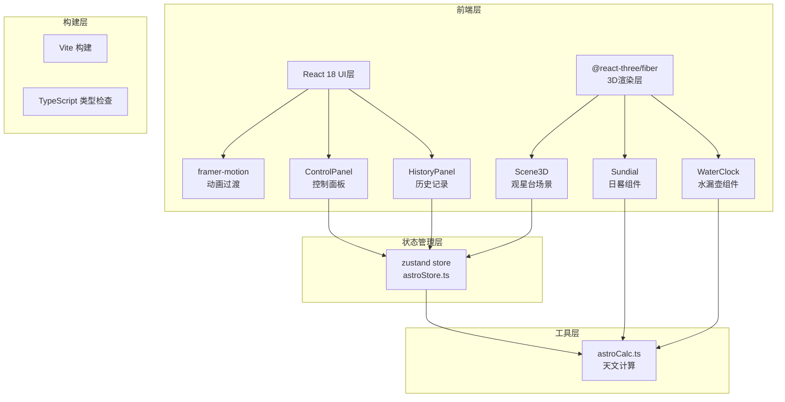

## 1. 架构设计



## 2. 技术描述

- **前端框架**: React@18 + TypeScript@5
- **3D渲染**: three@0.160 + @react-three/fiber@8.15 + @react-three/drei@9.92
- **状态管理**: zustand@4.4
- **动画库**: framer-motion@10.18
- **构建工具**: Vite@5.0 + @vitejs/plugin-react@4.2
- **初始化方式**: 使用 vite-init react-ts 模板创建基础项目结构

## 3. 路由定义

| 路由 | 用途 |
|------|------|
| / | 主页面，包含3D场景、控制面板、历史记录列表 |

## 4. 数据模型

### 4.1 状态数据模型

```typescript
interface HistoryRecord {
  id: string;
  timestamp: number;
  latitude: number;
  dayOfYear: number;
  shadowRatio: number;
  solarTerm: string;
  waterLevel: number;
}

interface AstroState {
  latitude: number;
  dayOfYear: number;
  shadowRatio: number;
  solarTerm: string;
  waterLevel: number;
  louKeScale: string[];
  history: HistoryRecord[];
  isAnimating: boolean;
  
  setLatitude: (lat: number) => void;
  setDate: (day: number) => void;
  reset: () => void;
  recordState: () => void;
  replayRecord: (record: HistoryRecord) => Promise<void>;
}
```

### 4.2 节气数据模型

```typescript
interface SolarTerm {
  name: string;
  minRatio: number;
  maxRatio: number;
  nightLou: number;
  dayLou: number;
}

const SOLAR_TERMS: SolarTerm[] = [
  { name: '冬至', minRatio: 1.5, maxRatio: 999, nightLou: 5, dayLou: 3 },
  { name: '小寒', minRatio: 1.4, maxRatio: 1.5, nightLou: 4, dayLou: 4 },
  { name: '大寒', minRatio: 1.3, maxRatio: 1.4, nightLou: 4, dayLou: 4 },
  { name: '立春', minRatio: 1.0, maxRatio: 1.1, nightLou: 3, dayLou: 5 },
  { name: '雨水', minRatio: 0.9, maxRatio: 1.0, nightLou: 3, dayLou: 5 },
  { name: '惊蛰', minRatio: 0.8, maxRatio: 0.9, nightLou: 2, dayLou: 6 },
  { name: '春分', minRatio: 0.7, maxRatio: 0.8, nightLou: 2, dayLou: 6 },
  { name: '清明', minRatio: 0.6, maxRatio: 0.7, nightLou: 2, dayLou: 6 },
  { name: '谷雨', minRatio: 0.5, maxRatio: 0.6, nightLou: 1, dayLou: 7 },
  { name: '立夏', minRatio: 0.4, maxRatio: 0.5, nightLou: 1, dayLou: 7 },
  { name: '夏至', minRatio: 0, maxRatio: 0.4, nightLou: 1, dayLou: 7 },
];
```

## 5. 文件结构

```
auto30/
├── package.json
├── vite.config.js
├── tsconfig.json
├── index.html
└── src/
    ├── main.tsx                    # React渲染入口
    ├── App.tsx                     # 根组件，三栏布局
    ├── index.css                   # 全局样式
    ├── store/
    │   └── astroStore.ts           # zustand状态管理
    ├── scene/
    │   ├── Scene3D.tsx             # 3D场景主组件
    │   ├── Sundial.tsx             # 日晷组件
    │   ├── WaterClock.tsx          # 水漏壶组件
    │   └── Ground.tsx              # 地面地砖组件
    ├── components/
    │   ├── ControlPanel.tsx        # 控制面板
    │   ├── HistoryPanel.tsx        # 历史记录面板
    │   └── Slider.tsx              # 自定义滑块组件
    └── utils/
        └── astroCalc.ts            # 天文计算工具函数
```

## 6. 性能优化策略

1. **组件优化**：
   - 使用 `React.memo` 包装3D子组件，避免不必要的重渲染
   - 使用 `useMemo` 缓存计算密集型结果（如影长系数、节气匹配）
   - 使用 `shallow` 选择器从zustand store获取状态，减少订阅更新

2. **3D渲染优化**：
   - 仅在状态变化时更新3D对象属性，而非每帧重建
   - 使用 `useFrame` 只更新水面波纹动画，其他元素按需更新
   - 几何体使用 `useLoader` 缓存，避免重复创建

3. **状态更新优化**：
   - 滑块使用节流更新，确保状态更新延迟不超过100ms
   - 历史回放使用requestAnimationFrame实现平滑过渡
