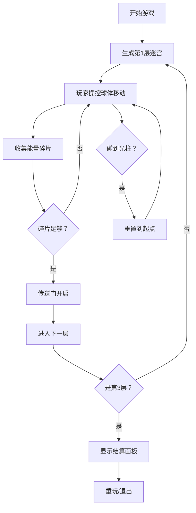

## 1. 产品概述

"幻境迷宫·光影回廊"是一款3D迷宫探索游戏，玩家操控发光球体在不断旋转变化的几何迷宫中寻找出口，沿途收集能量碎片解锁下一层，同时躲避移动的光柱障碍。

- 主要用途：休闲娱乐，考验玩家的反应能力和路径规划能力
- 目标用户：喜欢休闲益智类3D游戏的玩家
- 产品价值：提供沉浸式的赛博朋克风格迷宫探索体验

## 2. 核心功能

### 2.1 用户角色
| 角色 | 注册方式 | 核心权限 |
|------|----------|----------|
| 玩家 | 无需注册 | 进行游戏、暂停、重置、查看结算 |

### 2.2 功能模块
1. **游戏场景**：3D迷宫渲染、墙壁生成、光柱障碍、能量碎片
2. **玩家控制**：鼠标拖拽移动、空格冲刺、碰撞检测
3. **UI界面**：层数显示、碎片计数、暂停/重置按钮、结算面板
4. **视觉效果**：拖尾粒子、粒子爆散、屏幕闪烁、镜头过渡

### 2.3 页面详情
| 页面名称 | 模块名称 | 功能描述 |
|----------|----------|----------|
| 游戏主界面 | 3D场景 | 渲染迷宫、玩家、障碍和收集物 |
| 游戏主界面 | 顶部UI | 显示当前层数和收集的碎片数量 |
| 游戏主界面 | 底部UI | 暂停和重置按钮 |
| 游戏主界面 | 结算面板 | 通关后显示用时和收集率，提供重玩按钮 |

## 3. 核心流程

玩家进入游戏后，操控发光球体在迷宫中移动，收集能量碎片，躲避旋转的光柱障碍。收集足够碎片后传送门开启，进入下一层。每层迷宫结构和难度递增，通关三层后显示结算面板。

## 4. 用户界面设计

### 4.1 设计风格
- **主色调**：霓虹紫 #9b59b6、青色 #00e5ff
- **背景色**：深空黑 #0a0a0f
- **按钮风格**：半透明发光边框，圆角设计，悬浮有霓虹光效
- **字体**：使用 Orbitron 等科技感字体展示数字，正文使用现代无衬线字体
- **视觉风格**：赛博幻境风，半透明渐变墙壁，发光边框，粒子效果

### 4.2 页面设计概述
| 页面名称 | 模块名称 | UI元素 |
|----------|----------|--------|
| 游戏主界面 | 3D场景 | 半透明发光墙壁、旋转光柱、发光碎片、玩家球体 |
| 游戏主界面 | 顶部UI | 左上角显示层数和碎片数，霓虹发光字体 |
| 游戏主界面 | 底部UI | 右下角暂停/重置按钮，半透明发光样式 |
| 游戏主界面 | 结算面板 | 居中弹出，毛玻璃背景，显示用时、收集率、重玩按钮 |

### 4.3 响应性
- 桌面端优先，全屏游戏体验
- 自适应窗口大小，保持正确的3D渲染比例
- 鼠标拖拽操作，键盘空格键冲刺

### 4.4 3D场景指引
- **环境**：深空黑背景，添加雾气和光晕效果营造沉浸感
- **光照**：使用点光源和环境光，玩家球体自发光，墙壁和光柱有发光材质
- **相机**：固定俯视角度，跟随玩家移动，切换层时有缩放过渡动画
- **交互**：鼠标拖拽控制移动方向，空格键冲刺
- **后处理**：泛光效果、色彩调整，增强赛博朋克视觉效果
- **性能**：使用 InstancedMesh 批量渲染墙壁，帧率稳定60fps
