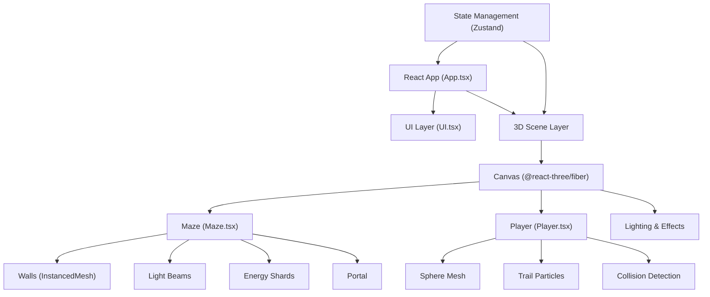

## 1. 架构设计



## 2. 技术描述

- **前端框架**：React 18 + TypeScript
- **构建工具**：Vite 5
- **3D渲染**：Three.js + @react-three/fiber 8 + @react-three/drei 9
- **状态管理**：Zustand 4
- **样式**：TailwindCSS 3
- **后处理**：@react-three/postprocessing
- **物理/碰撞**：自定义实现简单碰撞检测

## 3. 目录结构
```
src/
├── components/
│   ├── Maze.tsx        # 迷宫生成和渲染
│   ├── Player.tsx      # 玩家控制和碰撞
│   ├── UI.tsx          # 用户界面
│   └── Effects.tsx     # 粒子和后处理效果
├── hooks/
│   ├── useGameState.ts # 游戏状态管理
│   └── useControls.ts  # 输入控制
├── utils/
│   ├── mazeGenerator.ts # 迷宫算法
│   └── constants.ts    # 游戏常量
├── App.tsx             # 主组件
├── main.tsx            # 入口文件
└── index.css           # 全局样式
```

## 4. 核心数据模型

```typescript
// 游戏状态
interface GameState {
  level: number;
  shardsCollected: number;
  shardsRequired: number;
  totalShards: number;
  isPaused: boolean;
  isGameComplete: boolean;
  startTime: number;
  elapsedTime: number;
  playerPosition: [number, number, number];
  portalActive: boolean;
}

// 迷宫单元格
interface Cell {
  x: number;
  z: number;
  walls: { north: boolean; south: boolean; east: boolean; west: boolean };
}

// 能量碎片
interface Shard {
  id: number;
  position: [number, number, number];
  collected: boolean;
}

// 光柱障碍
interface LightBeam {
  id: number;
  rotationSpeed: number;
  rotationDirection: 1 | -1;
  angle: number;
  length: number;
}
```

## 5. 核心算法

### 5.1 迷宫生成
- 使用深度优先搜索(DFS)算法生成随机迷宫
- 每层迷宫大小递增：第1层7x7，第2层9x9，第3层11x11

### 5.2 碰撞检测
- AABB碰撞检测玩家与墙壁
- 距离检测玩家与光柱
- 距离检测玩家与能量碎片

### 5.3 性能优化
- 使用 InstancedMesh 批量渲染墙壁
- 对象池管理粒子
- 按需更新可见物体
