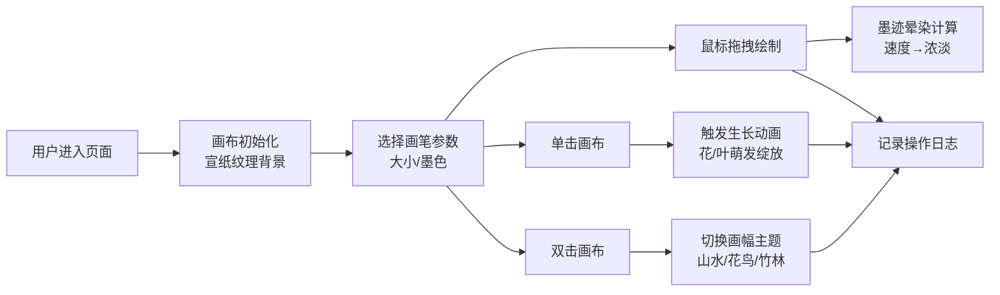

## 1. 产品概述

"梦笔生花·画境"是一款东方意境的交互式水墨绘画应用，让用户体验数字文人墨客的创作乐趣。通过Canvas技术模拟真实水墨画的墨迹晕染、流淌效果，结合生长动画和主题切换，打造沉浸式的数字水墨创作体验。

## 2. 核心功能

### 2.1 功能模块

1. **主画布区域**：Canvas绘画、墨迹晕染算法、生长动画系统
2. **画笔工具栏**：笔刷大小调节、墨色选择、主题切换
3. **创作日志面板**：操作历史记录展示

### 2.2 页面详情

| 页面名称 | 模块名称 | 功能描述 |
|-----------|-------------|---------------------|
| 主页面 | Canvas画布 | 支持鼠标拖拽绘制，墨迹自然晕开流淌渗透，笔触速度控制墨色浓淡，点击触发生长动画，双击切换主题 |
| 主页面 | 画笔工具栏 | 笔刷大小滑块（1-50px）、墨色色盘（5种浓度）、主题切换按钮（山水/花鸟/竹林） |
| 主页面 | 创作日志面板 | 显示最近5次绘制操作：操作类型、墨色值、坐标点 |

## 3. 核心流程

## 4. 用户界面设计

### 4.1 设计风格

- **主色调**：暖黄宣纸色 `#f5f0e1` 为背景，墨迹色从半透明黑 `#1a1a1a` 到灰 `#666`
- **按钮控件**：竹简纹理 + 金线描边，深棕色底色配金色文字
- **字体**：标题用书法风格字体（Ma Shan Zheng），正文用思源宋体
- **布局**：中央大画布（80%面积），左上角工具栏浮层，右下角日志面板浮层
- **交互反馈**：墨点飞溅动画、涟漪扩散效果、画笔光标跟随

### 4.2 页面设计概述

| 页面名称 | 模块名称 | UI元素 |
|-----------|-------------|-------------|
| 主页面 | Canvas画布 | 宣纸纹理背景，动态墨迹层，生长动画层，60fps渲染 |
| 主页面 | 画笔工具栏 | 竹简纹理卡片，金线边框，滑块带刻度，色盘为渐变色块，按钮有按压动效 |
| 主页面 | 创作日志面板 | 半透明深棕背景，金色边框，条目淡入动画，悬停高亮 |

### 4.3 响应式设计

- **桌面优先**：主要面向桌面用户，支持鼠标精确操作
- **画布自适应**：Canvas尺寸随窗口大小变化，保持绘画区域比例
- **面板定位**：工具栏和日志面板使用固定定位，小屏幕下自动调整尺寸

## 5. 性能要求

- 帧率稳定在 **60fps**
- 墨迹晕染计算使用 **requestAnimationFrame** 优化
- 采用 **多层Canvas** 分离静态背景和动态绘制层
- 生长动画使用 **粒子系统** 优化性能
- 日志记录采用 **节流处理** 避免频繁重渲染
