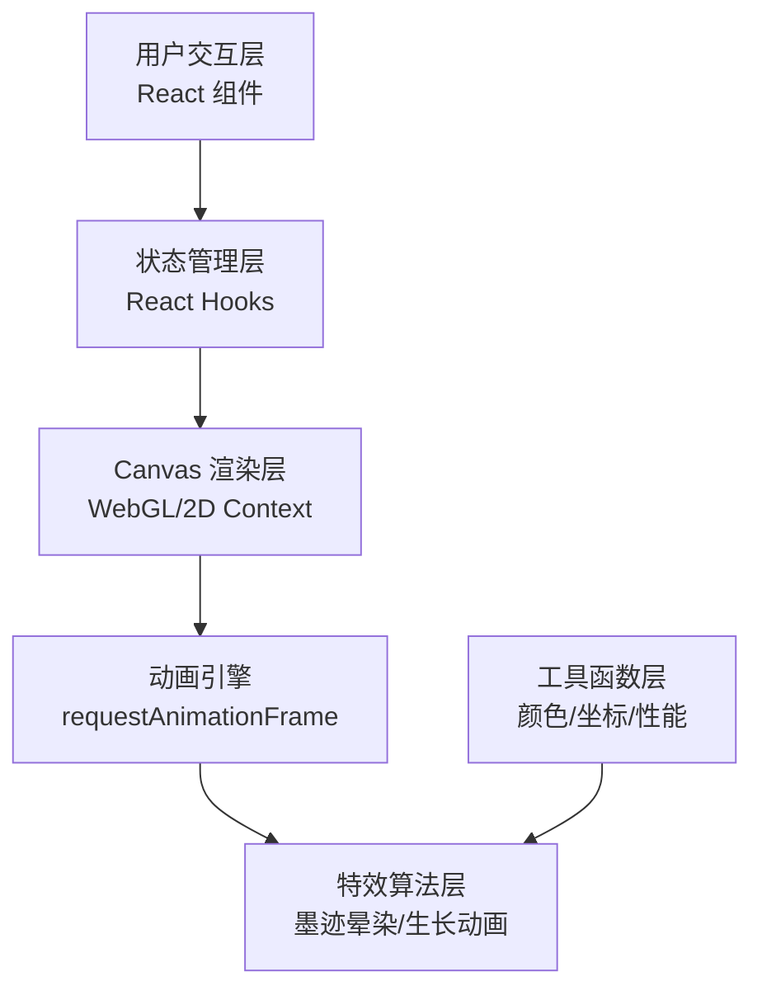

## 1. 架构设计



## 2. 技术描述

- **前端框架**：React 18 + TypeScript 5
- **构建工具**：Vite 5
- **渲染技术**：HTML5 Canvas 2D API
- **动画系统**：requestAnimationFrame + 自定义动画循环
- **样式方案**：CSS Modules + CSS Variables
- **字体**：Google Fonts (Ma Shan Zheng, Noto Serif SC)

## 3. 目录结构

```
src/
├── main.tsx              # React 入口文件
├── App.tsx               # 根组件，整合所有子组件
├── types/
│   └── index.ts          # TypeScript 类型定义
├── components/
│   ├── Canvas.tsx        # Canvas 绘画主组件
│   ├── Toolbar.tsx       # 画笔工具栏组件
│   └── LogPanel.tsx      # 创作日志面板组件
├── hooks/
│   ├── useCanvas.ts      # Canvas 操作自定义 Hook
│   └── useAnimation.ts   # 动画循环自定义 Hook
├── utils/
│   ├── ink.ts            # 墨迹晕染算法
│   ├── growth.ts         # 生长动画算法
│   ├── color.ts          # 颜色处理工具
│   └── performance.ts    # 性能优化工具
└── styles/
    ├── global.css        # 全局样式
    ├── variables.css     # CSS 变量定义
    └── textures.css      # 纹理样式定义
```

## 4. 核心数据类型定义

```typescript
// 画笔配置
interface BrushConfig {
  size: number;           // 笔刷大小 1-50
  color: string;          // 墨色值
  opacity: number;        // 透明度
  flowRate: number;       // 墨水流速
}

// 绘制点
interface DrawPoint {
  x: number;
  y: number;
  pressure: number;       // 压力（由速度计算）
  timestamp: number;
}

// 墨迹粒子
interface InkParticle {
  x: number;
  y: number;
  vx: number;
  vy: number;
  radius: number;
  opacity: number;
  life: number;
  maxLife: number;
}

// 生长元素
interface GrowthElement {
  id: string;
  type: 'flower' | 'leaf';
  x: number;
  y: number;
  progress: number;       // 0-1 生长进度
  rotation: number;
  scale: number;
  color: string;
}

// 操作日志
interface LogEntry {
  id: string;
  type: 'draw' | 'growth' | 'theme';
  color: string;
  x: number;
  y: number;
  timestamp: number;
  description: string;
}

// 主题类型
type ThemeType = 'landscape' | 'birdflower' | 'bamboo';
```

## 5. 核心算法说明

### 5.1 墨迹晕染算法

1. **速度→浓淡映射**：根据两点间距离和时间差计算笔触速度，速度越快墨色越淡
2. **粒子扩散**：每帧生成3-5个墨迹粒子，模拟自然扩散
3. **渗透效果**：使用径向渐变 + 高斯模糊模拟宣纸渗透
4. **毛刺边缘**：在笔刷边缘添加随机扰动点，模拟毛笔飞白效果

### 5.2 生长动画系统

1. **贝塞尔曲线生长**：使用3阶贝塞尔曲线描述花茎/叶脉生长路径
2. **分段绽放**：花瓣/叶片分阶段展开，每阶段有缓动函数
3. **粒子装饰**：生长过程中伴随金色光点粒子效果

### 5.3 性能优化策略

1. **多层Canvas**：背景层（宣纸纹理）、墨迹层（持久绘制）、特效层（临时动画）
2. **脏区域重绘**：只重绘动画活跃区域，而非全屏
3. **对象池**：墨迹粒子和生长元素使用对象池复用，减少GC
4. **节流日志**：操作日志记录使用节流，避免频繁状态更新

## 6. 性能指标

| 指标 | 目标值 | 实现方式 |
|------|--------|----------|
| 帧率 | ≥60fps | requestAnimationFrame + 分层渲染 |
| 内存占用 | ≤100MB | 对象池复用 + 及时释放粒子 |
| 响应延迟 | ≤16ms | 异步计算 + 输入防抖 |
| 首屏加载 | ≤2s | 懒加载纹理 + 代码分割 |
