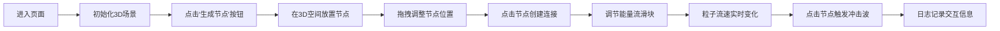

## 1. 产品概述

'星髓脉动'是一款沉浸式3D交互可视化项目，用户扮演星际地质学家，在深邃宇宙空间中通过放置和连接能量节点，创造出动态的能量网络。每个节点如微型恒星般自旋发光，节点间的粒子流随能量强度脉动，营造出熔岩星核般的炽热视觉体验。

- 核心价值：提供极具视觉冲击力的3D交互体验，让用户探索能量节点间的动态关系
- 目标用户：科技爱好者、视觉艺术从业者、3D交互体验探索者
- 市场定位：高端WebGL交互演示项目，展示前沿Web 3D技术能力

## 2. 核心功能

### 2.1 用户角色
| 角色 | 注册方式 | 核心权限 |
|------|----------|----------|
| 星际地质学家 | 无需注册，直接访问 | 完整的节点操作、视角控制、参数调节权限 |

### 2.2 功能模块
1. **3D场景渲染**：全屏Three.js场景，支持视角旋转和缩放
2. **能量节点系统**：节点放置、自旋动画、脉动光晕、点击冲击波
3. **连接系统**：节点拖拽连线、粒子流动动画、能量流滑块控制
4. **控制面板**：节点生成、能量流调节、视角重置、全屏切换
5. **交互日志**：记录最近5次节点交互的详细信息
6. **音效反馈**：节点点击时的冲击波音效

### 2.3 页面详情
| 页面名称 | 模块名称 | 功能描述 |
|----------|----------|----------|
| 主页面 | 3D场景模块 | 全屏渲染星核空间，支持鼠标拖拽旋转视角、滚轮缩放 |
| 主页面 | 控制面板模块 | 左下角半透明面板，包含节点生成按钮、能量流滑块、重置视角、全屏切换 |
| 主页面 | 日志面板模块 | 右下角能量日志，显示最近5次交互的节点ID、能量值和距离 |
| 主页面 | 节点交互模块 | 悬停显示属性标签、点击触发冲击波扩散动画和音效 |

## 3. 核心流程

用户进入页面后，首先看到深邃的熔岩星核背景空间。通过左下角控制面板生成能量节点，拖拽节点到合适位置，点击两个节点创建连接。调节能量流滑块控制连线粒子流速，点击节点触发能量冲击波。所有交互实时记录在右下角日志面板中。

## 4. 用户界面设计

### 4.1 设计风格
- **主色调**：熔岩橙 `#ff4500`、暗红 `#8b0000`
- **背景色**：从紫黑 `#1a0a2e` 渐变到暗红 `#4a0000`
- **节点样式**：半透明发光球体，带有脉动光晕效果
- **连线样式**：流动粒子束，呈现能量流动感
- **控制面板**：半透明深色背景（rgba(20, 0, 10, 0.7)），熔岩橙色边框高亮
- **字体**：使用 Orbitron 作为标题字体（科幻感），JetBrains Mono 作为数据显示字体

### 4.2 页面设计概述
| 页面名称 | 模块名称 | UI元素 |
|----------|----------|--------|
| 主页面 | 3D场景 | 全屏WebGL画布、紫黑到暗红渐变背景、发光节点、粒子连线、冲击波动画 |
| 主页面 | 控制面板 | 半透明圆角面板、发光按钮、熔岩橙色滑块、图标按钮 |
| 主页面 | 日志面板 | 半透明列表、等宽字体数据显示、最新记录高亮 |
| 主页面 | 交互反馈 | 悬停标签、微光环绕、扩散圆环、音效提示 |

### 4.3 响应性
- 桌面端优先设计，全屏3D场景自适应窗口大小
- 控制面板和日志面板使用固定定位，响应窗口尺寸变化
- 触控设备支持双指缩放和拖拽旋转

### 4.4 3D场景指导
- **环境**：深邃宇宙空间，背景使用径向渐变从紫黑到暗红，添加细微星点粒子
- **光照**：环境光 + 点光源，节点自身发光，使用 Bloom 后期处理增强发光效果
- **相机**：PerspectiveCamera，初始位置 (0, 0, 15)，使用 OrbitControls 支持拖拽旋转和滚轮缩放
- **构图**：节点分布在三维空间中，连线形成网络结构，视觉焦点在场景中心
- **交互**：点击放置节点、拖拽移动节点、点击选中创建连接、悬停显示信息
- **后处理**：Bloom发光效果、轻微色差、胶片颗粒，增强科幻质感
- **性能**：限制最大节点数量（建议20个以内），使用 InstancedMesh 优化粒子渲染，目标60fps
