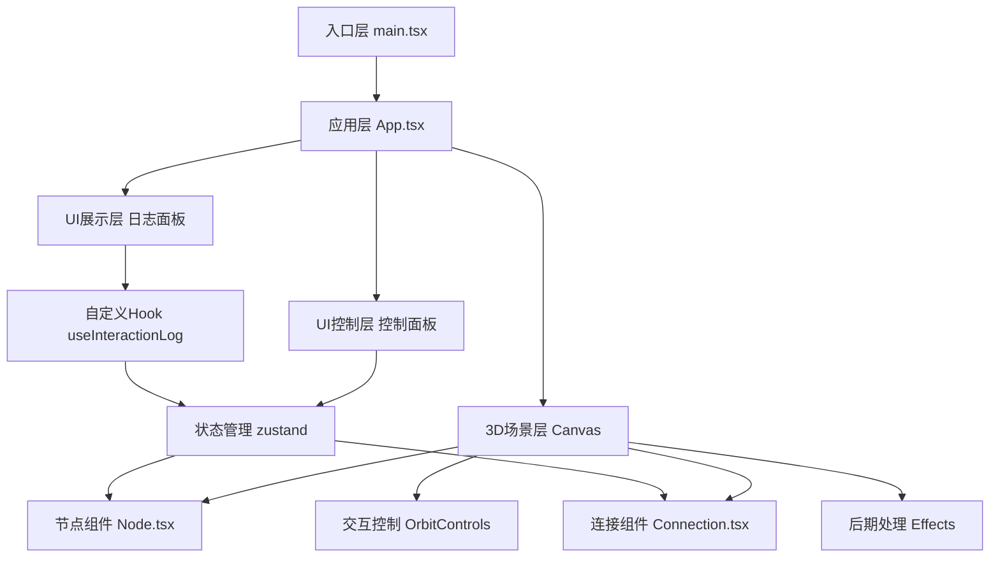

## 1. 架构设计

本项目为纯前端3D交互可视化应用，采用React组件化架构，通过react-three-fiber管理Three.js场景。



## 2. 技术描述

- **前端框架**: React@18 + TypeScript@5
- **构建工具**: Vite@5
- **3D渲染**: Three@0.160 + @react-three/fiber@8 + @react-three/drei@9 + @react-three/postprocessing@2
- **状态管理**: zustand@4
- **样式方案**: 原生CSS + CSS变量，不使用Tailwind（保持项目轻量化）
- **音效**: Web Audio API 生成合成音效

## 3. 目录结构

```
auto302/
├── .trae/documents/          # 项目文档
│   ├── prd.md               # 产品需求文档
│   └── tech-arch.md         # 技术架构文档
├── src/
│   ├── components/
│   │   ├── Node.tsx         # 能量节点组件
│   │   └── Connection.tsx   # 粒子连线组件
│   ├── hooks/
│   │   └── useInteractionLog.ts  # 交互日志Hook
│   ├── store/
│   │   └── useStore.ts      # 全局状态管理
│   ├── utils/
│   │   └── audio.ts         # 音效工具
│   ├── App.tsx              # 主应用组件
│   └── main.tsx             # 入口文件
├── index.html               # HTML入口
├── package.json             # 项目依赖
├── tsconfig.json            # TypeScript配置
└── vite.config.js           # Vite配置
```

## 4. 核心数据结构

### 4.1 节点数据类型
```typescript
interface EnergyNode {
  id: string;
  position: [number, number, number];
  energy: number;
  color: string;
  createdAt: number;
}
```

### 4.2 连接数据类型
```typescript
interface Connection {
  id: string;
  from: string;
  to: string;
  energyFlow: number;
}
```

### 4.3 交互日志类型
```typescript
interface InteractionLog {
  id: string;
  nodeId: string;
  energy: number;
  distance: number;
  timestamp: number;
  type: 'click' | 'connect' | 'create';
}
```

### 4.4 全局状态
```typescript
interface AppState {
  nodes: EnergyNode[];
  connections: Connection[];
  energyFlow: number;
  selectedNode: string | null;
  connectingFrom: string | null;
  addNode: (position: [number, number, number]) => void;
  removeNode: (id: string) => void;
  updateNodePosition: (id: string, position: [number, number, number]) => void;
  addConnection: (from: string, to: string) => void;
  setEnergyFlow: (value: number) => void;
  setSelectedNode: (id: string | null) => void;
  setConnectingFrom: (id: string | null) => void;
  resetView: () => void;
}
```

## 5. 性能优化策略

1. **节点渲染优化**：使用 `useFrame` 进行动画更新，避免不必要的重渲染
2. **粒子系统优化**：使用 `InstancedMesh` 批量渲染连线粒子，减少Draw Call
3. **后处理控制**：根据设备性能动态调整Bloom效果强度
4. **节点数量限制**：最大支持20个节点，超过后禁用创建按钮
5. **状态更新优化**：使用zustand的选择器避免不必要的组件重渲染
6. **帧率监控**：使用 `Stats` 组件监控帧率，保持60fps目标

## 6. 开发规范

1. 所有组件使用 `.tsx` 扩展名
2. 单组件文件不超过300行
3. 使用TypeScript严格模式
4. 动画逻辑使用 `useFrame` Hook
5. 交互事件使用 `onPointerDown`/`onPointerUp` 而非 `onClick`，支持拖拽
6. 组件命名使用 PascalCase，Hook使用 camelCase 并以 `use` 开头
