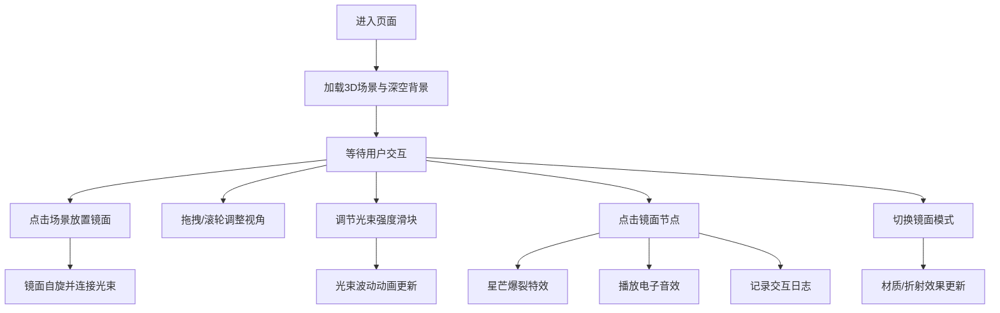

## 1. 产品概述

"星脉织镜"是一款沉浸式3D交互可视化艺术应用，让用户化身为星际编织者，在深邃宇宙空间中通过放置水晶棱镜镜面节点，创造出流动的光束网络与璀璨的星芒特效。

- 核心价值：通过极简的交互创造极富视觉冲击力的宇宙光束艺术，提供治愈性的创作体验
- 目标用户：艺术创作者、视觉设计爱好者、追求审美体验的普通用户
- 市场定位：web端创意交互艺术体验产品

## 2. 核心功能

### 2.1 用户角色

| 角色 | 注册方式 | 核心权限 |
|------|----------|----------|
| 访客用户 | 无需注册，直接访问 | 完整使用所有交互功能 |

### 2.2 功能模块

1. **3D主场景**：全屏宇宙空间，支持视角操控，承载所有镜面节点与光束效果
2. **镜面节点系统**：放置、旋转、模式切换、点击特效
3. **光束连接系统**：节点间动态光束、强度调节、波动动画
4. **控制面板**：生成按钮、强度滑块、视角重置、模式切换
5. **交互日志面板**：记录并展示最近交互信息

### 2.3 页面详情

| 页面名称 | 模块名称 | 功能描述 |
|----------|----------|----------|
| 主页面 | 3D场景模块 | 全屏Three.js渲染，支持鼠标拖拽旋转、滚轮缩放、点击放置镜面 |
| 主页面 | 镜面节点模块 | 水晶棱镜缓慢自旋、折射光束、点击触发星芒爆裂与电子音效 |
| 主页面 | 光束连接模块 | 节点间渐变光带、随强度波动的流动动画 |
| 主页面 | 控制面板模块 | 毛玻璃半透明效果，包含镜面生成按钮、光束强度滑块、重置视角按钮、镜面模式切换 |
| 主页面 | 日志面板模块 | 展示最近5次交互的镜面ID、光束角度和距离 |

## 3. 核心流程

用户进入页面 → 呈现深空背景与默认视角 → 用户点击场景放置镜面节点 → 镜面自动自旋并与其他节点产生光束连接 → 用户可拖拽旋转视角/滚轮缩放 → 用户拖动滑块调节光束强度 → 点击镜面触发星芒爆裂与音效 → 交互记录实时更新到日志面板 → 可随时重置视角或切换镜面模式

## 4. 用户界面设计

### 4.1 设计风格

- **主色调**：极光绿 `#00ff7f`、虹彩紫 `#8a2be2`
- **背景渐变**：深空蓝 `#0a0a1a` → 星云紫 `#1a0a2e`
- **视觉风格**：极虹星轨风，赛博朋克与宇宙浪漫的结合
- **字体**：使用 Google Fonts 的 Orbitron（科技感标题）搭配 Rajdhani（精致正文）
- **毛玻璃效果**：`backdrop-filter: blur(12px)`，半透明白色 `rgba(255,255,255,0.08)` 背景
- **按钮样式**：圆角胶囊形，极光绿描边，hover 时发光效果
- **滑块样式**：虹彩紫渐变轨道，极光绿滑块，带光晕效果

### 4.2 页面设计概述

| 页面名称 | 模块名称 | UI元素 |
|----------|----------|--------|
| 主页面 | 3D场景 | 全屏渲染、深空渐变背景、星点点缀、镜面棱镜、光束光带、粒子特效 |
| 主页面 | 控制面板 | 左下角固定位置、毛玻璃面板、图标按钮、范围滑块、模式切换标签 |
| 主页面 | 日志面板 | 右下角固定位置、毛玻璃面板、时间戳、镜面ID、角度距离数据 |

### 4.3 响应式设计

- **桌面端优先**：完整3D场景与控制面板布局
- **移动端适配**：控制面板自适应缩放，触控优化（双击放置、双指缩放）
- **触摸优化**：增大触摸热区，支持长按操作

### 4.4 3D场景指导

- **环境**：深空渐变背景，远处星星粒子层，体积光雾效果
- **光照**：环境光（低强度白色）+ 两盏点光源（极光绿与虹彩紫）+ 镜面自发光
- **相机**：PerspectiveCamera，fov 60，初始位置 [0, 0, 15]，启用 OrbitControls
- **后处理**：Bloom 泛光效果，轻微色调映射，抗锯齿
- **动画**：
  - 镜面：Y轴缓慢自旋（0.3rad/s），点击时轻微震动缩放动画
  - 光束：UV流动偏移，正弦波动，强度随滑块变化
  - 星芒爆裂：粒子向外扩散，透明度衰减，大小变化
- **性能预算**：镜面节点上限 50 个，总三角形数 < 100k，目标帧率 60fps
