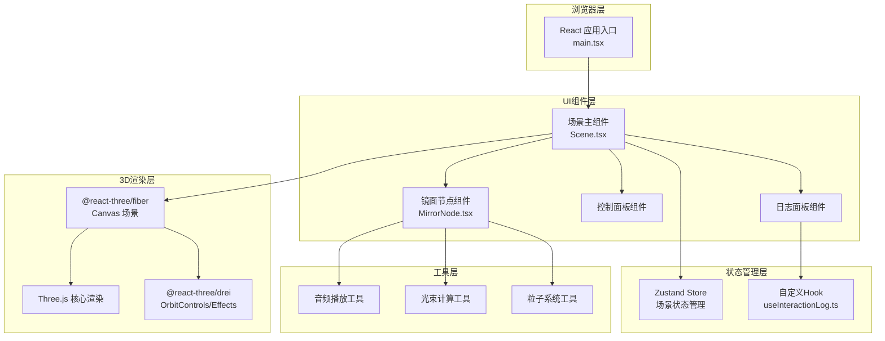

## 1. 架构设计



## 2. 技术描述

- **前端框架**：React 18 + TypeScript 5
- **构建工具**：Vite 5
- **3D渲染**：Three.js 0.160 + @react-three/fiber 8.15 + @react-three/drei 9.92 + @react-three/postprocessing 2.15
- **状态管理**：Zustand 4.4
- **样式方案**：TailwindCSS 3.4
- **音频处理**：Web Audio API（内置电子音效生成）
- **开发工具**：@types/react、@types/react-dom、@types/three

## 3. 路由定义

| 路由 | 用途 |
|------|------|
| / | 主页面，包含完整3D场景与控制面板 |

本项目为单页应用，无需复杂路由配置。

## 4. 数据模型

### 4.1 核心类型定义

```typescript
// 镜面节点数据
interface MirrorNode {
  id: string;
  position: [number, number, number];
  rotation: [number, number, number];
  mode: 'reflect' | 'refract' | 'split';
  scale: number;
}

// 交互日志条目
interface InteractionLog {
  id: string;
  mirrorId: string;
  timestamp: number;
  beamAngle: number;
  distance: number;
}

// 镜面模式类型
type MirrorMode = 'reflect' | 'refract' | 'split';

// 全局场景状态
interface SceneState {
  mirrors: MirrorNode[];
  beamIntensity: number;
  selectedMirrorId: string | null;
  cameraPosition: [number, number, number];
  addMirror: (position: [number, number, number]) => void;
  removeMirror: (id: string) => void;
  setBeamIntensity: (intensity: number) => void;
  setMirrorMode: (id: string, mode: MirrorMode) => void;
  resetCamera: () => void;
  clearAll: () => void;
}
```

### 4.2 状态管理设计

使用 Zustand 创建全局 store，管理镜面节点、光束强度、选中状态等。

## 5. 项目文件结构

```
project-root/
├── package.json
├── tsconfig.json
├── vite.config.ts
├── tailwind.config.js
├── postcss.config.js
├── index.html
├── src/
│   ├── main.tsx              # React 入口
│   ├── index.css             # 全局样式 + Tailwind
│   ├── App.tsx               # 根组件
│   ├── components/
│   │   ├── Scene.tsx         # 主场景组件
│   │   ├── MirrorNode.tsx    # 镜面节点组件
│   │   ├── ControlPanel.tsx  # 控制面板
│   │   ├── LogPanel.tsx      # 日志面板
│   │   ├── BeamConnection.tsx # 光束连接组件
│   │   └── StarBurst.tsx     # 星芒爆裂特效
│   ├── hooks/
│   │   ├── useInteractionLog.ts  # 交互日志hook
│   │   └── useAudio.ts       # 音频hook
│   ├── store/
│   │   └── useSceneStore.ts  # Zustand状态管理
│   ├── utils/
│   │   ├── beamMath.ts       # 光束计算
│   │   └── audioSynth.ts     # 音效合成
│   └── types/
│       └── index.ts          # 类型定义
```

## 6. 性能优化策略

1. **实例化渲染**：使用 `InstancedMesh` 渲染多个镜面节点，减少draw call
2. **资源复用**：几何体与材质对象缓存复用，避免重复创建
3. **帧率控制**：`useFrame` 中使用 `delta` 时间控制动画速度，自适应刷新率
4. **粒子池**：粒子特效使用对象池模式，避免频繁GC
5. **LOD策略**：远距离镜面降低细节级别
6. **事件节流**：滑块变化使用防抖处理，避免频繁状态更新
7. **WebWorker**：复杂光束计算可移至Worker线程（后续优化）

## 7. 开发与构建

- **开发命令**：`npm run dev` - 启动 Vite 开发服务器
- **构建命令**：`npm run build` - 生产环境构建
- **预览命令**：`npm run preview` - 预览构建结果
- **类型检查**：`npm run check` - TypeScript 类型检查
