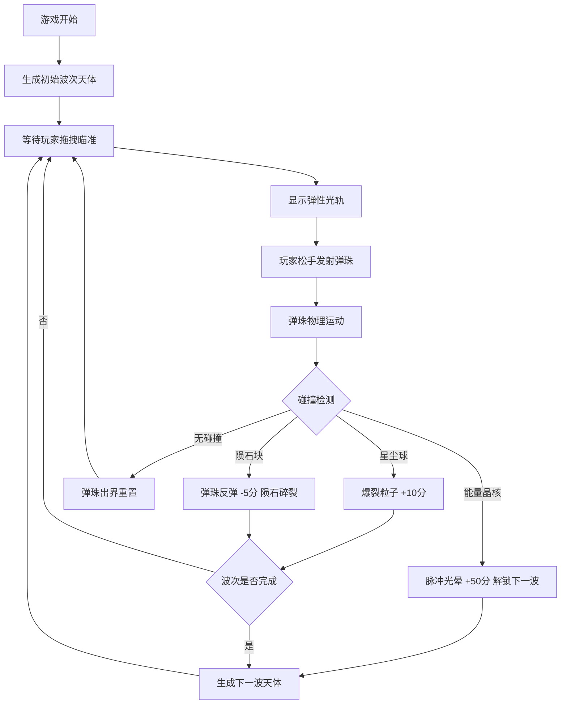

## 1. 产品概述

星轨弹珠是一款基于物理引擎的太空主题弹射游戏，玩家在星空中拖动弹性光轨瞄准并发射弹珠，撞击各种天体目标获得分数，逐步解锁更高难度的波次。

- 目标用户：休闲游戏玩家，喜欢物理弹射类游戏的用户
- 产品价值：提供流畅的物理弹射体验，配合霓虹风格的视觉效果和丰富的碰撞反馈，带来沉浸式的游戏乐趣

## 2. 核心功能

### 2.1 功能模块

1. **游戏主场景**：物理弹射击核心玩法、碰撞检测、得分系统
2. **弹珠系统**：弹性光轨瞄准、发射物理、发光拖尾、碰撞粒子
3. **天体系统**：星尘球、陨石块、能量晶核的生成与行为
4. **UI界面**：得分显示、连击计数、波次进度、暂停按钮、结算面板
5. **音效系统**：蓄力音效、碰撞音效、得分音效

### 2.2 页面详情

| 页面名称 | 模块名称 | 功能描述 |
|-----------|-------------|---------------------|
| 游戏主界面 | 游戏画布 | 中央全屏Phaser游戏渲染区域，处理所有游戏逻辑 |
| 游戏主界面 | 左上角信息 | 实时显示当前得分和连击数 |
| 游戏主界面 | 右上角控制 | 暂停/继续按钮，点击后游戏暂停并变暗 |
| 游戏主界面 | 底部进度 | 波次进度条，紫到金渐变显示当前波次完成度 |
| 游戏主界面 | 结算面板 | 半透明弹窗，显示最终得分、最高分、重玩按钮 |

## 3. 核心流程

玩家在游戏画布任意位置按下鼠标并拖拽，形成一条紫色渐变的弹性光轨，光轨长度决定弹射力度。松开鼠标后弹珠沿光轨方向飞出，撞击不同天体触发不同效果：
- 星尘球（金色）：爆裂粒子，+10分
- 陨石块（暗红）：弹珠反弹，-5分，陨石碎裂
- 能量晶核（青色）：全屏脉冲光晕，+50分，解锁下一波

## 4. 用户界面设计

### 4.1 设计风格

- **主色调**：深空蓝黑 `#0b0f2a` 背景，紫色渐变 `#7b2ff7` → `#ff4b8b` 光轨
- **辅助色**：金色 `#ffd700` 星尘，暗红 `#cc0000` 陨石，青色 `#00e5ff` 晶核
- **视觉风格**：深空霓虹风，所有物体带投影和发光效果，粒子系统丰富
- **字体**：使用Orbitron等科幻风格字体，增强太空主题氛围

### 4.2 页面设计概述

| 页面名称 | 模块名称 | UI元素 |
|-----------|-------------|-------------|
| 游戏主界面 | 游戏画布 | 深蓝色星空背景，随机闪烁星星，紫粉渐变光轨，发光天体 |
| 游戏主界面 | 得分显示 | 左上角白色文字，得分数字带金色发光效果，连击数带脉冲动画 |
| 游戏主界面 | 暂停按钮 | 右上角圆角按钮，悬停放大，点击后画面变暗显示暂停图标 |
| 游戏主界面 | 进度条 | 底部中央，紫色到金色渐变填充，带发光边框 |
| 游戏主界面 | 结算面板 | 半透明深色背景，毛玻璃效果，金色文字显示得分，重玩按钮带霓虹边框 |

### 4.3 响应性

- 桌面端优先，游戏画布自适应窗口大小
- 支持鼠标和触摸操作
- 暂停/重玩按钮尺寸适合点击操作

### 4.4 动画与特效

- 弹性光轨：拖拽时拉伸动画，松手后回弹消失
- 弹珠拖尾：发光粒子跟随，运动时尾迹拉长
- 碰撞粒子：星尘爆裂散射，陨石碎裂小块
- 能量吸收：全屏脉冲光晕，颜色从青色扩散到整个屏幕
- 得分弹出：碰撞时数字从碰撞点向上飘升并淡出
