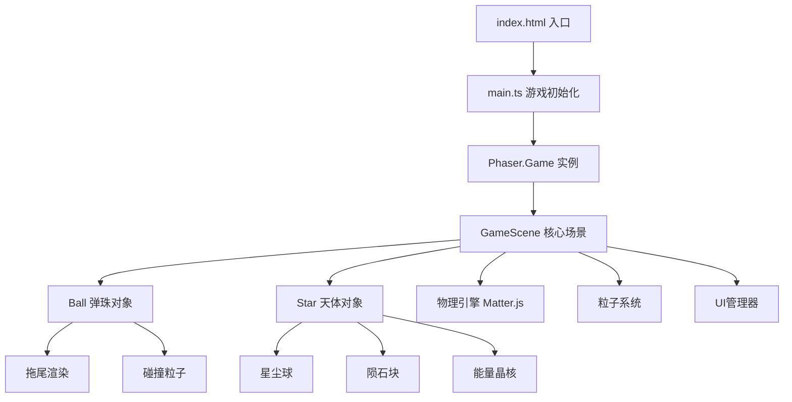

## 1. 架构设计



## 2. 技术描述

- **游戏引擎**：Phaser 3.x
- **开发语言**：TypeScript 5.x (strict模式)
- **构建工具**：Vite 5.x
- **物理引擎**：Phaser内置Matter.js
- **类型定义**：@types/phaser
- **模块系统**：ESNext

## 3. 项目结构

```
auto304/
├── package.json
├── tsconfig.json
├── vite.config.js
├── index.html
└── src/
    ├── main.ts              # Phaser游戏初始化、场景管理、全局配置
    ├── scenes/
    │   └── GameScene.ts     # 核心逻辑：弹射物理、碰撞处理、得分更新
    └── objects/
        ├── Ball.ts          # 弹珠封装：物理行为、渲染、发光拖尾、碰撞粒子
        └── Star.ts          # 天体管理：星尘/陨石/晶核的生成、行为、销毁动画
```

## 4. 核心类定义

### 4.1 Ball 类

```typescript
class Ball {
    constructor(scene: Phaser.Scene, x: number, y: number);
    launch(velocityX: number, velocityY: number): void;
    reset(x: number, y: number): void;
    update(time: number, delta: number): void;
    destroy(): void;
}
```

### 4.2 Star 类

```typescript
enum StarType {
    DUST = 'dust',      // 星尘球
    METEOR = 'meteor',  // 陨石块
    CRYSTAL = 'crystal' // 能量晶核
}

class Star {
    constructor(scene: Phaser.Scene, x: number, y: number, type: StarType);
    hit(): { score: number; shouldBounce: boolean; waveComplete: boolean };
    destroy(): void;
}
```

### 4.3 GameScene 类

```typescript
class GameScene extends Phaser.Scene {
    score: number;
    combo: number;
    wave: number;
    isPaused: boolean;
    isAiming: boolean;
    aimStart: Phaser.Math.Vector2;
    aimEnd: Phaser.Math.Vector2;
}
```

## 5. 性能优化

- **帧率**：锁定60fps，使用Phaser的RAF模式
- **粒子控制**：总粒子数限制在200以内，粒子池复用
- **碰撞检测**：使用Matter.js的碰撞回调，避免每帧遍历
- **对象池**：天体和粒子对象使用对象池管理，减少GC
- **渲染优化**：使用Canvas纹理渲染发光效果，避免过多WebGL调用

## 6. 音效实现

- 使用Web Audio API生成程序化音效，无需外部音频文件
- 蓄力音效：频率随拖拽长度递增的正弦波
- 碰撞音效：不同天体对应不同频率和波形
- 得分音效：音高随分数递增
