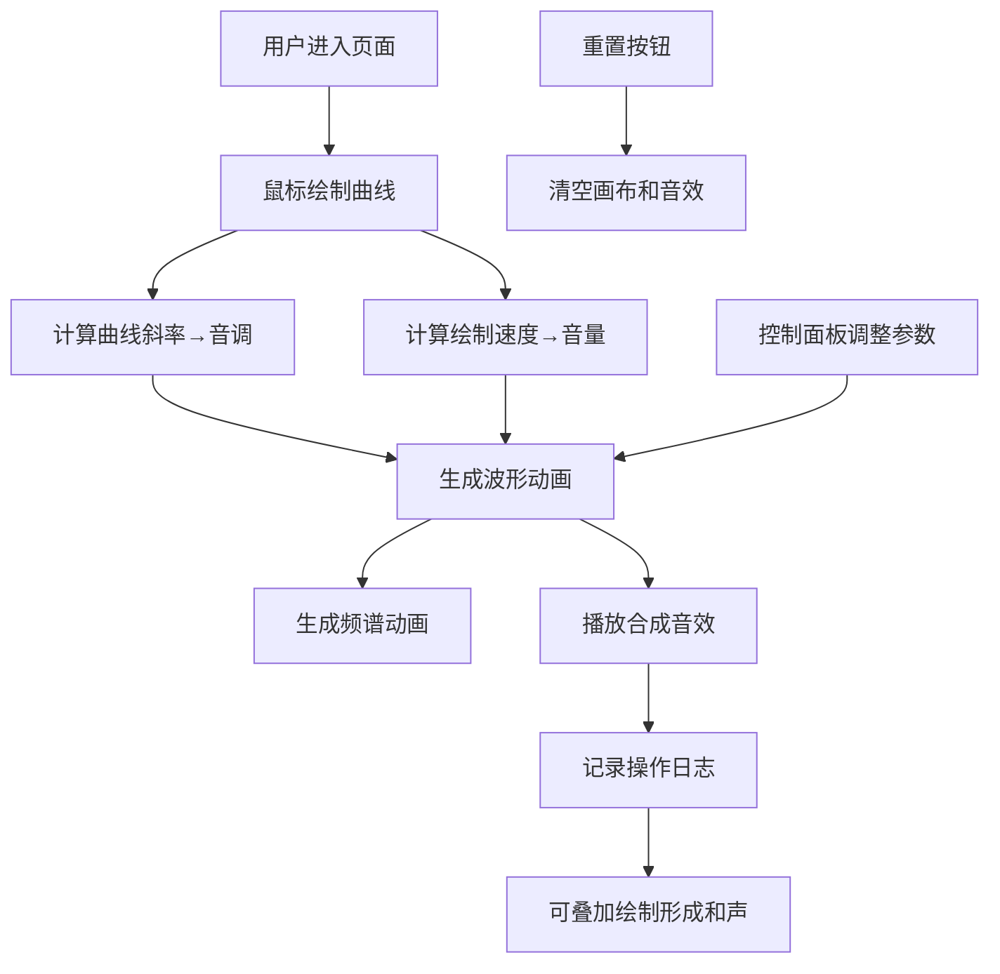

## 1. 产品概述

"光织音绘"是一款交互式动态音频可视化应用，让用户化身为声音画家，通过鼠标在画布上绘制曲线，实时生成对应的波形和频谱动画，并播放随曲线形状变化的合成音效。不同曲线斜率对应不同音调，绘制速度控制音量，多条曲线可叠加形成和声。

- 目标用户：音乐爱好者、视觉艺术家、创意工作者
- 产品价值：将声音与视觉艺术结合，提供沉浸式的创意表达体验

## 2. 核心功能

### 2.1 功能模块
1. **可视化画布**：中央Canvas画布，支持鼠标绘制曲线、波形动画、频谱动画、粒子特效
2. **控制面板**：波形选择下拉框、频谱显示开关、重置按钮、音量滑块
3. **声音日志**：显示最近5次绘制操作的音高和时长

### 2.2 页面详情
| 页面名称 | 模块名称 | 功能描述 |
|-----------|-------------|---------------------|
| 主页面 | 可视化画布 | 鼠标绘制曲线生成波形，实时频谱动画，粒子爆炸和震动效果，多条曲线叠加和声 |
| 主页面 | 控制面板 | 切换波形类型（正弦波、方波、锯齿波、三角波），开关频谱显示，重置画布，调节主音量 |
| 主页面 | 声音日志 | 记录最近5次绘制操作，显示音高范围、时长、音量信息 |

## 3. 核心流程

用户进入页面 → 点击或拖拽鼠标在画布上绘制 → 系统根据曲线斜率计算音调、根据绘制速度计算音量 → 实时生成波形动画和频谱动画 → 播放合成音效 → 记录操作日志 → 可叠加多条曲线形成和声 → 可通过控制面板调整参数或重置

## 4. 用户界面设计

### 4.1 设计风格
- **视觉风格**：霓虹赛博朋克风
- **主色调**：霓虹紫 `#b300ff`、暗青 `#00e5ff`
- **背景色**：深黑 `#0a0a0f`
- **按钮风格**：渐变背景 + 发光边框，悬停时有光晕扩散效果
- **字体**：显示字体使用 Orbitron（科技感），正文字体使用 JetBrains Mono（等宽现代感）
- **布局**：中央Canvas占主要面积，左下角控制面板，右下角声音日志

### 4.2 页面设计概述
| 页面名称 | 模块名称 | UI元素 |
|-----------|-------------|-------------|
| 主页面 | 可视化画布 | 全屏Canvas，绘制曲线带霓虹发光效果，波形和频谱动画，粒子爆炸特效，绘制时轻微震动反馈 |
| 主页面 | 控制面板 | 毛玻璃背景面板，下拉框带霓虹边框，开关按钮带发光状态，滑块带霓虹轨道，按钮点击有波纹效果 |
| 主页面 | 声音日志 | 半透明面板，最新记录高亮显示，条目带渐入动画 |

### 4.3 响应式
- 桌面端优先设计，Canvas自适应窗口大小
- 控制面板和日志面板固定在角落，不随窗口滚动
- 触摸设备支持触屏绘制操作

### 4.4 动画与交互
- 页面加载：元素依次淡入，Canvas背景有脉冲光效
- 绘制时：曲线跟随鼠标，带拖尾效果，端点有粒子爆炸
- 按钮悬停：边框发光增强，背景渐变位移
- 日志更新：新条目从下往上滑入，带淡入效果
- 音效播放时：画布边缘有与节拍同步的光晕
