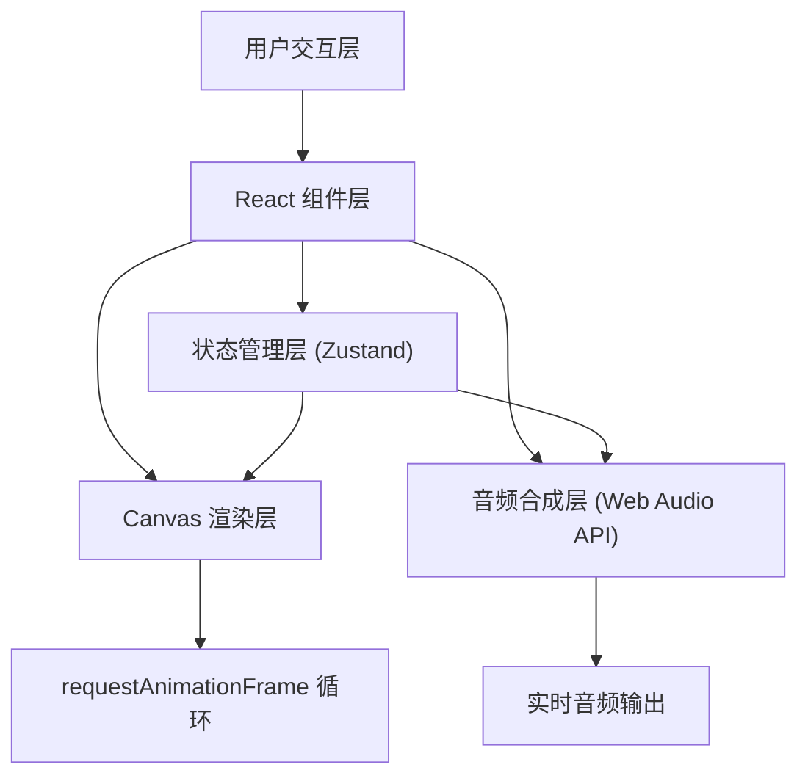

## 1. 架构设计



## 2. 技术描述

- **前端框架**：React@18 + TypeScript
- **构建工具**：Vite@5
- **状态管理**：Zustand
- **UI框架**：TailwindCSS@3
- **图标库**：lucide-react
- **音频处理**：Web Audio API（原生）
- **图形渲染**：Canvas 2D API
- **动画驱动**：requestAnimationFrame（60fps循环）

## 3. 项目目录结构

```
├── package.json
├── tsconfig.json
├── vite.config.ts
├── tailwind.config.js
├── postcss.config.js
├── index.html
└── src/
    ├── main.tsx           # React入口
    ├── App.tsx            # 主组件，布局管理
    ├── index.css          # 全局样式
    ├── components/
    │   ├── Visualizer.tsx    # Canvas画布组件
    │   ├── ControlPanel.tsx  # 控制面板组件
    │   └── LogPanel.tsx      # 日志面板组件
    ├── hooks/
    │   ├── useAudioEngine.ts # 音频引擎Hook
    │   └── useCanvasRenderer.ts # Canvas渲染Hook
    ├── store/
    │   └── useAppStore.ts    # 应用状态管理
    ├── types/
    │   └── index.ts          # 类型定义
    └── utils/
        └── audio.ts          # 音频工具函数
```

## 4. 类型定义

```typescript
// 波形类型
type WaveformType = 'sine' | 'square' | 'sawtooth' | 'triangle';

// 绘制点
interface DrawPoint {
  x: number;
  y: number;
  timestamp: number;
}

// 绘制曲线
interface DrawCurve {
  id: string;
  points: DrawPoint[];
  color: string;
  waveform: WaveformType;
  frequencyRange: [number, number];
  volume: number;
  duration: number;
  startTime: number;
}

// 日志条目
interface LogEntry {
  id: string;
  timestamp: number;
  pitchRange: [number, number];
  duration: number;
  volume: number;
  waveform: WaveformType;
}

// 应用状态
interface AppState {
  curves: DrawCurve[];
  currentCurve: DrawCurve | null;
  isDrawing: boolean;
  showSpectrum: boolean;
  waveformType: WaveformType;
  masterVolume: number;
  logs: LogEntry[];
  particles: Particle[];
}

// 粒子
interface Particle {
  x: number;
  y: number;
  vx: number;
  vy: number;
  life: number;
  maxLife: number;
  color: string;
  size: number;
}
```

## 5. 核心模块设计

### 5.1 音频引擎 (useAudioEngine)
- 使用 Web Audio API 创建 OscillatorNode 和 GainNode
- 根据曲线斜率映射到频率范围 (20Hz - 2000Hz)
- 根据绘制速度计算增益 (0 - 1)
- 支持多条曲线同时播放形成和声
- 淡入淡出效果避免爆音

### 5.2 Canvas 渲染 (useCanvasRenderer)
- 60fps 渲染循环
- 绘制用户曲线（带霓虹发光效果）
- 绘制波形可视化（从音频 analyser 获取数据）
- 绘制频谱可视化（FFT 数据）
- 粒子系统（爆炸效果）
- 震动效果（canvas 偏移）

### 5.3 状态管理 (useAppStore)
- 管理绘制状态、曲线数据、日志记录
- 提供操作方法：开始绘制、添加点、结束绘制、重置、切换参数

## 6. 性能优化

- 使用 requestAnimationFrame 确保 60fps
- 曲线点数据采样（避免过多点影响性能）
- 粒子对象池复用
- 离屏 Canvas 预渲染发光效果
- 使用 transform 而非 top/left 进行动画
- 合理控制 FFT 大小（256 或 512）
