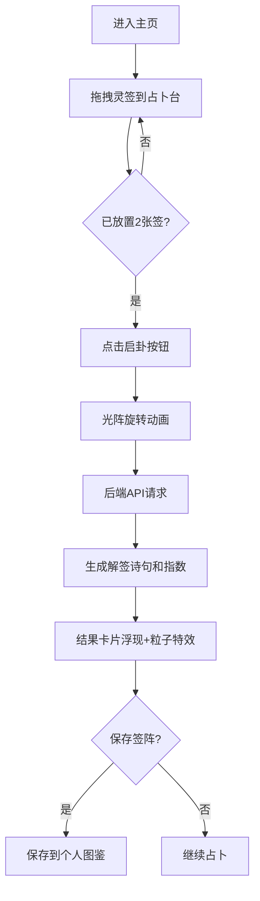

## 1. 产品概述
"灵签·心象簿"是一款融合神秘占卜与现代心理分析的全栈Web应用。用户扮演心灵占卜师，通过拖拽不同类型的灵签到占卜台组合阵型，获得个性化解签诗句和心理指数，并可保存、查看历史记录与周报。
- 核心价值：提供沉浸式的占卜体验，结合心理指数帮助用户自我觉察
- 目标用户：喜欢神秘学、心理学、寻求自我探索的年轻人群

## 2. 核心功能

### 2.1 用户角色
| 角色 | 注册方式 | 核心权限 |
|------|----------|----------|
| 普通用户 | 无需注册，本地存储 | 每日5次占卜、保存签阵、查看历史和周报 |

### 2.2 功能模块
1. **占卜台主页**：灵签仓库、拖拽占卜、启卦动画、结果展示
2. **个人图鉴**：已保存的签阵列表、详情查看
3. **历史记录**：最近5条签阵、历史统计图表
4. **心象周报**：每周雷达图、关键词云、数据分析

### 2.3 页面详情
| 页面名称 | 模块名称 | 功能描述 |
|----------|----------|----------|
| 占卜台主页 | 灵签仓库 | 三种灵签（心境签、星运签、元素签），拖拽源区域 |
| 占卜台主页 | 占卜台 | 拖放目标区域，显示已放置的签，启卦按钮 |
| 占卜台主页 | 结果卡片 | 显示解签诗句、心理指数、粒子动画、保存按钮 |
| 占卜台主页 | 次数面板 | 显示剩余占卜次数、倒计时恢复 |
| 占卜台主页 | 历史面板 | 最近5条记录，点击展开详情 |
| 个人图鉴 | 签阵列表 | 网格展示已保存签阵，点击查看详情 |
| 心象周报 | 数据可视化 | 雷达图、关键词云、一周数据总结 |

## 3. 核心流程
用户从左侧灵签仓库拖拽两张签到中央占卜台 → 点击"启卦"按钮 → 触发光阵旋转动画和音效 → 后端生成解签诗句和心理指数 → 结果卡片浮现并触发粒子特效 → 用户可保存到图鉴或继续占卜。

## 4. 用户界面设计

### 4.1 设计风格
- **主色调**：星河紫 `#6a0dad`、星芒金 `#ffd700`
- **背景**：深空渐变 `#0a0a2e` → `#1a1a3e`
- **卡片**：半透明毛玻璃效果（backdrop-filter: blur(12px)），微光描边（1px solid rgba(255,215,0,0.3)）
- **按钮**：渐变金色（linear-gradient(135deg, #ffd700, #ffaa00)），悬停发光（box-shadow: 0 0 20px rgba(255,215,0,0.6)），上浮动画（transform: translateY(-2px)）
- **字体**：标题使用 Cinzel Decorative（神秘衬线字体），正文使用 Noto Sans SC
- **图标**：使用神秘符号图标（月亮、星星、火焰、水滴等）
- **整体风格**：神秘星空+赛博占卜风，融合古典玄学与未来科技感

### 4.2 页面设计概述
| 页面名称 | 模块名称 | UI元素 |
|----------|----------|--------|
| 占卜台主页 | 灵签仓库 | 三列布局，每种签不同颜色（心境签：紫#9b59b6、星运签：蓝#3498db、元素签：绿#2ecc71），卡片带微光动效 |
| 占卜台主页 | 占卜台 | 中央大区域，虚线边框（2px dashed rgba(255,215,0,0.5)），微弱光晕（box-shadow: 0 0 40px rgba(106,13,173,0.4)），圆形光阵背景 |
| 占卜台主页 | 次数面板 | 右上角，数字+进度条，倒计时显示 |
| 占卜台主页 | 历史面板 | 右下角，可折叠，最近5条缩略 |
| 占卜台主页 | 结果卡片 | 中央弹出，缓缓浮现，带微光边框，诗句竖排展示 |

### 4.3 响应式
- **PC端**（≥1200px）：三栏布局，左仓库（300px）+ 中央占卜台（自适应）+ 右面板（280px）
- **平板端**（768px-1199px）：上下布局，上方占卜台，下方灵签仓库和面板并排
- **触屏优化**：支持触摸拖拽，增加拖拽区域热区，按钮最小尺寸44×44px

### 4.4 动画与特效
- **拖拽**：卡片跟随鼠标，缩放1.05倍，半透明
- **放置**：'咚'震动反馈（navigator.vibrate），卡片吸附动画
- **启卦**：中央旋转光阵（2秒），占卜台光晕脉动
- **结果**：卡片opacity从0到1，translateY从20px到0
- **粒子**：彩色光点从签上飘散，数量≤200，60fps流畅
- **音效**：放置'咚'声、启卦空灵合成音、保存'叮'声
