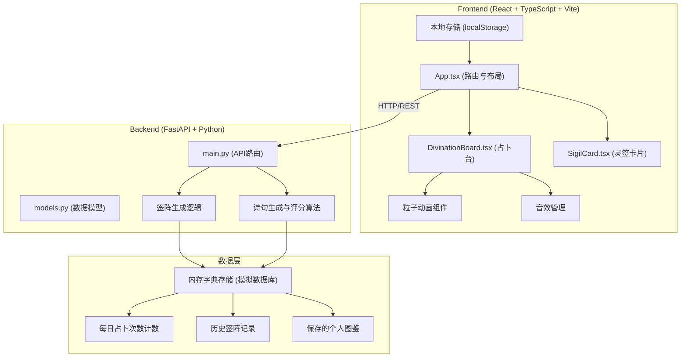
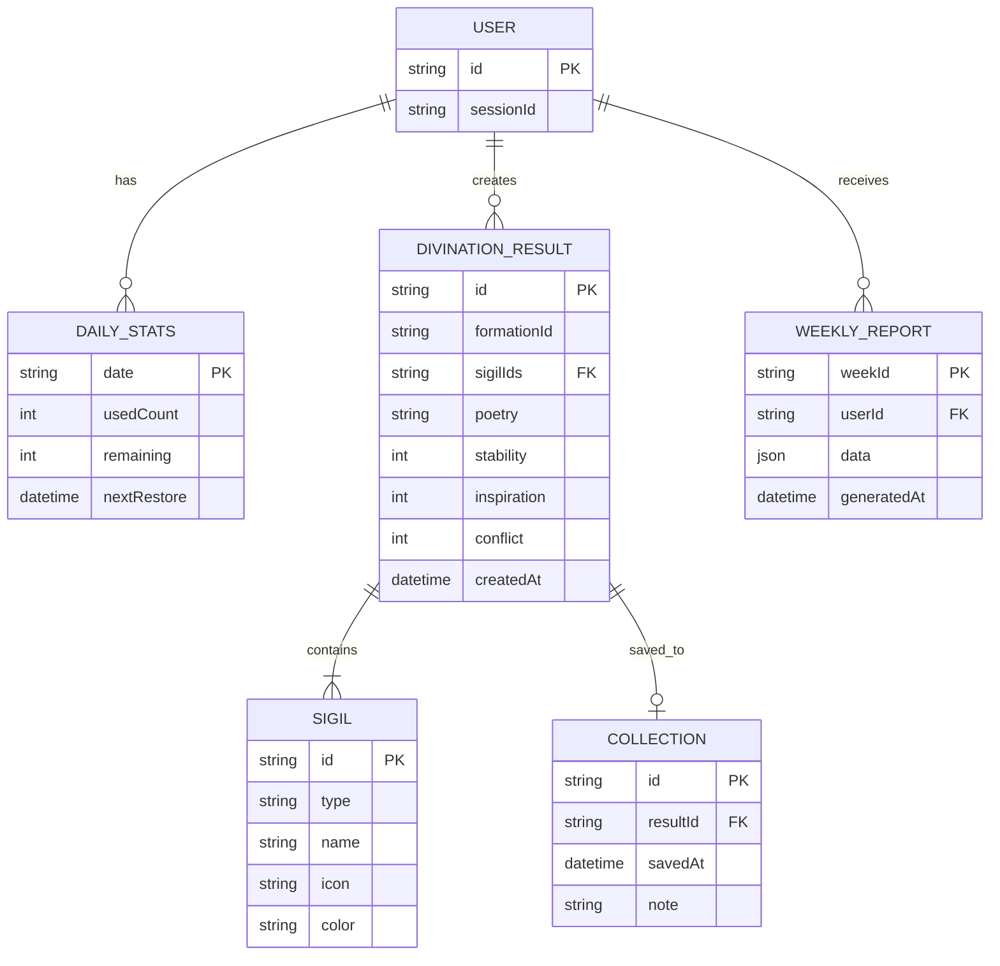

## 1. 架构设计



## 2. 技术描述

### 2.1 前端技术栈
- **框架**：React 18 + TypeScript 5
- **构建工具**：Vite 5
- **样式**：CSS Modules + CSS Variables（主题系统）
- **路由**：React Router DOM 6
- **拖拽**：原生 HTML5 Drag and Drop API + 触摸事件兼容
- **动画**：CSS Animations + requestAnimationFrame（粒子系统）
- **图表**：Recharts（雷达图、统计图表）
- **状态管理**：React useState + useReducer（轻量级）
- **本地存储**：localStorage（用户数据持久化）

### 2.2 后端技术栈
- **Web框架**：FastAPI 0.109+
- **ASGI服务器**：Uvicorn 0.27+
- **数据验证**：Pydantic 2
- **CORS**：FastAPI CORSMiddleware
- **数据存储**：Python 字典（内存存储，模拟数据库）

### 2.3 初始化命令
```bash
# 前端
npm create vite@latest . -- --template react-ts
npm install react-router-dom recharts

# 后端
pip install fastapi uvicorn pydantic
```

## 3. 目录结构

```
auto306/
├── frontend/
│   ├── src/
│   │   ├── components/
│   │   │   ├── DivinationBoard.tsx    # 占卜台主组件
│   │   │   ├── SigilCard.tsx          # 灵签卡片组件
│   │   │   ├── SigilWarehouse.tsx     # 灵签仓库组件
│   │   │   ├── ResultCard.tsx         # 结果展示卡片
│   │   │   ├── ParticleEffect.tsx     # 粒子动画组件
│   │   │   ├── CountdownPanel.tsx     # 次数倒计时面板
│   │   │   ├── HistoryPanel.tsx       # 历史记录面板
│   │   │   ├── CollectionPage.tsx     # 个人图鉴页面
│   │   │   └── WeeklyReport.tsx       # 心象周报页面
│   │   ├── hooks/
│   │   │   ├── useDragAndDrop.ts      # 拖拽逻辑Hook
│   │   │   ├── useAudio.ts            # 音效管理Hook
│   │   │   └── useLocalStorage.ts     # 本地存储Hook
│   │   ├── utils/
│   │   │   ├── api.ts                 # API请求封装
│   │   │   ├── particles.ts           # 粒子系统工具
│   │   │   └── audio.ts               # 音效合成工具
│   │   ├── types/
│   │   │   └── index.ts               # TypeScript类型定义
│   │   ├── App.tsx                    # 主应用组件
│   │   ├── main.tsx                   # 入口文件
│   │   └── index.css                  # 全局样式与主题变量
├── backend/
│   ├── main.py                        # FastAPI主文件
│   ├── models.py                      # Pydantic数据模型
│   └── utils/
│       ├── divination.py              # 签阵生成逻辑
│       ├── poetry.py                  # 诗句生成算法
│       └── scoring.py                 # 心理指数评分
├── index.html                         # Vite入口HTML
├── package.json                       # 前端依赖
├── tsconfig.json                      # TypeScript配置
├── vite.config.ts                     # Vite配置
└── requirements.txt                   # Python后端依赖
```

## 4. 路由定义

| 路由 | 页面 | 功能 |
|------|------|------|
| `/` | 占卜台主页 | 核心占卜功能 |
| `/collection` | 个人图鉴 | 已保存签阵列表 |
| `/history` | 历史记录 | 全部历史签阵与统计 |
| `/weekly` | 心象周报 | 每周数据分析报告 |

## 5. API 定义

### 5.1 类型定义（TypeScript）

```typescript
// 灵签类型
type SigilType = 'mood' | 'star' | 'element';

interface Sigil {
  id: string;
  type: SigilType;
  name: string;
  icon: string;
  color: string;
  description: string;
}

interface DivinationFormation {
  id: string;
  sigils: [Sigil, Sigil];
  timestamp: number;
}

interface DivinationResult {
  id: string;
  formation: DivinationFormation;
  poetry: string;
  interpretation: string;
  indices: {
    stability: number;    // 安定值 0-100
    inspiration: number;  // 灵感值 0-100
    conflict: number;     // 冲突值 0-100
  };
  createdAt: string;
}

interface DailyStats {
  remaining: number;      // 剩余次数
  nextRestore: number;    // 下次恢复时间戳
  totalToday: number;     // 今日已使用次数
}

interface WeeklyReport {
  weekStart: string;
  weekEnd: string;
  averageIndices: {
    stability: number;
    inspiration: number;
    conflict: number;
  };
  sigilFrequency: Record<string, number>;
  keywords: string[];
  formations: DivinationResult[];
}
```

### 5.2 API 接口

| 方法 | 路径 | 请求 | 响应 | 描述 |
|------|------|------|------|------|
| POST | `/api/divination` | `{ sigils: [Sigil, Sigil] }` | `DivinationResult` | 生成占卜结果 |
| POST | `/api/save` | `{ result: DivinationResult }` | `{ success: boolean; id: string }` | 保存签阵到图鉴 |
| GET | `/api/collection` | - | `DivinationResult[]` | 获取个人图鉴列表 |
| GET | `/api/history` | `?limit=5` | `DivinationResult[]` | 获取历史记录 |
| GET | `/api/daily-stats` | - | `DailyStats` | 获取每日占卜状态 |
| GET | `/api/weekly-report` | `?week=2026-W24` | `WeeklyReport` | 获取心象周报 |
| DELETE | `/api/collection/:id` | - | `{ success: boolean }` | 删除保存的签阵 |

## 6. 数据模型

### 6.1 实体关系图



### 6.2 内存数据结构（Python）

```python
# backend/models.py 中定义的存储结构
storage = {
    "sessions": {
        "session_id": {
            "daily_stats": {
                "date": "2026-06-10",
                "used": 3,
                "remaining": 2,
                "next_restore": 1718000000
            },
            "history": [],       # 历史占卜记录列表
            "collection": [],    # 保存的签阵列表
            "weekly_reports": {} # 周报数据
        }
    },
    "sigils": {
        "mood": [...],      # 心境签池
        "star": [...],      # 星运签池
        "element": [...]    # 元素签池
    }
}
```

## 7. 核心算法

### 7.1 签阵生成算法
- 基于两张灵签的类型组合，使用加权随机算法生成诗句
- 心理指数根据签的属性通过公式计算：`指数 = 基础分 + 组合加成 + 随机扰动`

### 7.2 诗句模板库
- 预置50+诗句模板，根据签的类型和组合匹配最合适的模板
- 支持关键词替换，使每次结果都有独特性

### 7.3 粒子系统
- 使用 Canvas 2D 实现，粒子数动态控制在 100-200 之间
- 采用对象池模式复用粒子对象，避免频繁 GC
- requestAnimationFrame 驱动，确保 60fps 流畅度
