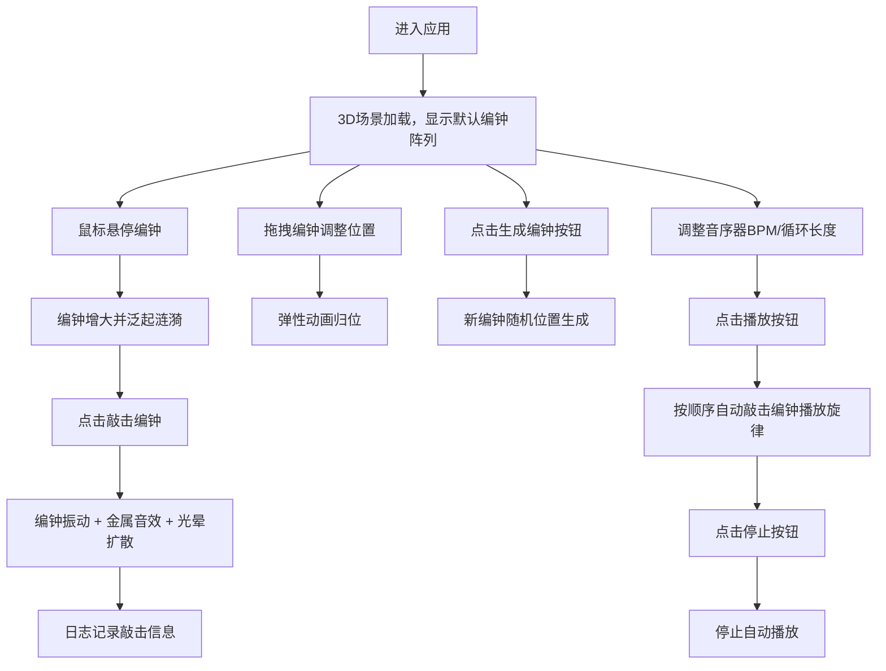

## 1. 产品概述

"流光编钟"是一款融合古代编钟文化与现代数字技术的3D交互可视化音乐创作应用。用户化身为数字时代的乐师，在三维空间中悬挂、敲击虚拟编钟，创作属于自己的旋律。

- **核心价值**：将中国古代青铜编钟的文化底蕴与现代数字交互技术结合，提供沉浸式音乐创作体验
- **目标用户**：音乐爱好者、数字艺术创作者、教育工作者及普通大众
- **独特性**：古铜流光视觉风格 + 物理仿真音效 + 实时3D交互 + 音序器自动演奏

## 2. 核心功能

### 2.1 功能模块

1. **3D编钟场景**：三维空间中的编钟阵列，支持视角旋转、缩放
2. **编钟交互系统**：点击敲击、拖拽悬挂、悬停反馈
3. **音效引擎**：基于Web Audio API的金属音色合成
4. **音序器系统**：BPM控制、循环长度设置、自动播放
5. **控制面板**：编钟生成、视角重置、播放/停止
6. **旋律日志**：记录最近敲击信息

### 2.2 页面详情

| 页面名称 | 模块名称 | 功能描述 |
|-----------|-------------|---------------------|
| 主界面 | 3D场景区域 | 全屏Three.js场景，编钟阵列显示，鼠标拖拽旋转视角，滚轮缩放 |
| 主界面 | 控制面板 | 左下角半透明毛玻璃面板，包含编钟生成按钮、BPM滑块、循环长度滑块、重置视角按钮、播放/停止开关 |
| 主界面 | 旋律日志面板 | 右下角面板，显示最近5次敲击的编钟编号、音高和节拍位置 |

## 3. 核心流程

### 用户操作流程

## 4. 用户界面设计

### 4.1 设计风格

**古铜流光风**：
- **主色调**：古铜金 `#b87333`，翡翠绿 `#00c853`
- **背景渐变**：深棕 `#1a0f0a` → 暗金 `#2d1f14`
- **编钟质感**：青铜氧化纹理，金属高光
- **光晕效果**：暖金色半透明粒子
- **控件样式**：圆角金属质感，柔和发光边框
- **字体**：标题使用衬线字体体现古典韵味，正文使用现代无衬线字体

### 4.2 页面设计概述

| 页面名称 | 模块名称 | UI元素 |
|-----------|-------------|-------------|
| 主界面 | 3D场景 | 编钟阵列（青铜材质、流动裂纹纹理、缓慢自旋）、光晕粒子、背景渐变、环境光 |
| 主界面 | 控制面板 | 毛玻璃背景 `backdrop-filter: blur(12px)`、古铜金色按钮、发光边框、滑块控件、开关按钮 |
| 主界面 | 旋律日志 | 半透明深色面板、等宽字体显示敲击记录、时间戳高亮 |

### 4.3 交互反馈

- **悬停**：编钟微微增大（1.1倍），表面泛起涟漪动画
- **点击**：敲击瞬间振动模糊效果，音波粒子扩散，音效同步播放
- **拖拽**：编钟跟随鼠标，释放时有弹性缓动动画
- **按钮**：悬停发光增强，点击有缩放反馈

### 4.4 3D场景设计

- **环境**：深棕到暗金的径向渐变背景，轻微雾效增加纵深感
- **光照**：主光源（暖金色）+ 环境光（柔和）+ 点光源（编钟自发光）
- **相机**：PerspectiveCamera，初始距离15单位，支持OrbitControls
- **编钟模型**：自定义几何体（钟形），青铜PBR材质，法线贴图模拟裂纹，顶点动画实现振动
- **后处理**：Bloom发光效果，轻微色彩分级
- **性能优化**：InstancedMesh处理多个编钟，几何体合并，LOD策略

## 5. 性能要求

- 帧率稳定在60fps
- 编钟数量达到30个时仍流畅运行
- 内存占用控制在500MB以内
- 首次加载时间 < 3秒
