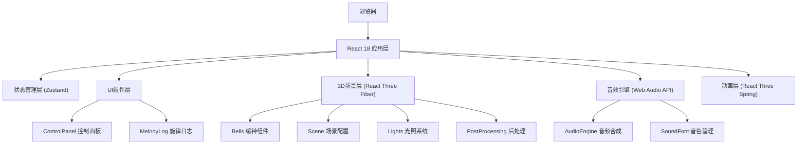

## 1. 架构设计



## 2. 技术栈

### 2.1 核心依赖

| 库名称 | 版本 | 用途 |
|--------|------|------|
| react | ^18.2.0 | UI框架 |
| react-dom | ^18.2.0 | DOM渲染 |
| three | ^0.160.0 | 3D渲染引擎 |
| @react-three/fiber | ^8.15.0 | React Three.js绑定 |
| @react-three/drei | ^9.92.0 | R3F实用组件库 |
| @react-three/postprocessing | ^2.15.0 | 后处理效果 |
| @react-three/spring | ^6.0.0 | 物理动画 |
| zustand | ^4.4.0 | 状态管理 |
| typescript | ^5.3.0 | 类型系统 |
| vite | ^5.0.0 | 构建工具 |
| tailwindcss | ^3.4.0 | CSS框架 |
| lucide-react | ^0.294.0 | 图标库 |

### 2.2 开发依赖

| 库名称 | 版本 | 用途 |
|--------|------|------|
| @types/react | ^18.2.0 | React类型定义 |
| @types/react-dom | ^18.2.0 | ReactDOM类型定义 |
| @types/three | ^0.160.0 | Three.js类型定义 |
| @vitejs/plugin-react | ^4.2.0 | Vite React插件 |

## 3. 文件结构

```
.
├── index.html                     # 入口HTML
├── package.json                   # 项目配置
├── tsconfig.json                  # TypeScript配置
├── vite.config.js                 # Vite配置
├── tailwind.config.js             # Tailwind配置
├── postcss.config.js              # PostCSS配置
└── src/
    ├── main.tsx                   # React入口
    ├── App.tsx                    # 主应用组件
    ├── store/
    │   └── useStore.ts            # Zustand状态管理
    ├── scene/
    │   ├── Bells.tsx              # 编钟组件
    │   ├── Scene.tsx              # 3D场景
    │   ├── AudioEngine.ts         # 音效引擎
    │   └── types.ts               # 3D相关类型
    ├── ui/
    │   ├── ControlPanel.tsx       # 控制面板
    │   ├── MelodyLog.tsx          # 旋律日志
    │   └── components/
    │       ├── GlassPanel.tsx     # 毛玻璃面板
    │       ├── Slider.tsx         # 滑块组件
    │       └── Button.tsx         # 按钮组件
    ├── hooks/
    │   ├── useSequencer.ts        # 音序器Hook
    │   └── useBellInteraction.ts  # 编钟交互Hook
    ├── utils/
    │   ├── bellGeometry.ts        # 编钟几何工具
    │   └── audioUtils.ts          # 音频工具函数
    └── styles/
        └── index.css              # 全局样式
```

## 4. 核心数据模型

### 4.1 编钟数据结构

```typescript
interface Bell {
  id: string;
  position: [number, number, number];
  rotation: [number, number, number];
  scale: number;
  note: string;      // 音名 (C4, D5, etc.)
  frequency: number; // 频率 Hz
  isHit: boolean;    // 是否被敲击
  hitTime: number;   // 敲击时间戳
}
```

### 4.2 音序器状态

```typescript
interface SequencerState {
  isPlaying: boolean;
  bpm: number;
  loopLength: number;  // 拍数
  currentBeat: number;
  sequence: { bellId: string; beat: number }[];
}
```

### 4.3 敲击日志

```typescript
interface HitLog {
  id: string;
  bellId: string;
  note: string;
  beatPosition: number;
  timestamp: number;
}
```

## 5. 状态管理

使用 Zustand 管理全局状态：

```typescript
// store/useStore.ts
import { create } from 'zustand';

interface AppState {
  bells: Bell[];
  sequencer: SequencerState;
  hitLogs: HitLog[];
  addBell: (bell: Bell) => void;
  updateBell: (id: string, updates: Partial<Bell>) => void;
  hitBell: (id: string) => void;
  setBpm: (bpm: number) => void;
  setLoopLength: (length: number) => void;
  togglePlay: () => void;
  resetCamera: () => void;
  addHitLog: (log: HitLog) => void;
}

export const useStore = create<AppState>((set) => ({
  // ... 状态和操作方法
}));
```

## 6. 核心模块说明

### 6.1 音效引擎 (AudioEngine.ts)

- 使用 Web Audio API 合成金属音色
- 采用 FM 合成或加法合成模拟编钟泛音
- 包含 ADSR 包络控制
- 支持混响效果增强空间感

### 6.2 编钟组件 (Bells.tsx)

- 自定义钟形几何体 (LatheGeometry)
- PBR 青铜材质，带法线贴图和金属度
- 顶点着色器实现裂纹纹理流动
- 物理动画实现振动和自旋
- 射线检测处理点击/悬停/拖拽

### 6.3 音序器 Hook (useSequencer.ts)

- 使用 requestAnimationFrame 实现精确节拍
- 根据 BPM 计算每拍时间间隔
- 自动播放时按序触发编钟敲击
- 支持实时调整 BPM 和循环长度

## 7. 性能优化策略

1. **几何体优化**：使用 InstancedMesh 渲染多个编钟
2. **材质复用**：共享材质实例，减少绘制调用
3. **动画优化**：使用 shader 动画替代 JS 动画
4. **事件节流**：鼠标移动事件使用 requestAnimationFrame 节流
5. **内存管理**：及时 dispose 不再使用的几何体和材质
6. **LOD 策略**：远景编钟使用简化几何体
