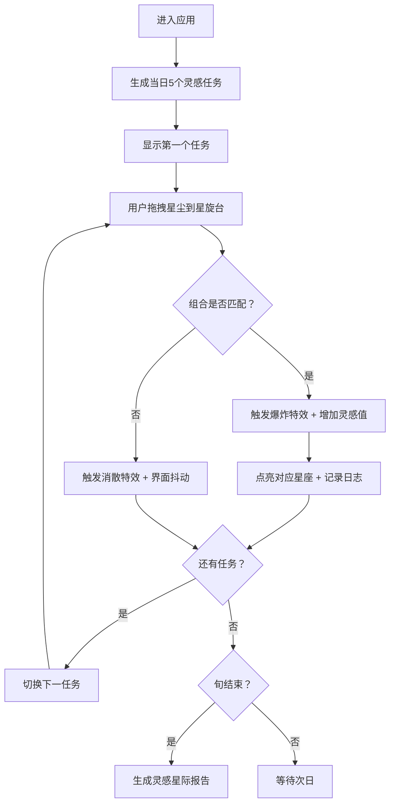

## 1. 产品概述
「星语便签·灵感星际」是一款以星际为主题的创意灵感收集游戏，用户扮演星际灵感收集者，通过拖拽不同颜色的星尘组合出灵感碎片，在限时任务中获取灵感值。产品通过沉浸式的银河视觉风格和即时反馈的交互体验，帮助用户在游戏化场景中激发创意灵感。

- 目标用户：创意工作者、学生、需要灵感激发的各类人群
- 产品价值：将创意训练转化为有趣的星际探索游戏，通过视觉化、游戏化的方式培养用户的组合思维和创意联想能力

## 2. 核心功能

### 2.1 用户角色
| 角色 | 注册方式 | 核心权限 |
|------|----------|----------|
| 灵感收集者 | 无需注册，本地会话 | 拖拽星尘、完成任务、查看报告 |

### 2.2 功能模块
1. **星图主界面**：Canvas星图画布、星尘拖拽交互、粒子特效渲染
2. **星尘仓库**：五色星尘展示（红、蓝、金、紫、绿）、稀有度标签、拖拽手柄
3. **任务面板**：每日5个随机灵感任务、2分钟倒计时、完成进度条
4. **灵感日志**：最近5次灵感记录、星尘组合展示、得分显示
5. **旬报告系统**：完成度统计、灵感值分析、柱状图展示、成就徽章

### 2.3 页面详情
| 页面名称 | 模块名称 | 功能描述 |
|----------|----------|----------|
| 主界面 | 星图Canvas | 渲染深空背景、星旋台、拖拽星尘、粒子爆炸特效 |
| 主界面 | 星尘仓库 | 左侧网格展示五色星尘，支持拖拽操作，显示稀有度 |
| 主界面 | 任务面板 | 右上角显示当前任务需求、倒计时、进度条，任务结束自动切换 |
| 主界面 | 灵感日志 | 右下角显示最近5次灵感的名称、组合、得分 |
| 报告弹窗 | 旬报告 | 每旬结束显示完成度柱状图、灵感值统计、成就徽章 |

## 3. 核心流程
用户进入应用后，系统自动生成当日5个灵感任务。用户从左侧星尘仓库拖拽星尘到中央星旋台，系统检测星尘组合是否匹配当前任务需求：
- 匹配成功：触发金色粒子爆炸特效，增加灵感值，对应星座点亮，记录到灵感日志
- 匹配失败：触发灰色消散粒子，界面轻微抖动，播放消散音效
- 倒计时结束：未完成则任务失败，播放急促滴答声，切换下一任务
- 每旬（10天）结束：生成《灵感星际报告》，展示统计数据和成就徽章

## 4. 用户界面设计

### 4.1 设计风格
- **主色调**：星尘紫 `#9b59b6`、星辉蓝 `#3498db`
- **背景色**：深空渐变 `#0b0b2e` 到 `#1a1a4e`
- **星尘颜色**：红 `#e74c3c`、蓝 `#3498db`、金 `#f1c40f`、紫 `#9b59b6`、绿 `#2ecc71`
- **控件风格**：圆角毛玻璃效果（`backdrop-filter: blur(10px)` + 半透明背景）
- **字体**：标题使用 Orbitron（科技感字体），正文使用 Noto Sans SC
- **动画**：星尘微弱发光和旋转动画、拖拽流光尾迹、成功金色光环、失败抖动效果
- **图标**：使用 Lucide React 图标库，配合自定义星尘图标

### 4.2 页面设计概述
| 页面名称 | 模块名称 | UI元素 |
|----------|----------|--------|
| 主界面 | 星图Canvas | 深空渐变背景、星旋台（中央发光圆环）、12星座点位、粒子系统 |
| 主界面 | 星尘仓库 | 2×3网格布局、五色星尘卡片、稀有度标签（普通/稀有/传说）、拖拽手柄 |
| 主界面 | 任务面板 | 毛玻璃卡片、任务名称、星尘需求图标、倒计时圆环、进度条 |
| 主界面 | 灵感日志 | 毛玻璃卡片、时间轴布局、灵感名称标签、星尘组合小图标、得分数字 |
| 报告弹窗 | 旬报告 | 模态框、柱状图（Chart.js）、成就徽章网格、统计数据卡片 |

### 4.3 响应性
- **桌面端（≥1200px）**：左侧星尘仓库 + 中央星图 + 右侧任务面板和日志面板四栏布局
- **平板端（768px-1199px）**：底部星尘仓库 + 中央星图（缩小比例） + 右上角任务面板 + 右下角日志面板
- **移动端（<768px）**：暂不支持，提示用户使用桌面端或平板设备

### 4.4 视觉特效细节
- **拖拽反馈**：星尘跟随鼠标放大1.2倍，轻微抖动，尾部产生流光粒子
- **成功特效**：金色漩涡爆炸（300粒子），全屏金色光环闪过，显示"灵感诞生！"文字
- **失败特效**：灰色消散粒子（100粒子），界面translate抖动，显示"星尘消散..."文字
- **音效**：Web Audio API生成合成音——碰撞（短促中音）、成功（上升琶音）、失败（下降音阶）、倒计时滴答（高频短促）
