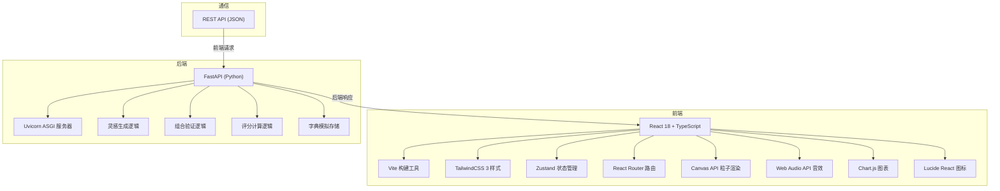
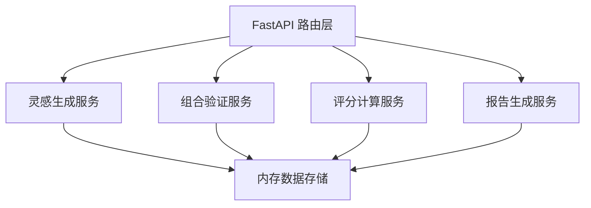

## 1. 架构设计


## 2. 技术描述
- **前端**：React 18 + TypeScript 5 + Vite 5 + TailwindCSS 3
- **状态管理**：Zustand（轻量级状态管理，管理游戏状态、任务、得分）
- **图表库**：Chart.js + react-chartjs-2（旬报告柱状图）
- **图标库**：Lucide React
- **后端**：FastAPI 0.100+ + Python 3.10+
- **ASGI服务器**：Uvicorn
- **数据存储**：后端内存字典模拟，前端localStorage持久化会话数据
- **初始化工具**：Vite react-ts 模板

## 3. 目录结构
```
auto312/
├── src/
│   ├── components/
│   │   ├── StarMap.tsx          # Canvas星图组件（拖拽、粒子、渲染）
│   │   ├── StarDustPanel.tsx    # 星尘仓库面板
│   │   ├── TaskPanel.tsx        # 任务面板（倒计时、进度）
│   │   ├── InspirationLog.tsx   # 灵感日志面板
│   │   ├── TenDayReport.tsx     # 旬报告弹窗
│   │   └── ui/                  # 通用UI组件
│   ├── store/
│   │   └── useGameStore.ts      # Zustand游戏状态管理
│   ├── hooks/
│   │   ├── useDragAndDrop.ts    # 拖拽逻辑hook
│   │   ├── useCountdown.ts      # 倒计时hook
│   │   └── useAudio.ts          # 音效hook
│   ├── api/
│   │   └── combineLogic.ts      # 后端API封装
│   ├── types/
│   │   └── index.ts             # TypeScript类型定义
│   ├── utils/
│   │   ├── particleSystem.ts    # 粒子系统
│   │   └── audioEngine.ts       # Web Audio引擎
│   ├── App.tsx                  # 主组件（布局、路由）
│   ├── main.tsx                 # 应用入口
│   └── index.css                # 全局样式（Tailwind指令、自定义主题）
├── backend/
│   ├── main.py                  # FastAPI入口
│   └── requirements.txt         # Python依赖
├── index.html                   # HTML入口
├── package.json                 # 前端依赖
├── tsconfig.json                # TypeScript配置
├── vite.config.js               # Vite配置
└── tailwind.config.js           # Tailwind配置
```

## 4. 路由定义
| 路由 | 用途 |
|------|------|
| `/` | 主游戏界面（星图、任务、星尘仓库、日志） |

## 5. API 定义
```typescript
// 类型定义
type StarDustColor = 'red' | 'blue' | 'gold' | 'purple' | 'green';

interface StarDust {
  id: string;
  color: StarDustColor;
  rarity: 'common' | 'rare' | 'legendary';
  name: string;
}

interface InspirationTask {
  id: string;
  name: string;
  description: string;
  requiredColors: StarDustColor[];
  constellation: string;
  points: number;
  timeLimit: number;
}

interface InspirationLogEntry {
  id: string;
  taskName: string;
  combination: StarDustColor[];
  success: boolean;
  points: number;
  timestamp: number;
}

interface TenDayReport {
  periodStart: string;
  periodEnd: string;
  totalTasks: number;
  completedTasks: number;
  totalPoints: number;
  dailyBreakdown: { date: string; completed: number; points: number }[];
  achievements: { id: string; name: string; description: string; icon: string }[];
}

interface CombineRequest {
  taskId: string;
  colors: StarDustColor[];
}

interface CombineResponse {
  success: boolean;
  points: number;
  message: string;
  constellation: string;
}

// API端点
GET  /api/tasks              # 获取当日任务列表
POST /api/combine            # 提交星尘组合验证
GET  /api/report?period=10   # 获取旬报告
GET  /api/stardust           # 获取星尘列表
```

## 6. 后端服务架构


### 后端模块说明
1. **main.py**：FastAPI应用入口，包含所有路由
2. **数据模型**：
   - `tasks_db`：存储每日生成的任务
   - `inspiration_db`：存储灵感组合配方
   - `user_progress`：存储用户进度和得分
   - `constellations`：12星座数据和点亮状态
3. **核心逻辑**：
   - `generate_daily_tasks()`：随机生成5个灵感任务
   - `validate_combination(task_id, colors)`：验证星尘组合是否匹配
   - `calculate_score(task_id, time_remaining)`：根据剩余时间计算得分
   - `generate_ten_day_report(user_id)`：生成旬统计报告

## 7. 状态管理设计
```typescript
// Zustand store
interface GameState {
  currentTask: InspirationTask | null;
  tasks: InspirationTask[];
  taskIndex: number;
  timeRemaining: number;
  totalPoints: number;
  completedConstellations: string[];
  inspirationLog: InspirationLogEntry[];
  placedStardust: StarDust[];
  isDragging: boolean;
  dragPosition: { x: number; y: number };
  draggedStardust: StarDust | null;
  showReport: boolean;
  tenDayReport: TenDayReport | null;
  shakeScreen: boolean;
  successFlash: boolean;
  
  // Actions
  setCurrentTask: (task: InspirationTask) => void;
  nextTask: () => void;
  updateTime: (time: number) => void;
  addPoints: (points: number) => void;
  addLogEntry: (entry: InspirationLogEntry) => void;
  placeStardust: (stardust: StarDust) => void;
  clearPlatform: () => void;
  setDragging: (dragging: boolean, stardust: StarDust | null, pos: { x: number; y: number }) => void;
  triggerSuccess: () => void;
  triggerFailure: () => void;
  openReport: (report: TenDayReport) => void;
  closeReport: () => void;
}
```

## 8. 性能优化策略
1. **Canvas渲染优化**：
   - 使用 `requestAnimationFrame` 驱动渲染循环
   - 粒子对象池复用，避免频繁GC
   - 粒子数量上限500，超出自动清除最早粒子
   - 离屏Canvas预渲染星尘图标

2. **拖拽性能**：
   - 使用 `pointerevents` 替代 `mousemove`
   - 节流拖拽事件处理（每16ms一次）
   - CSS `transform` 硬件加速

3. **React优化**：
   - 组件拆分，使用 `React.memo` 避免不必要重渲染
   - Zustand 选择器订阅特定状态片段
   - 使用 `useCallback` 缓存事件处理函数

## 9. 后端数据结构
```python
# 灵感配方库 - 灵感名称 -> 所需星尘颜色
INSPIRATION_RECIPES = {
    "创意风暴": ["red", "blue"],
    "智慧之泉": ["blue", "purple"],
    "财富之光": ["gold", "green"],
    "热情之火": ["red", "red", "gold"],
    "自然和谐": ["green", "blue"],
    "神秘力量": ["purple", "purple", "gold"],
    # ... 更多配方
}

# 星座数据
CONSTELLATIONS = [
    {"id": "aries", "name": "白羊座", "position": {"x": 0.2, "y": 0.3}},
    {"id": "taurus", "name": "金牛座", "position": {"x": 0.5, "y": 0.2}},
    # ... 其余星座
]
```
