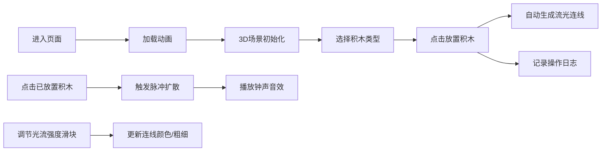

## 1. 产品概述
「幻光积木·构筑之诗」是一款3D交互可视化创意工具，让用户化身为光影建筑师，在三维空间中自由搭建抽象发光建筑。通过拖拽放置半透明发光几何体，创造出流动的光效艺术作品。

- **核心价值**：提供沉浸式的创意搭建体验，结合视觉与听觉的双重感官反馈
- **目标用户**：创意设计师、艺术爱好者、喜欢视觉实验的普通用户
- **市场定位**：Web端轻量级3D艺术创作工具，无需安装即可体验

## 2. 核心功能

### 2.1 用户角色
无需注册，打开即用的单用户体验。

### 2.2 功能模块
1. **3D场景主界面**：全屏Three.js渲染场景，视角控制，积木渲染
2. **积木控制系统**：三种几何体（立方体、球体、四面体）的生成、放置、选中与删除
3. **流光连线系统**：相邻积木间自动生成动态流光连线
4. **脉冲交互系统**：点击积木触发涟漪式彩色脉冲扩散与钟声音效
5. **控制面板**：积木类型选择、光流强度调节、视角重置、全屏切换
6. **建筑日志**：记录最近6次操作的积木信息

### 2.3 页面详情
| 页面名称 | 模块名称 | 功能描述 |
|-----------|-------------|---------------------|
| 主界面 | 3D场景模块 | 全屏渲染3D空间，支持鼠标拖拽旋转、滚轮缩放 |
| 主界面 | 控制面板 | 左下角半透明毛玻璃面板，积木按钮、光流滑块、重置与全屏按钮 |
| 主界面 | 建筑日志 | 右下角面板，显示最近6次操作记录 |
| 主界面 | 加载动画 | 入口页面加载动画，提升仪式感 |

## 3. 核心流程
用户进入页面 → 等待加载动画完成 → 3D场景呈现 → 选择积木类型 → 在场景中点击放置积木 → 自动生成相邻连线 → 点击积木触发脉冲效果 → 调节光流强度改变连线效果 → 查看操作日志

## 4. 用户界面设计

### 4.1 设计风格
- **配色主题**：幻光琉璃风
  - 主色：冰蓝 `#00bfff`、粉晶 `#ff6eb4`
  - 背景：深紫黑 `#0a0a1f`
  - 辅助色：渐变发光效果
- **视觉元素**：半透明磨砂质感、柔和内发光、边缘渐变光晕
- **动效风格**：平滑缓动、弹性微动画、缓慢自转、流光效果
- **字体**：选用现代感强的无衬线字体，标题使用细体字营造科技感

### 4.2 页面设计概述
| 页面名称 | 模块名称 | UI Elements |
|-----------|-------------|-------------|
| 主界面 | 3D场景 | 深紫黑背景，柔和环境光，积木半透明带内发光，自转动画 |
| 主界面 | 控制面板 | 毛玻璃半透明效果（backdrop-filter），圆角设计，按钮带磨砂质感，hover有弹性动效 |
| 主界面 | 建筑日志 | 半透明深色背景，每行记录带淡入动画，最新记录高亮显示 |
| 入口 | 加载动画 | 中央发光Logo旋转，进度条流光效果，完成后平滑过渡到主场景 |

### 4.3 响应式
- Desktop-first设计，适配主流桌面分辨率（1280px及以上）
- 控制面板与日志面板固定定位，不随3D视角变化
- 滑块和按钮尺寸适合鼠标操作

### 4.4 3D场景指导
- **环境**：深紫黑背景 + 柔和雾效，营造深邃空间感
- **灯光**：两盏方向光（冰蓝+粉晶）+ 环境光，突出积木的半透明质感
- **相机**：PerspectiveCamera，初始距离适中，支持OrbitControls拖拽旋转和滚轮缩放
- **交互**：Raycaster进行鼠标拾取，拖拽放置有预览半透明效果
- **动效**：积木缓慢自转，连线流光动画，脉冲波扩散效果
- **性能**：限制积木数量60个，帧率目标60fps，使用InstancedMesh优化渲染
