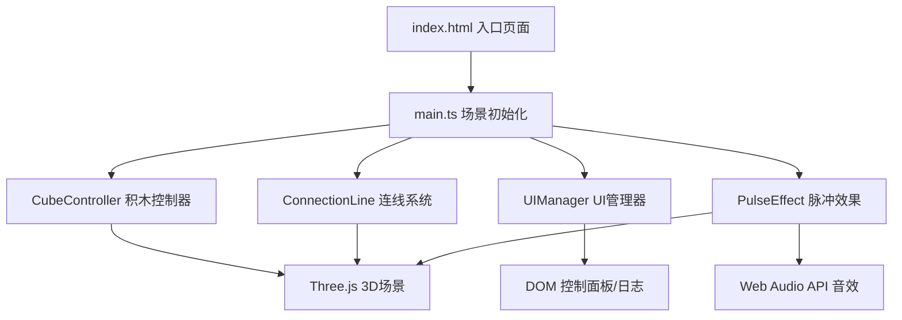

## 1. 架构设计



## 2. 技术描述
- **前端框架**：原生 TypeScript + Three.js
- **构建工具**：Vite 5.x
- **3D引擎**：Three.js 0.160.x
- **类型定义**：@types/three
- **无后端**：纯前端项目，数据存储在内存中
- **音效**：Web Audio API 生成随机钟声音效

## 3. 文件结构
```
项目根目录/
├── package.json          # 项目配置与依赖
├── tsconfig.json         # TypeScript配置（strict模式）
├── vite.config.js        # Vite配置
├── index.html            # 入口页面（含加载动画）
└── src/
    ├── main.ts           # 场景初始化、相机、灯光、渲染循环
    ├── CubeController.ts # 积木生成、放置、删除、选中逻辑
    ├── ConnectionLine.ts # 流光连线的创建、更新、销毁
    ├── UIManager.ts      # 控制面板与日志面板交互绑定
    └── PulseEffect.ts    # 扩散脉冲与音效触发
```

## 4. 核心数据结构

### 4.1 积木数据类型
```typescript
interface Block {
  id: string;
  type: 'cube' | 'sphere' | 'tetrahedron';
  position: { x: number; y: number; z: number };
  color: string;
  mesh: THREE.Mesh;
  rotationSpeed: { x: number; y: number; z: number };
}

interface OperationLog {
  id: string;
  timestamp: number;
  type: 'cube' | 'sphere' | 'tetrahedron';
  position: { x: number; y: number; z: number };
  flowIntensity: number;
  action: 'placed' | 'removed';
}
```

### 4.2 全局配置
```typescript
interface GlobalConfig {
  MAX_BLOCKS: number;      // 60
  BLOCK_SIZE: number;      // 1
  SNAP_GRID: number;       // 1.5
  CONNECTION_DISTANCE: number;  // 2.5
  colors: {
    iceBlue: string;
    pinkCrystal: string;
    background: string;
  };
}
```

## 5. 核心模块说明

### 5.1 main.ts - 主入口
- 初始化Three.js场景、相机、渲染器
- 设置OrbitControls控制器
- 配置环境光和方向光
- 启动渲染循环（requestAnimationFrame）
- 实例化各个功能模块

### 5.2 CubeController.ts - 积木控制器
- 管理积木数组，维护当前选中的积木类型
- 处理鼠标点击放置逻辑（Raycaster射线检测）
- 积木放置时的预览效果
- 积木自动缓慢自转
- 积木删除逻辑（右键或选中后按Delete）
- 超出60个时提示并阻止放置

### 5.3 ConnectionLine.ts - 连线系统
- 实时检测积木间距离，小于阈值时创建连线
- 使用Line + 动态材质实现流光效果
- 光流强度变化时更新连线颜色和粗细
- 积木移动/删除时自动更新连线

### 5.4 UIManager.ts - UI管理器
- 绑定控制面板按钮事件（三种积木按钮、重置视角、全屏切换）
- 绑定光流强度滑块的input事件
- 维护操作日志数组（最多6条）
- 渲染日志面板DOM

### 5.5 PulseEffect.ts - 脉冲效果
- 创建可展开的圆环网格（RingGeometry）
- 点击积木时触发缩放+透明度动画
- 使用Web Audio API创建OscillatorNode生成随机音调
- 连接GainNode控制音量包络，模拟钟声衰减

## 6. 性能优化策略
- 积木几何体和材质复用，避免重复创建
- 使用BufferGeometry减少内存占用
- 连线系统使用空间网格划分，减少距离检测计算量
- 渲染循环中使用clock.getDelta()确保动画速度一致
- 限制更新频率，非必要每2帧更新一次连线检测
