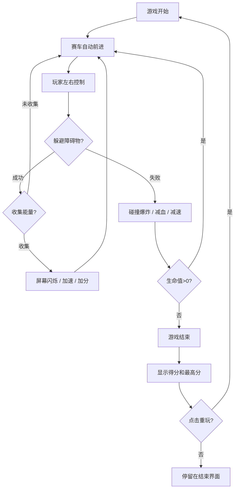

## 1. 产品概述
极速像素漂移是一款霓虹像素风格的无限竞速游戏，玩家操控像素赛车在动态生成的赛道上躲避障碍、收集能量方块，追求极限速度与高分。
- 主要目的：提供快节奏、视觉冲击力强的休闲竞速体验
- 目标用户：喜爱像素风格、霓虹美学和街机竞速游戏的玩家
- 产品价值：碎片化时间即可游玩，通过速度与反应力的挑战带来爽感与成就感

## 2. 核心功能

### 2.1 用户角色
| 角色 | 注册方式 | 核心权限 |
|------|---------|----------|
| 玩家 | 无需注册 | 进行游戏、查看得分、重玩游戏 |

### 2.2 功能模块
1. **主游戏场景**：赛车控制、赛道生成、障碍物系统、能量收集、碰撞检测、计分系统
2. **游戏结束场景**：得分展示、最高分记录、重玩按钮

### 2.3 页面详情
| 页面名称 | 模块名称 | 功能描述 |
|---------|----------|----------|
| 主游戏场景 | 赛车控制 | 左右方向键控制赛车水平移动，收集能量后自动加速 |
| 主游戏场景 | 动态赛道 | 无限分段生成，每段宽度和障碍布局不同，背景色随速度渐变 |
| 主游戏场景 | 障碍物系统 | 静态方块障碍 + 动态激光栅栏，碰撞后触发爆炸并减速 |
| 主游戏场景 | 能量收集 | 随机生成能量方块，收集后屏幕闪烁、得分加倍、速度提升 |
| 主游戏场景 | UI界面 | 顶部显示得分和速度，底部显示3条生命值条 |
| 主游戏场景 | 特效系统 | 赛车拖尾、加速光效、轮胎火星、碰撞爆炸、能量光环 |
| 游戏结束场景 | 结果展示 | 显示本局得分、历史最高分、重玩按钮 |

## 3. 核心流程
玩家进入游戏 → 赛车自动前进 → 按左右键控制赛车躲避障碍物 → 收集能量方块获得加速和加分 → 碰撞障碍物损失生命值 → 生命值耗尽 → 显示得分和重玩选项 → 点击重玩重新开始

## 4. 用户界面设计

### 4.1 设计风格
- **主色调**：深色背景 `#0a0a0f`，霓虹绿 `#00ffaa`，霓虹洋红 `#ff00aa`，辅助色霓虹蓝 `#00aaff`
- **按钮风格**：像素风矩形按钮，霓虹边框发光效果，hover时亮度增强
- **字体**：像素风格等宽字体，大号标题 + 中号正文，数字使用等宽字体
- **布局风格**：全屏游戏画布，UI元素固定在四角和边缘，不遮挡核心游戏区域
- **视觉特效**：霓虹发光、色彩闪烁、屏幕震动、粒子效果、速度线

### 4.2 页面设计概述
| 页面名称 | 模块名称 | UI元素 |
|---------|----------|--------|
| 主游戏场景 | 顶部UI | 左侧显示得分（霓虹绿数字），右侧显示速度（单位km/h，洋红色） |
| 主游戏场景 | 底部UI | 3条像素风格生命条，霓虹绿边框，满血填充渐变绿到蓝 |
| 主游戏场景 | 赛车 | 像素块拼成的赛车，车身霓虹绿，车窗洋红，轮胎深色 |
| 主游戏场景 | 赛道 | 深灰色赛道，两侧霓虹光带，中心虚线快速滚动 |
| 主游戏场景 | 障碍物 | 静态方块为霓虹红，激光栅栏为闪烁的洋红光束 |
| 主游戏场景 | 能量方块 | 旋转的霓虹蓝方块，带发光脉冲效果 |
| 游戏结束场景 | 中心面板 | 半透明深色背景，霓虹边框，显示GAME OVER标题、得分、最高分、重玩按钮 |

### 4.3 响应式
- 桌面端优先，画布按比例缩放适配不同屏幕尺寸
- 键盘操作（← →方向键）为主，暂不考虑移动端触控
- 游戏区域保持固定宽高比，边缘用深色背景填充

### 4.4 游戏场景设计
- **环境氛围**：赛博朋克霓虹风格，深色背景配合发光元素
- **场景动画**：背景色随速度从深蓝渐变到深紫再到深红，营造加速感
- **相机设置**：俯视视角，固定机位，赛车在屏幕下方1/3处
- **光影效果**：所有游戏元素带霓虹发光（glow）效果，加速时整体亮度提升
- **粒子特效**：轮胎火星、碰撞爆炸、能量光环，总数控制在50以内保证60fps
