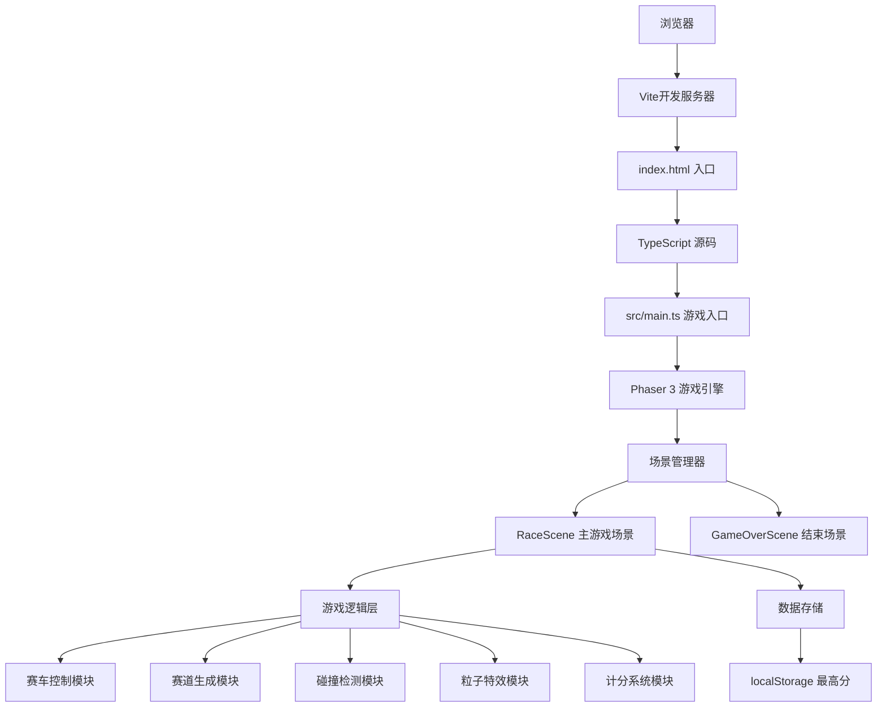

## 1. 架构设计


## 2. 技术描述
- **前端框架**：Phaser 3.80+（2D游戏引擎）
- **开发语言**：TypeScript 5.4+（strict模式）
- **构建工具**：Vite 5.2+
- **类型定义**：Phaser 3 内置 TypeScript 类型
- **数据存储**：localStorage（存储最高分）
- **无后端、无数据库**，纯前端游戏

## 3. 文件结构
```
auto315/
├── index.html                    # 入口页面，包含游戏容器
├── package.json                  # 项目配置和依赖
├── tsconfig.json                 # TypeScript配置（strict模式，ESNext模块）
├── vite.config.js                # Vite配置
└── src/
    ├── main.ts                   # 游戏入口，初始化Phaser和场景
    └── scenes/
        ├── RaceScene.ts          # 主游戏场景
        └── GameOverScene.ts      # 游戏结束场景
```

## 4. 核心类定义

### 4.1 主入口 main.ts
```typescript
import Phaser from 'phaser';
import RaceScene from './scenes/RaceScene';
import GameOverScene from './scenes/GameOverScene';

const config: Phaser.Types.Core.GameConfig = {
    type: Phaser.AUTO,
    width: 800,
    height: 600,
    parent: 'game-container',
    backgroundColor: '#0a0a0f',
    physics: {
        default: 'arcade',
        arcade: {
            gravity: { y: 0 },
            debug: false
        }
    },
    scene: [RaceScene, GameOverScene]
};

new Phaser.Game(config);
```

### 4.2 RaceScene 主游戏场景
- **状态变量**：speed(当前速度)、baseSpeed(基础速度)、score(得分)、lives(生命值)、trackY(赛道滚动位置)
- **游戏对象**：player(赛车)、obstacles(障碍组)、energyBlocks(能量方块组)、trailParticles(拖尾粒子)、explosionParticles(爆炸粒子)
- **核心方法**：
  - `create()`：初始化场景、创建赛车、设置UI、注册键盘事件
  - `update()`：游戏主循环，处理赛道滚动、障碍生成、碰撞检测
  - `createTrackSegment()`：生成赛道分段
  - `spawnObstacle()`：生成障碍物
  - `spawnEnergyBlock()`：生成能量方块
  - `checkCollisions()`：碰撞检测
  - `onHitObstacle()`：处理碰撞障碍物
  - `onCollectEnergy()`：处理收集能量
  - `updateUI()`：更新UI显示
  - `gameOver()`：切换到结束场景

### 4.3 GameOverScene 结束场景
- **核心方法**：
  - `create()`：显示得分、最高分、重玩按钮
  - `restartGame()`：重新开始游戏

## 5. 性能优化
- **粒子控制**：所有粒子效果限制在50个以内，使用对象池复用粒子
- **赛道分段**：移出屏幕的赛道段及时销毁，内存中保持3-5段
- **渲染优化**：使用Phaser的Camera效果，避免全屏重绘
- **帧率锁定**：目标60fps，使用`requestAnimationFrame`的固定时间步长
- **碰撞优化**：使用Arcade物理引擎的圆形/矩形碰撞，避免复杂碰撞检测

## 6. 配色常量
```typescript
const COLORS = {
    BG_DARK: '#0a0a0f',
    NEON_GREEN: '#00ffaa',
    NEON_MAGENTA: '#ff00aa',
    NEON_BLUE: '#00aaff',
    NEON_RED: '#ff3366',
    TRACK_GRAY: '#1a1a2e',
    ROAD_MARKING: '#3a3a5e'
};
```
