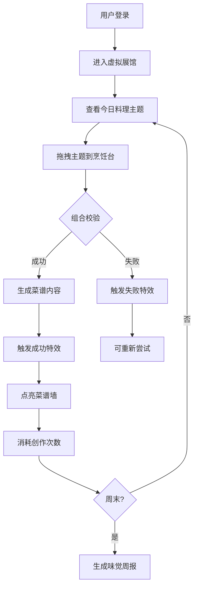

## 1. 产品概述

幻光食谱·味觉博物馆是一款创意美食组合应用，用户扮演美食策展人，在虚拟展馆中通过拖拽不同时代的料理主题组合出创意菜谱。系统自动生成文案、食材搭配和AI风格化插图，并通过丰富的视觉特效增强交互体验。

- 核心价值：让用户体验创意美食组合的乐趣，结合游戏化机制和视觉特效提升用户粘性
- 目标用户：美食爱好者、创意游戏玩家、年轻群体

## 2. 核心功能

### 2.1 用户角色
| 角色 | 注册方式 | 核心权限 |
|------|----------|----------|
| 美食策展人 | 用户名登录 | 创作菜谱、查看菜谱墙、生成味觉周报 |

### 2.2 功能模块
1. **虚拟展馆主页**：动态背景、每日主题展示、料理主题卡片
2. **烹饪台**：拖拽组合、特效反馈、菜谱生成
3. **菜谱墙**：网格展示、点亮特效、成就系统
4. **味觉周报**：雷达图分析、成就徽章、数据统计

### 2.3 页面详情
| 页面名称 | 模块名称 | 功能描述 |
|---------|----------|----------|
| 登录页 | 用户认证 | 用户名输入、一键登录、访客模式 |
| 虚拟展馆 | 主题展示 | 动态背景切换、料理主题卡片展示、剩余创作次数 |
| 烹饪台 | 拖拽组合 | 主题卡片拖拽、弹性反馈、组合校验、菜品生成动画 |
| 菜谱墙 | 成就展示 | 网格布局、点亮特效、已创作菜谱预览 |
| 味觉周报 | 数据报告 | 雷达图展示、成就徽章、周统计数据 |

## 3. 核心流程

用户登录后进入虚拟展馆，查看今日可用的料理主题。拖拽2-3个主题到烹饪台，系统校验组合有效性：
- 组合成功：生成菜品描述、食材卡、AI插图，触发厨具发光和香气粒子特效，消耗1次创作机会，点亮菜谱墙对应区域
- 组合失败：触发烧焦冒烟动画，不消耗创作机会

每日6次创作机会，周末生成味觉周报，展示综合评分雷达图和成就徽章。

## 4. 用户界面设计

### 4.1 设计风格
- **主色调**：珊瑚红 #ff6b6b，奶油黄 #ffe082
- **背景**：暖色调渐变，根据每日主题动态变化（古典红木、科幻蓝光、奇幻星云）
- **按钮风格**：大圆角（16px），柔和阴影，悬停放大效果
- **字体**：展示字体用富有设计感的衬线字体，正文用圆润的无衬线字体
- **动效**：所有交互平滑过渡，成功/失败有明显的视觉反馈

### 4.2 页面设计概述
| 页面名称 | 模块名称 | UI元素 |
|---------|----------|--------|
| 登录页 | 认证模块 | 渐变背景、美食主题插画、圆角输入框、发光登录按钮 |
| 虚拟展馆 | 主题展示区 | 动态背景、主题卡片（3D悬浮、光晕效果）、创作次数进度条 |
| 烹饪台 | 交互区 | 木质纹理台面、发光凹槽、主题卡片拖拽动画、中央菜品展示区 |
| 菜谱墙 | 展示区 | 网格布局、点亮流光特效、半透明未解锁区域 |
| 味觉周报 | 报告区 | 雷达图、成就徽章卡片、统计数据卡片 |

### 4.3 响应性
- 桌面端优先设计，支持平板适配
- 移动端优化拖拽交互，提供点击选择作为备选方案
- 触控设备优化按钮大小和交互区域

### 4.4 视觉特效指引
- **成功特效**：厨具发光脉动、金色香气粒子向上飘散、菜品插图淡入缩放
- **失败特效**：火焰闪烁、黑烟粒子、主题卡片轻微抖动
- **点亮特效**：流光从中心点向外填充、亮度渐变、轻微缩放回弹
- **拖拽反馈**：卡片缩放1.1倍、边缘光晕、阴影加深
