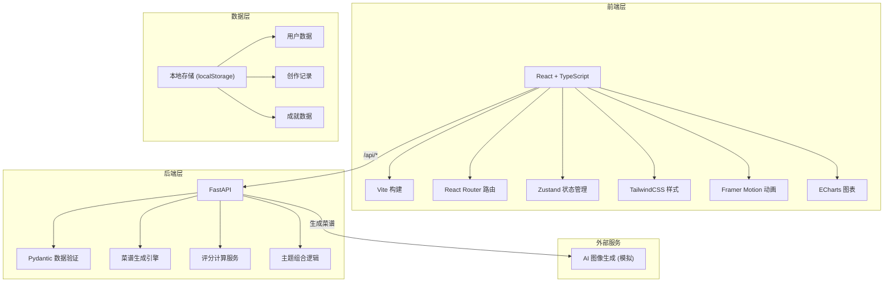
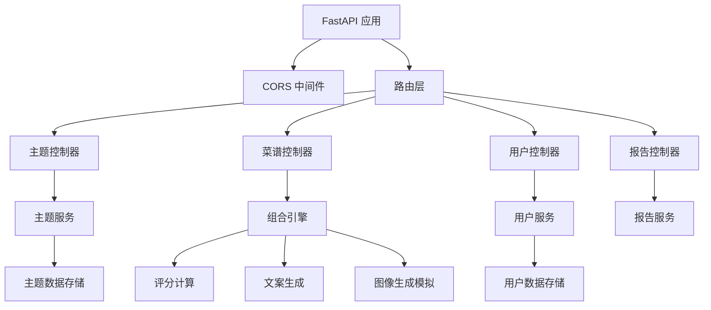

## 1. 架构设计



## 2. 技术描述

- **前端**：React 18 + TypeScript 5 + Vite 5 + TailwindCSS 3 + Zustand + Framer Motion + ECharts
- **初始化工具**：Vite react-ts 模板
- **后端**：FastAPI 0.100+ + Python 3.10+ + Uvicorn
- **数据存储**：前端 localStorage 模拟持久化，后端无数据库（演示版本）
- **代理配置**：Vite 代理 /api 到 FastAPI 后端端口

## 3. 路由定义

| 路由 | 页面 | 用途 |
|------|------|------|
| /login | 登录页 | 用户认证入口 |
| /pavilion | 虚拟展馆 | 主页面，展示料理主题卡片 |
| /cooking | 烹饪台 | 拖拽组合创作页面 |
| /recipe-wall | 菜谱墙 | 成就展示页面 |
| /weekly-report | 味觉周报 | 周数据分析页面 |
| / | 重定向 | 根据登录状态跳转 |

## 4. API 定义

### 4.1 TypeScript 类型定义

```typescript
interface CookingTheme {
  id: string;
  name: string;
  era: 'ancient' | 'modern' | 'sci-fi' | 'fantasy';
  description: string;
  color: string;
  icon: string;
  ingredients: string[];
}

interface Recipe {
  id: string;
  name: string;
  description: string;
  themes: string[];
  ingredients: { name: string; amount: string }[];
  imageUrl: string;
  score: {
    creativity: number;
    depth: number;
    diversity: number;
    taste: number;
    presentation: number;
  };
  createdAt: string;
}

interface CombinationResult {
  success: boolean;
  recipe?: Recipe;
  message: string;
}

interface WeeklyReport {
  weekStart: string;
  weekEnd: string;
  totalRecipes: number;
  averageScore: number;
  themeCoverage: Record<string, number>;
  radarData: {
    creativity: number;
    themeDepth: number;
    diversity: number;
    consistency: number;
    exploration: number;
  };
  achievements: Achievement[];
}

interface Achievement {
  id: string;
  name: string;
  description: string;
  icon: string;
  unlockedAt?: string;
}

interface UserState {
  username: string;
  dailyAttempts: number;
  maxDailyAttempts: number;
  lastAttemptDate: string;
  recipes: Recipe[];
  achievements: Achievement[];
}
```

### 4.2 后端 API 接口

| 方法 | 路径 | 描述 | 请求 | 响应 |
|------|------|------|------|------|
| GET | /api/themes | 获取今日料理主题 | - | `CookingTheme[]` |
| POST | /api/combine | 组合主题生成菜谱 | `{ themeIds: string[] }` | `CombinationResult` |
| GET | /api/recipes | 获取用户菜谱列表 | - | `Recipe[]` |
| GET | /api/weekly-report | 获取本周报告 | - | `WeeklyReport` |
| GET | /api/user/state | 获取用户状态 | - | `UserState` |
| POST | /api/user/login | 用户登录 | `{ username: string }` | `UserState` |

## 5. 服务器架构图



## 6. 项目文件结构

```
auto316/
├── package.json
├── tsconfig.json
├── vite.config.js
├── index.html
├── tailwind.config.js
├── postcss.config.js
├── src/
│   ├── main.tsx
│   ├── App.tsx
│   ├── index.css
│   ├── pages/
│   │   ├── LoginPage.tsx
│   │   ├── PavilionPage.tsx
│   │   ├── CookingPage.tsx
│   │   ├── RecipeWallPage.tsx
│   │   └── WeeklyReportPage.tsx
│   ├── components/
│   │   ├── CookingStation.tsx
│   │   ├── RecipeWall.tsx
│   │   ├── ThemeCard.tsx
│   │   ├── RecipeCard.tsx
│   │   ├── ParticleEffect.tsx
│   │   ├── RadarChart.tsx
│   │   ├── AchievementBadge.tsx
│   │   └── Header.tsx
│   ├── store/
│   │   └── useStore.ts
│   ├── types/
│   │   └── index.ts
│   ├── utils/
│   │   └── api.ts
│   └── hooks/
│       └── useDragAndDrop.ts
└── backend/
    ├── main.py
    ├── requirements.txt
    └── models/
        └── __init__.py
```

## 7. 性能优化要点

- 动画使用 CSS transform 和 opacity 保持 60fps
- 粒子特效使用 Canvas 或 requestAnimationFrame 优化
- 组件按需渲染，避免不必要的重绘
- 后端 API 响应时间控制在 200ms 以内
- 图片资源预加载，使用占位图过渡
- Zustand 状态分片，避免全局重渲染
