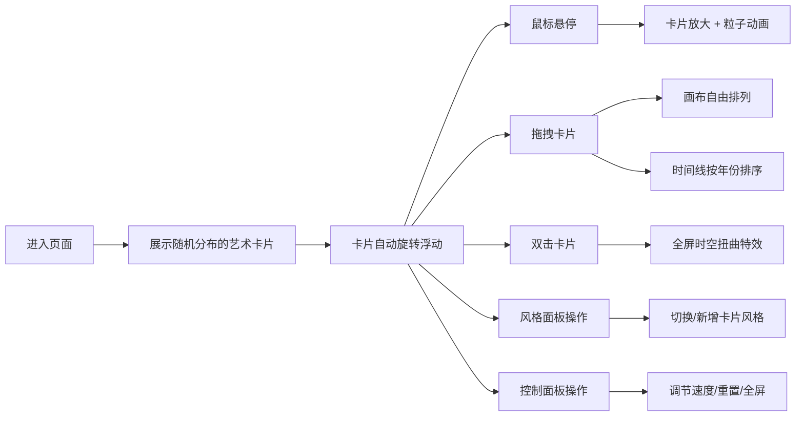

## 1. 产品概述
"星尘记忆·时光画廊"是一款沉浸式交互式艺术体验应用，用户化身时空旅人，在深空调布的画布上自由排列不同艺术风格的时空卡片，探索艺术史的流变。

- 核心价值：通过趣味性的交互方式，让用户感受不同艺术风格的视觉魅力，创造属于自己的艺术时空排列
- 目标用户：艺术爱好者、设计从业者、追求新奇交互体验的年轻用户
- 市场定位：Web端创意交互展示应用，兼具艺术性和娱乐性

## 2. 核心 Features

### 2.1 Feature Module
1. **画廊主画布**：卡片渲染、拖拽交互、粒子特效、时空扭曲
2. **风格选择面板**：6种艺术风格切换、随机模式开关
3. **控制面板**：动画速度调节、布局重置、全屏切换
4. **时间线系统**：卡片年份排序、历史轨迹展示

### 2.3 页面详情
| 页面名称 | 模块名称 | Feature 描述 |
|-----------|-------------|---------------------|
| 主画廊页面 | 画布区域 | 卡片自由排列，支持拖拽、旋转、悬停动画，背景深空渐变 |
| 主画廊页面 | 风格选择面板 | 6种艺术风格按钮（文艺复兴、巴洛克、印象派、现代主义、赛博朋克、未来主义），随机模式开关 |
| 主画廊页面 | 控制面板 | 动画速度滑块（0.5x-2x）、重置布局按钮、全屏切换按钮 |
| 主画廊页面 | 时间线区域 | 底部横向时间线，拖拽卡片可按年份排序，显示已排序卡片的年份标记 |

## 3. 核心流程

### 3.1 用户主流程
用户进入页面 → 看到随机分布的艺术风格卡片 → 卡片缓慢自转和浮动 → 鼠标悬停卡片放大并播放粒子动画 → 拖拽卡片到画布任意位置 → 拖拽卡片到底部时间线按年份排序 → 双击卡片触发全屏时空扭曲特效 → 通过风格面板切换/新增卡片 → 通过控制面板调节动画速度或重置 → 点击全屏按钮沉浸式体验

## 4. 用户界面设计

### 4.1 设计风格
- **主色调**：复古金 #ffd700、未来蓝 #00bfff
- **背景色**：深空渐变 #0f0c29 → #302b63 → #24243e
- **按钮风格**：圆角玻璃态（backdrop-filter: blur(10px)），半透明白色背景，微弱发光边框
- **字体**：标题使用 Cinzel Decorative（复古感），正文使用 Rajdhani（未来感）
- **布局**：非对称布局，中央画布为主，左上角和右下角为控制面板，底部为时间线
- **动效**：弹性过渡动画（cubic-bezier(0.68, -0.55, 0.265, 1.55)），悬停发光效果，平滑缓动

### 4.2 页面设计概述
| 页面名称 | 模块名称 | UI 元素 |
|-----------|-------------|-------------|
| 主画廊页面 | 画布区域 | 深空渐变背景、漂浮的艺术风格卡片、动态星空粒子、卡片发光边框 |
| 主画廊页面 | 风格选择面板 | 垂直排列的6个玻璃态按钮，每个按钮带风格图标和名称，随机模式拨动开关 |
| 主画廊页面 | 控制面板 | 横向滑块带刻度标签，圆角玻璃按钮，发光悬停效果 |
| 主画廊页面 | 时间线区域 | 横向发光时间轴，年份标记点，已排序卡片缩略图 |

### 4.3 响应性
- 桌面端优先设计，支持 1280px 以上分辨率
- 时间线和控制面板在小屏幕自动调整布局
- 触摸设备支持触屏拖拽和双击操作

### 4.4 视觉特效说明
- **卡片特效**：缓慢自转（Y轴360°循环）、上下浮动（正弦波运动）、悬停放大1.2倍+金色发光
- **粒子特效**：印象派→彩色斑点飘散、文艺复兴→金粉飘落、赛博朋克→霓虹网格爆发、巴洛克→繁复花纹粒子、现代主义→几何碎片、未来主义→流光轨迹
- **时空扭曲**：全屏径向模糊→色调偏移→快速收缩恢复，持续1.5秒
- **背景**：缓慢漂移的星点粒子，星云光晕效果

## 5. 性能指标
- 帧率稳定 60fps
- 粒子总数不超过 500 个
- 卡片数量动态控制在 12-20 张
- 动画使用 requestAnimationFrame 进行性能优化
