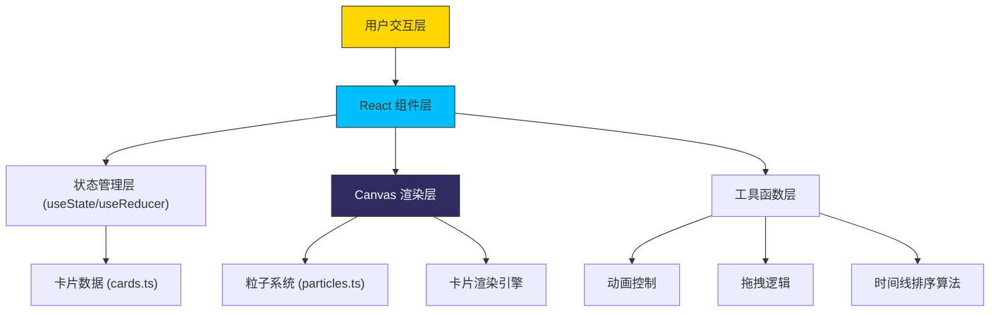

## 1. 架构设计



## 2. 技术描述
- **前端框架**：React@18 + TypeScript@5
- **构建工具**：Vite@5
- **渲染方式**：HTML5 Canvas 2D API + React DOM 混合
- **状态管理**：React Hooks (useState, useEffect, useRef, useCallback)
- **动画方案**：requestAnimationFrame + CSS3 动画结合
- **粒子系统**：自定义 Canvas 粒子引擎，支持多种粒子形态

## 3. 文件结构定义
```
d:\Solocoder\VersionFast\tasks\auto317\
├── package.json
├── tsconfig.json
├── vite.config.js
├── index.html
└── src\
    ├── main.tsx          # React 入口
    ├── App.tsx           # 主组件，状态管理和布局
    ├── types\            # 类型定义
    │   └── index.ts
    ├── components\
    │   ├── Gallery.tsx       # 画布组件
    │   ├── StylePanel.tsx    # 风格选择面板
    │   ├── ControlPanel.tsx  # 控制面板
    │   └── Timeline.tsx      # 时间线组件
    ├── utils\
    │   ├── particles.ts      # 粒子动画逻辑
    │   └── animation.ts      # 动画辅助函数
    ├── data\
    │   └── cards.ts          # 卡片数据
    └── styles\
        └── global.css        # 全局样式
```

## 4. 核心数据类型定义

### 4.1 卡片类型
```typescript
interface ArtCard {
  id: string;
  style: ArtStyle;
  year: number;
  title: string;
  artist: string;
  color: string;
  position: { x: number; y: number };
  rotation: number;
  floatOffset: number;
  isHovered: boolean;
  isDragging: boolean;
  isOnTimeline: boolean;
  timelineIndex: number | null;
}

type ArtStyle = 
  | 'renaissance'  // 文艺复兴
  | 'baroque'      // 巴洛克
  | 'impressionist' // 印象派
  | 'modernist'    // 现代主义
  | 'cyberpunk'    // 赛博朋克
  | 'futurism';    // 未来主义

interface Particle {
  x: number;
  y: number;
  vx: number;
  vy: number;
  life: number;
  maxLife: number;
  color: string;
  size: number;
  type: 'dot' | 'line' | 'square' | 'star';
  style: ArtStyle;
}

interface AppState {
  cards: ArtCard[];
  animationSpeed: number;
  isRandomMode: boolean;
  isFullscreen: boolean;
  isDistorting: boolean;
  selectedStyle: ArtStyle;
}
```

## 5. 核心算法说明

### 5.1 粒子系统算法
- 对象池模式管理粒子，避免频繁 GC
- 每种风格对应独立的粒子发射策略
- 粒子总数上限 500，超出自动回收最早的粒子

### 5.2 拖拽排序算法
- 时间线位置映射到年份区间
- 插入排序维护时间线顺序
- 磁吸效应自动对齐时间刻度

### 5.3 动画控制
- requestAnimationFrame 驱动主循环
- 时间差计算确保不同帧率下速度一致
- 动画速度乘数全局控制所有动态效果

## 6. 性能优化策略
- Canvas 分层渲染：背景层、卡片层、粒子层分离
- 离屏 Canvas 预渲染卡片内容
- 不可见卡片暂停动画更新
- 粒子数量动态调整
- 使用 transform 和 opacity 进行 GPU 加速
- 节流 resize 和 mousemove 事件

## 7. 构建配置
- package.json scripts: dev → vite, build → tsc && vite build
- tsconfig.json: strict: true, module: ESNext, jsx: react-jsx
- vite.config.js: 简单配置，端口 5173
