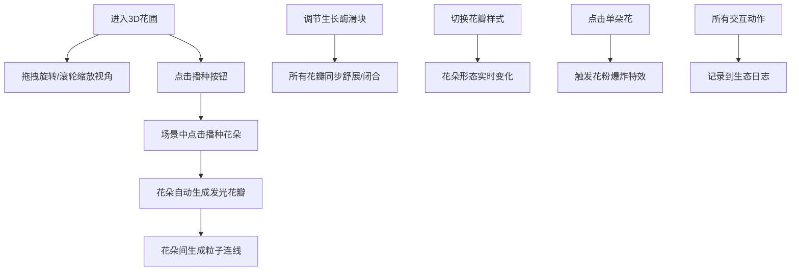

## 1. 产品概述

"量子花圃·光谱秘境"是一款沉浸式3D交互可视化应用，用户扮演量子园丁在三维空间中播种和培育半透明发光花朵。通过直观的交互方式，用户可以创造属于自己的极光幻彩花园，体验量子美学与自然生长的完美融合。

- 核心价值：为用户提供疗愈性、创造性的3D交互体验，探索数字艺术与自然美学的边界
- 目标用户：数字艺术爱好者、创意工作者、追求视觉美感的普通用户

## 2. 核心功能

### 2.1 用户角色

| 角色 | 注册方式 | 核心权限 |
|------|---------|---------|
| 量子园丁 | 无需注册，直接进入 | 播种花朵、调节生长、触发特效、自由探索 |

### 2.2 功能模块

1. **3D花圃场景**：全屏Three.js渲染场景，支持视角控制
2. **花朵培育系统**：播种、生长调节、样式切换
3. **粒子连线系统**：花朵间动态流动的量子连线
4. **交互特效系统**：花粉爆炸、光晕扩散
5. **控制面板**：播种按钮、生长酶滑块、视角重置、花瓣样式
6. **生态日志面板**：记录最近5次交互数据

### 2.3 页面详情

| 页面名称 | 模块名称 | 功能描述 |
|---------|---------|---------|
| 主场景 | 3D花圃场景 | 全屏渲染，鼠标拖拽旋转视角，滚轮缩放 |
| 主场景 | 花朵组件 | 点击播种，花瓣动画，光晕辐射，点击爆炸特效 |
| 主场景 | 粒子连线系统 | 花朵间自动生成流动粒子连线，颜色密度随距离变化 |
| 主场景 | 控制面板 | 左下角毛玻璃面板，包含播种按钮、生长酶滑块、重置视角、花瓣样式切换 |
| 主场景 | 生态日志 | 右下角面板，显示最近5次交互的花朵编号、花瓣张角、光色值 |

## 3. 核心流程

用户进入应用后，在极光幻彩的3D空间中自由探索：通过控制面板点击播种按钮，在场景中点击位置生成半透明发光花朵；调节生长酶滑块控制所有花朵的花瓣舒展程度；切换花瓣样式（单瓣/重瓣/星形）改变花朵形态；点击任意花朵触发花粉爆炸特效；花朵间自动形成流动的量子连线；所有交互实时记录在生态日志中。

## 4. 用户界面设计

### 4.1 设计风格

- **主色调**：极光绿 `#00ff7f`、虹彩紫 `#8a2be2`
- **背景**：深蓝 `#0a0a2e` 渐变到暗紫 `#1a0a2e`，营造宇宙秘境氛围
- **按钮风格**：极光渐变填充 + 发光边框，圆角设计，悬停时有光晕扩散效果
- **字体**：标题使用优雅的衬线字体，正文使用现代无衬线字体，营造科技与自然的平衡感
- **布局风格**：沉浸式全屏布局，控制面板采用半透明毛玻璃效果，悬浮于场景之上
- **视觉元素**：半透明材质、发光效果、粒子系统、柔和平滑的动画

### 4.2 页面设计概述

| 页面名称 | 模块名称 | UI元素 |
|---------|---------|--------|
| 主场景 | 3D花圃场景 | 极光渐变背景、半透明发光花朵、流动粒子连线、粒子爆炸特效 |
| 主场景 | 控制面板 | 毛玻璃背景（backdrop-filter）、发光按钮、渐变滑块、发光边框 |
| 主场景 | 生态日志 | 半透明背景、实时更新数据、极光色文本、编号高亮 |

### 4.3 响应性

- 桌面端优先设计，全屏沉浸式体验
- 支持窗口大小自适应，3D场景实时调整
- 触摸设备优化：双指缩放、单指旋转视角
- 控制面板位置固定，不随场景变化

### 4.4 3D场景指引

- **环境氛围**：深空极光风格，深蓝到暗紫的渐变背景，配合柔和的环境光
- **光照设置**：主光源（极光绿方向光）+ 环境光（虹彩紫）+ 点光源（每朵花自带发光）
- **相机设置**：透视相机，初始位置较远，可自由旋转缩放，支持阻尼平滑效果
- **构图要素**：花朵散布在三维空间中，形成层次丰富的花圃，粒子连线构建量子网络
- **交互动画**：花瓣缓慢舒展动画、光晕呼吸效果、粒子连线流动动画、爆炸粒子扩散效果
- **后期处理**：Bloom泛光效果增强发光质感，轻微色彩校正
- **性能预算**：单页应用，目标帧率60fps，花朵数量建议控制在20朵以内以保证流畅度
