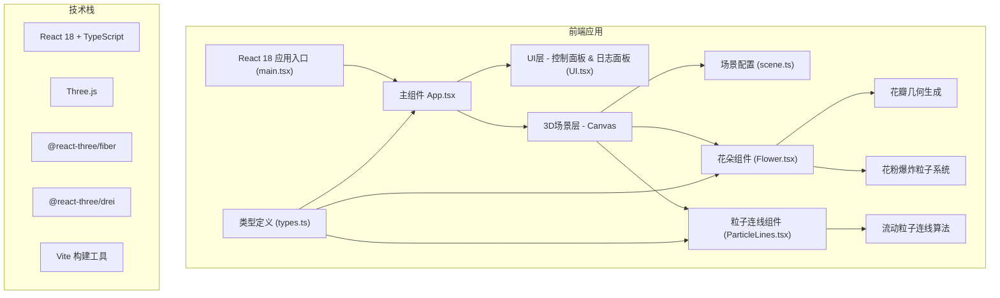

## 1. 架构设计



## 2. 技术描述

- **前端框架**：React 18 + TypeScript 5，严格模式（strict），ESNext 模块系统
- **3D渲染**：Three.js r150+，通过 @react-three/fiber 进行声明式管理
- **3D辅助库**：@react-three/drei 提供 OrbitControls、Points、Effects 等常用组件
- **构建工具**：Vite 5，支持热更新，快速开发体验
- **状态管理**：React useState/useRef 本地状态管理，避免过度复杂的状态方案
- **动画系统**：Three.js Clock + requestAnimationFrame，结合 lerp 平滑插值
- **性能优化**：InstancedMesh 粒子系统、BufferGeometry 复用、frustumCulling

## 3. 项目文件结构

```
auto318/
├── package.json              # 项目依赖和脚本
├── tsconfig.json             # TypeScript 配置（strict模式，ESNext）
├── vite.config.js            # Vite 简单配置
├── index.html                # 入口HTML
└── src/
    ├── main.tsx              # React应用入口
    ├── App.tsx               # 主组件，场景布局和UI整合
    ├── types.ts              # 全局类型定义
    ├── scene.ts              # 场景配置（光照、相机、背景）
    ├── components/
    │   ├── Flower.tsx        # 花朵组件
    │   ├── ParticleLines.tsx # 粒子连线组件
    │   └── UI.tsx            # 控制面板和日志面板
    └── styles/
        └── index.css         # 全局样式
```

## 4. 核心数据结构定义

### 4.1 FlowerData 花朵数据

```typescript
interface FlowerData {
  id: string;
  position: [number, number, number];
  petalStyle: 'single' | 'double' | 'star';
  petalCount: number;
  growth: number;
  color: string;
  glowColor: string;
  createdAt: number;
}
```

### 4.2 LogEntry 生态日志条目

```typescript
interface LogEntry {
  id: string;
  flowerId: string;
  action: 'plant' | 'growth' | 'style' | 'explode';
  petalAngle: number;
  color: string;
  timestamp: number;
}
```

### 4.3 ParticleData 粒子数据

```typescript
interface ParticleData {
  position: Float32Array;
  velocity: Float32Array;
  color: Float32Array;
  life: Float32Array;
  size: number;
}
```

## 5. 核心组件说明

### 5.1 Flower 组件

- **职责**：单朵花朵的渲染和交互
- **功能**：
  - 根据 petalStyle 生成不同形状的花瓣几何体
  - 根据 growth 值控制花瓣张角动画
  - 发光材质和光晕效果
  - 点击触发花粉爆炸粒子特效
  - useFrame 驱动花瓣呼吸动画

### 5.2 ParticleLines 组件

- **职责**：花朵间动态粒子连线
- **功能**：
  - 计算所有花朵对之间的距离
  - 根据距离动态调整粒子数量和颜色
  - 使用 InstancedBufferGeometry 优化性能
  - 粒子沿连线方向流动动画

### 5.3 UI 组件

- **职责**：控制面板和生态日志
- **功能**：
  - 播种模式切换按钮
  - 生长酶滑块（0-100）
  - 重置视角按钮
  - 花瓣样式切换（单瓣/重瓣/星形）
  - 最近5条交互日志展示
  - 毛玻璃效果和极光发光样式

## 6. 性能优化策略

1. **粒子系统优化**：使用 InstancedMesh 和 BufferGeometry 避免重复绘制调用
2. **几何体复用**：预生成花瓣几何体模板，不同花朵复用同一几何体
3. **距离剔除**：超出一定距离的花朵间不生成连线
4. **帧率控制**：使用 THREE.Clock 获取 deltaTime，保证不同设备动画速度一致
5. **材质复用**：共享 ShaderMaterial，仅通过 uniforms 区分个体参数
6. **状态更新优化**：避免不必要的重渲染，使用 useRef 存储频繁更新的数据

## 7. 依赖包列表

| 包名 | 版本 | 用途 |
|------|------|------|
| react | ^18.2.0 | UI框架 |
| react-dom | ^18.2.0 | DOM渲染 |
| typescript | ^5.0.0 | 类型系统 |
| three | ^0.150.0 | 3D渲染引擎 |
| @react-three/fiber | ^8.15.0 | React-Three桥接 |
| @react-three/drei | ^9.88.0 | 3D辅助组件 |
| @types/react | ^18.2.0 | React类型定义 |
| @types/react-dom | ^18.2.0 | ReactDOM类型定义 |
| @types/three | ^0.149.0 | Three.js类型定义 |
| vite | ^5.0.0 | 构建工具 |
| @vitejs/plugin-react | ^4.2.0 | React Vite插件 |
