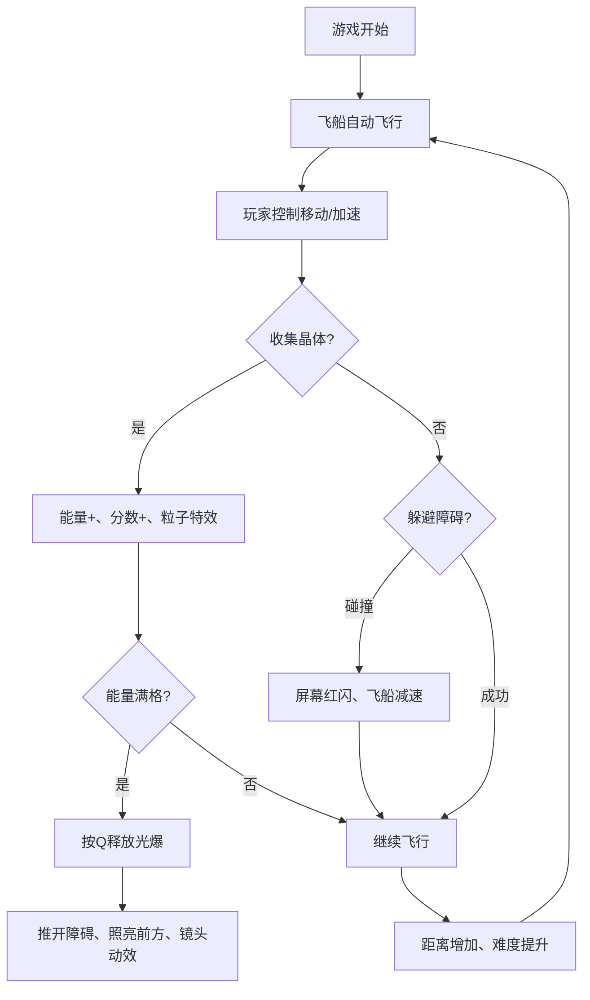

## 1. 产品概述
"深渊回响·光锥迷航"是一款3D迷幻探索飞行游戏，玩家在无限生成的幽暗隧道中操控光锥飞船，躲避障碍、收集晶体、释放光爆，体验赛博深渊风格的视觉冲击。
- 核心玩法：操控飞船在隧道中飞行，通过左右移动和加速躲避光墙与脉冲陷阱，收集光子晶体充能
- 目标用户：喜欢3D飞行游戏、赛博朋克视觉风格的休闲玩家

## 2. 核心功能

### 2.1 功能模块
1. **游戏主场景**：3D隧道无限生成、动态粒子光带、环境音效
2. **玩家飞船**：光锥飞船渲染、键盘控制、加速、光爆技能
3. **障碍系统**：光墙（带缝隙）、脉冲陷阱（周期性扩散）、难度递增
4. **收集系统**：光子晶体生成、碰撞检测、粒子爆炸特效
5. **UI系统**：能量条、分数显示、进度指示、屏幕特效

### 2.2 页面详情
| 页面名称 | 模块名称 | 功能描述 |
|-----------|-------------|---------------------|
| 游戏主界面 | 3D场景模块 | Canvas渲染隧道、飞船、障碍物、晶体 |
| 游戏主界面 | 飞船控制模块 | A/D或左右方向键控制移动，空格加速，Q释放光爆 |
| 游戏主界面 | HUD显示模块 | 左下角能量条、右下角分数、顶部进度指示 |
| 游戏主界面 | 特效模块 | 收集粒子爆炸、屏幕震动、光爆闪烁、碰撞红屏 |

## 3. 核心流程

游戏开始 → 飞船自动向前飞行 → 玩家控制左右移动/加速 → 收集晶体增加能量和分数 → 躲避光墙和脉冲陷阱 → 能量满格时释放光爆 → 随距离增加速度和难度提升 → 碰撞障碍减速/游戏继续

## 4. 用户界面设计

### 4.1 设计风格
- **主色调**：深紫#1a0033到暗蓝#000033渐变背景
- **飞船配色**：白色渐变到青色，带发光边缘
- **粒子光带**：霓虹紫和青色混色，流动效果
- **能量条**：从蓝到金渐变，半透明毛玻璃效果
- **整体风格**：赛博深渊风，所有元素带发光效果

### 4.2 页面设计概述
| 页面名称 | 模块名称 | UI元素 |
|-----------|-------------|-------------|
| 游戏主界面 | 3D场景 | 无限隧道、动态粒子光带、发光障碍物、晶体 |
| 游戏主界面 | 飞船 | 光锥造型、白色到青色渐变、边缘发光、尾焰效果 |
| 游戏主界面 | 能量条 | 左下角、半透明毛玻璃、蓝到金渐变、发光边框 |
| 游戏主界面 | 分数 | 右下角、霓虹青色、发光数字 |
| 游戏主界面 | 进度指示 | 顶部中央、光晕效果、显示距离下片光墙的进度 |

### 4.3 响应性
- 全屏3D场景，自适应窗口大小
- 桌面端键盘控制，UI元素固定在屏幕四角

### 4.4 3D场景设计
- **环境**：幽暗隧道，深紫到暗蓝渐变背景，动态流动的粒子光带附着在隧道壁
- **灯光**：飞船自带点光源照亮前方，环境光较暗，障碍物和晶体自发光
- **相机**：第三人称跟随视角，光爆时镜头推近再拉远
- **构图**：隧道占据视野主体，飞船位于屏幕下方中央
- **交互**：收集晶体时屏幕震动，光爆时白光闪烁，碰撞时红屏闪烁
- **后处理**：Bloom发光效果，轻微的色差和晕影增强迷幻感
- **性能**：60fps稳定，隧道使用对象池内存回收

## 5. 操作说明
| 按键 | 功能 |
|------|------|
| A / 左方向键 | 向左移动 |
| D / 右方向键 | 向右移动 |
| 空格键 | 加速飞行 |
| Q键 | 释放光爆（能量满格时可用） |
