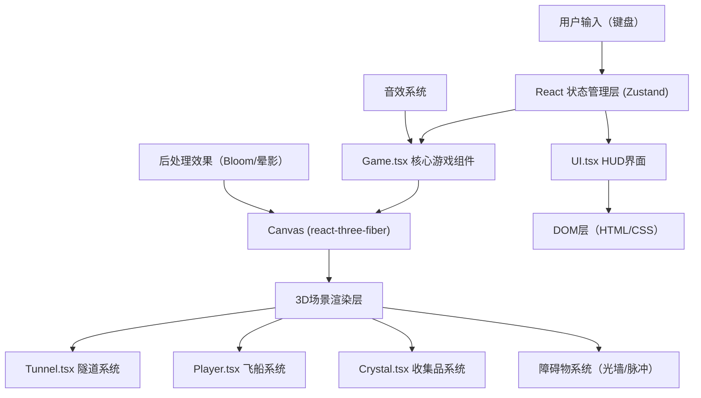

## 1. 架构设计



## 2. 技术描述

- **前端框架**：React@18 + TypeScript
- **构建工具**：Vite@5
- **3D引擎**：Three.js + @react-three/fiber + @react-three/drei
- **状态管理**：Zustand
- **后处理**：@react-three/postprocessing
- **样式方案**：原生CSS + CSS变量，无UI框架
- **开发服务器**：Vite dev server

## 3. 文件结构

| 文件路径 | 用途 |
|----------|------|
| `package.json` | 项目依赖配置 |
| `tsconfig.json` | TypeScript配置（strict模式，ESNext模块） |
| `vite.config.js` | Vite构建配置 |
| `index.html` | 入口HTML页面 |
| `src/main.tsx` | React应用入口，挂载游戏组件 |
| `src/Game.tsx` | 核心游戏组件，包含Canvas、场景、灯光、相机 |
| `src/Player.tsx` | 光锥飞船逻辑与渲染，移动控制、加速、光爆 |
| `src/Tunnel.tsx` | 动态隧道生成、障碍物管理、对象池 |
| `src/Crystal.tsx` | 光子晶体逻辑、收集交互、粒子特效 |
| `src/UI.tsx` | HUD界面：能量条、分数、进度指示、屏幕特效 |
| `src/store/gameStore.ts` | Zustand状态管理：游戏状态、分数、能量 |
| `src/hooks/useKeyboard.ts` | 键盘输入Hook |
| `src/utils/objectPool.ts` | 对象池工具类 |
| `src/types/index.ts` | TypeScript类型定义 |

## 4. 状态管理设计

### 4.1 游戏状态类型

```typescript
interface GameState {
  score: number;
  energy: number;
  maxEnergy: number;
  speed: number;
  distance: number;
  isAccelerating: boolean;
  isLightBurst: boolean;
  isHit: boolean;
  screenShake: number;
  flashWhite: number;
  flashRed: number;
  difficulty: number;
}
```

### 4.2 状态操作

- `addScore(points)`：增加分数
- `addEnergy(amount)`：增加能量
- `useLightBurst()`：使用光爆
- `triggerHit()`：触发碰撞效果
- `updateSpeed(baseSpeed)`：更新飞行速度
- `updateDifficulty()`：随距离提升难度

## 5. 核心系统设计

### 5.1 隧道生成系统
- 使用TubeGeometry创建圆形隧道
- 对象池管理隧道片段，回收复用
- 隧道壁面附加流动粒子光带（ShaderMaterial）
- 每段隧道长度固定，根据飞行位置动态生成/回收

### 5.2 障碍物系统
- **光墙**：环形障碍物，留有随机位置的缝隙供穿过
- **脉冲陷阱**：中心球体周期性向外扩散冲击波，需提前闪避
- 难度递增：随距离增加障碍物密度和移动速度

### 5.3 碰撞检测系统
- 简化为AABB和球体碰撞检测
- 飞船与晶体：球体碰撞，收集后触发特效
- 飞船与障碍物：AABB碰撞，触发伤害和减速

### 5.4 视觉特效系统
- 粒子爆炸：收集晶体时生成扩散粒子群
- 屏幕震动：随机偏移相机位置
- 光爆效果：全屏白光闪烁 + 镜头推近拉远 + 推开附近障碍
- 碰撞红屏：红色半透明覆盖层闪烁

## 6. 性能优化

1. **对象池**：隧道片段、障碍物、晶体、粒子全部使用对象池管理，避免频繁GC
2. **实例化渲染**：使用InstancedMesh渲染大量粒子
3. **视锥剔除**：Three.js自动处理，超出视野的物体不渲染
4. **LOD**：远处障碍物降低精度
5. **帧率控制**：使用deltaTime确保速度与帧率无关
6. **内存管理**：及时回收Geometry和Material，避免内存泄漏

## 7. 关键技术点

1. **react-three-fiber**：声明式Three.js渲染，响应式状态驱动3D场景
2. **@react-three/drei**：提供Controls、Effects等常用组件
3. **@react-three/postprocessing**：Bloom、Vignette等后处理效果
4. **自定义Shader**：隧道壁粒子流动、障碍物发光动画
5. **Zustand**：轻量级状态管理，跨组件共享游戏状态
6. **useFrame**：r3f的帧更新钩子，处理游戏逻辑和动画
