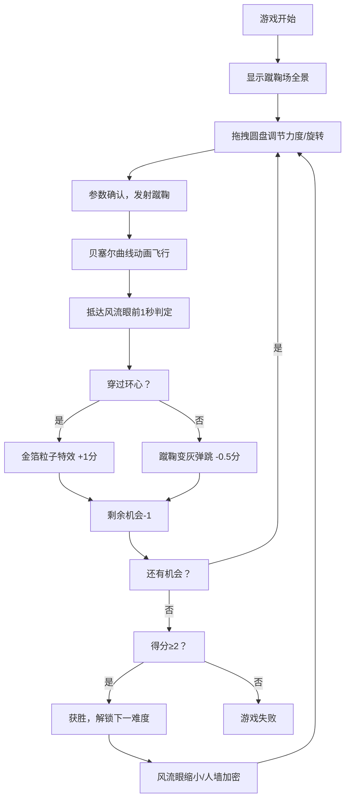

## 1. 产品概述

宝津楼角球是一款以北宋汴京蹴鞠文化为背景的体育模拟游戏，玩家扮演左军球头，通过调整发球力度和旋转，让蹴鞠绕过防守人墙，穿过高悬的风流眼得分。游戏融合了历史文化元素与现代游戏机制，为用户提供沉浸式的古代体育体验。

- 核心玩法：拖拽圆盘控件调节力度与旋转，控制贝塞尔曲线轨迹射门
- 目标用户：对中国传统文化和体育游戏感兴趣的玩家
- 市场价值：以独特的历史题材填补体育游戏细分市场空白

## 2. 核心功能

### 2.1 用户角色
| 角色 | 注册方式 | 核心权限 |
|------|----------|----------|
| 玩家 | 无需注册，直接游戏 | 进行角球射门、调节控件、查看得分、解锁难度 |

### 2.2 功能模块
1. **游戏主场景**：CSS绘制的宋代蹴鞠场、风流眼球门、防守人墙
2. **圆盘控件**：拖拽调节力度（0-100%）和旋转方向（左旋/右旋）
3. **轨迹动画**：贝塞尔曲线呈现蹴鞠飞行路径，实时更新
4. **特效系统**：金箔粒子（得分）、弹跳动画（失败）、击鼓助威
5. **计分系统**：3次机会、得分规则、难度解锁机制

### 2.3 页面详情
| 页面名称 | 模块名称 | 功能描述 |
|----------|----------|----------|
| 游戏主页面 | 蹴鞠场场景 | 夯土地面、朱红立柱、风流眼、防守人墙、发球点标记 |
| 游戏主页面 | 圆盘控件 | 四象限力度旋转调节、十字准星拖拽、实时参数显示 |
| 游戏主页面 | 轨迹动画 | 贝塞尔曲线飞行、虚线轨迹、命中判定 |
| 游戏主页面 | 特效系统 | 金箔粒子爆炸、击鼓动画、灯笼摆动、帷幔装饰 |
| 游戏主页面 | 计分面板 | 当前得分、剩余机会、难度层级、胜负判定 |

## 3. 核心流程

玩家进入游戏后，首先看到北宋宫廷风格的蹴鞠场全景。通过拖拽圆盘控件的十字准星调整发球参数（力度由距离盘心决定，旋转由方位角决定），确认后蹴鞠沿贝塞尔曲线飞行。系统在到达风流眼前1秒判断是否命中环心，触发金箔特效或失败弹跳动画。每场3次机会，累积2分以上获胜并解锁更高难度。

## 4. 用户界面设计

### 4.1 设计风格
- **主色调**：米黄色绢帛底#f5e6c8，朱红#cc0000，木纹#8b4513，金色#ffd700
- **按钮风格**：宋代漆器风格，黑底#1a1a1a，朱红描边#cc0000 2px，金边装饰，悬停时凹刻box-shadow inset效果
- **字体**：使用衬线字体模拟古籍刻本风格，标题加粗装饰性字体，正文清晰易读
- **布局风格**：居中对称布局，帷幔装饰边框，灯笼顶部悬挂，模拟宫廷宴乐场景
- **动画风格**：流畅优雅，风流眼微颤、灯笼摆动、金箔飘落，符合宋代美学

### 4.2 页面设计概述
| 页面名称 | 模块名称 | UI元素 |
|----------|----------|--------|
| 游戏主页面 | 场景层 | 夯土地面#8b7b6b、朱红立柱#cc0000、风流眼丝绸圆环#f0f0f080、防守人墙#5d3a1a倒V形、发球点#6b8e23 |
| 游戏主页面 | 装饰层 | 朱红帷幔#b22222渐变布褶、彩色灯笼渐变#ffa500-#ff4500摆动动画、大鼓#8b3400可点击 |
| 游戏主页面 | 控件层 | 木纹圆盘#8b4513四象限配色、十字准星拖拽、实时力度旋转数值 |
| 游戏主页面 | 信息层 | 漆器风格计分板、当前得分、剩余机会、难度层级显示 |

### 4.3 响应式
- **宽屏（≥1280px）**：完整显示全景场景，所有装饰元素完整呈现
- **标准屏（768-1280px）**：保持场景比例，适当缩放
- **窄屏（<768px）**：风流眼放大至60px，人墙简化为竖直排列3个，控件位置调整至底部

### 4.4 动画效果
- 风流眼随风微颤（正弦波动，周期2秒，幅度2px）
- 灯笼缓慢左右摆动（周期3秒，角度±5度）
- 金箔粒子爆炸（60个金色小方块，生命周期1.5秒）
- 击鼓动画（鼓面径向膨胀10%，0.2秒音效反馈）
- 蹴鞠飞行（贝塞尔曲线，60Hz更新，白色虚线轨迹）
- 按钮悬停（0.3秒凹刻inset阴影过渡）

## 5. 性能要求
- 游戏循环稳定在50FPS以上
- 贝塞尔曲线动画更新频率≥60Hz
- 金箔粒子总数≤60个，单个生命周期1.5秒
- 圆盘控件拖拽响应延迟<50ms
