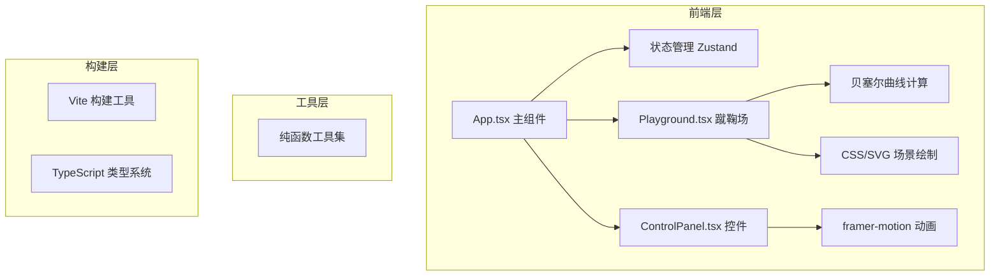

## 1. 架构设计



## 2. 技术描述

- **前端框架**：React@18 + TypeScript@5
- **构建工具**：Vite@5 + @vitejs/plugin-react
- **状态管理**：Zustand@4
- **动画库**：framer-motion@11
- **样式方案**：CSS Modules + 内联样式 + CSS变量
- **无后端**：纯前端游戏，数据本地管理

## 3. 项目结构

```
auto32/
├── src/
│   ├── App.tsx              # 主组件，组合场景与控件
│   ├── components/
│   │   ├── Playground.tsx   # 蹴鞠场CSS绘制+动画
│   │   └── ControlPanel.tsx # 圆盘控件，拖拽交互
│   ├── utils/
│   │   └── trajectory.ts    # 贝塞尔曲线计算纯函数
│   └── main.tsx             # 入口文件
├── index.html               # HTML入口
├── vite.config.ts           # Vite配置
├── tsconfig.json            # TypeScript配置
└── package.json             # 依赖与脚本
```

## 4. 核心数据模型

### 4.1 游戏状态
```typescript
interface GameState {
  score: number;           // 当前得分
  attemptsLeft: number;    // 剩余机会（初始3）
  level: number;           // 难度层级（1-2）
  isPlaying: boolean;      // 是否正在踢球
  isWon: boolean | null;   // 胜负状态
  power: number;           // 力度 0-100
  spin: number;            // 旋转 -1（左旋）到 1（右旋）
  holeDiameter: number;    // 风流眼直径
  wallGap: number;         // 人墙间距
}
```

### 4.2 轨迹计算输入输出
```typescript
interface TrajectoryInput {
  power: number;           // 力度 0-100
  spin: number;            // 旋转 -1 到 1
  startX: number;          // 发球点X
  startY: number;          // 发球点Y
  targetX: number;         // 目标X（风流眼）
  targetY: number;         // 目标Y
}

interface TrajectoryOutput {
  controlPoints: [number, number][];  // 贝塞尔控制点
  pathPoints: [number, number][];     // 路径点数组
  duration: number;                    // 动画时长(ms)
}
```

## 5. 关键实现要点

### 5.1 贝塞尔曲线轨迹计算
使用三次贝塞尔曲线，根据力度和旋转动态调整控制点：
- 力度影响曲线高度和飞行时间
- 旋转（正值右旋，负值左旋）影响横向偏移量
- 控制点1控制上升弧度，控制点2控制下降弧度和旋转偏移

### 5.2 命中判定
在蹴鞠到达风流眼前1秒进行判定：
- 计算当前轨迹预测落点与风流眼环心的距离
- 距离 < 风流眼半径则判定命中
- 距离 > 风流眼半径且 < 环体外沿则判定擦边（失败）

### 5.3 粒子系统
金箔粒子效果使用CSS动画实现：
- 最多60个粒子，以风流眼为中心爆散
- 每个粒子有随机的初始速度、旋转角度、下落速度
- 生命周期1.5秒，使用CSS transform和opacity动画

### 5.4 性能优化
- 使用`will-change`和`transform`提升动画性能
- 贝塞尔点计算使用requestAnimationFrame，60Hz更新
- 粒子使用GPU加速的CSS属性
- 组件使用React.memo减少不必要重渲染

## 6. 响应式适配逻辑

```typescript
const getResponsiveConfig = (width: number) => {
  if (width >= 1280) {
    return { holeDiameter: 20, wallCount: 6, wallGap: 10, layout: 'full' };
  } else if (width >= 768) {
    return { holeDiameter: 20, wallCount: 6, wallGap: 10, layout: 'normal' };
  } else {
    return { holeDiameter: 60, wallCount: 3, wallGap: 6, layout: 'compact' };
  }
};
```
