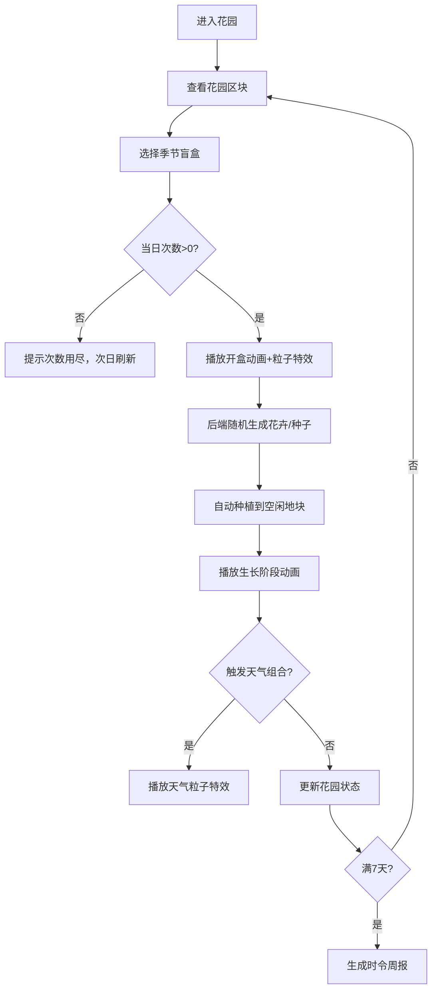

## 1. 产品概述

"云种盲盒·时令花园"是一款虚拟园艺Web应用，用户扮演云游园丁，通过开启季节盲盒获得时令花卉和魔法种子，在虚拟花园中体验种植乐趣，观察花卉生长动画，触发天气事件，每周生成种植报告。

- 主要目的：为用户提供轻松治愈的虚拟园艺体验，结合盲盒随机性和养成类游戏的成就感
- 目标用户：喜欢治愈系游戏、盲盒收集、园艺爱好的年轻用户
- 产品价值：通过季节主题和随机机制创造持续探索乐趣，精美的动画效果提升用户沉浸感

## 2. 核心功能

### 2.1 用户角色
| 角色 | 注册方式 | 核心权限 |
|------|----------|----------|
| 云游园丁 | 无需注册，本地存储 | 开启盲盒、种植花卉、查看周报 |

### 2.2 功能模块
1. **花园主界面**：季节背景渐变、花园地块展示、花卉生长动画、天气粒子特效
2. **盲盒系统**：四季盲盒选择、开盒动画、随机奖励生成、每日次数限制
3. **种植系统**：种子自动种植、四阶段生长动画（发芽→抽枝→开花→结籽）
4. **天气系统**：组合触发特殊天气（春雨/夏雷/秋风/冬雪）、粒子特效
5. **周报系统**：每周统计图表、种类多样性分析、稀有度统计

### 2.3 页面详情
| 页面名称 | 模块名称 | 功能描述 |
|---------|----------|----------|
| 花园主界面 | 背景展示 | 根据当前季节显示渐变背景，随时间平滑过渡 |
| 花园主界面 | 花园区 | 6-8个种植地块，展示不同生长阶段的花卉 |
| 花园主界面 | 盲盒区 | 四个季节盲盒按钮，显示剩余开盒次数 |
| 花园主界面 | 状态栏 | 显示当前季节、已收集品种数、当日剩余次数 |
| 盲盒弹窗 | 开盒动画 | 彩色粒子爆炸效果、花卉/种子展示、抖动反馈 |
| 周报页面 | 统计图表 | 品种多样性饼图、花开数量柱状图、稀有度雷达图 |
| 周报页面 | 数据概览 | 本周总结、收集进度、下周目标 |

## 3. 核心流程

用户进入应用后查看当前花园状态，选择季节盲盒开启，获得随机花卉或种子后自动种植到空闲地块，花卉经历四个生长阶段动画。不同季节花卉组合触发对应天气事件和粒子特效。每日有5次开盒机会，每7天生成一份时令周报。

## 4. 用户界面设计

### 4.1 设计风格
- **主色调**：#2d5016 草绿（主色）、#e0f2e9 浅绿（辅助色）
- **季节配色**：
  - 春季：#f0fff4 → #9ae6b4 嫩绿渐变
  - 夏季：#c6f6d5 → #38a169 翠绿渐变
  - 秋季：#fefcbf → #d69e2e 金黄渐变
  - 冬季：#ebf8ff → #90cdf4 冰蓝渐变
- **按钮风格**：圆角24px，悬浮阴影，点击轻微缩放+抖动
- **字体**：标题使用圆润衬线字体，正文使用清晰无衬线字体
- **图标**：使用lucide-react图标库，配合自然元素emoji
- **整体风格**：森系清新风，柔和光影，花卉带柔光呼吸动画

### 4.2 页面设计概述
| 页面名称 | 模块名称 | UI元素 |
|---------|----------|--------|
| 花园主界面 | 背景层 | 季节渐变+颗粒噪点+柔光浮动光斑 |
| 花园主界面 | 花园区块 | 网格布局8个地块，每个地块有土壤纹理 |
| 花园主界面 | 花卉展示 | SVG绘制花卉，4阶段生长动画，柔光呼吸效果 |
| 花园主界面 | 盲盒按钮 | 四季主题色彩，礼盒图标，悬浮抬起效果 |
| 盲盒弹窗 | 开盒动画 | 3D旋转打开，彩色粒子爆炸，奖励卡片翻转展示 |
| 盲盒弹窗 | 结果展示 | 花卉大图+名称+稀有度标签+属性描述 |
| 周报页面 | 图表区 | Recharts图表，动画加载，配色与主题一致 |
| 周报页面 | 数据卡片 | 毛玻璃效果，圆角卡片，悬浮微动 |

### 4.3 响应式设计
- **设计原则**：桌面优先，移动端自适应
- **断点**：桌面（>1024px）、平板（768-1024px）、手机（<768px）
- **移动端适配**：
  - 花园地块改为2×4布局
  - 盲盒按钮横向滚动排列
  - 触控目标≥44×44px
  - 优化触摸反馈，移除hover状态，改用active状态
- **性能优化**：
  - CSS动画使用transform和opacity，保证60fps
  - 粒子效果使用Canvas实现，限制最大粒子数
  - 图片使用SVG，减少网络请求

### 4.4 动效设计
- **页面加载**：元素从下往上 staggered 渐入
- **盲盒开启**：礼盒抖动→3D旋转打开→彩色粒子爆炸→奖励卡片翻转
- **花卉生长**：4阶段平滑过渡，每阶段伴随缩放+旋转微动画
- **天气效果**：
  - 春雨：蓝色雨滴粒子+水波纹
  - 夏雷：黄色闪电闪光+雷声震动反馈
  - 秋风：橙色叶子飘落粒子+背景横向移动
  - 冬雪：白色雪花粒子+缓慢下落旋转
- **交互反馈**：按钮点击scale(0.95)，盲盒开启shake抖动
