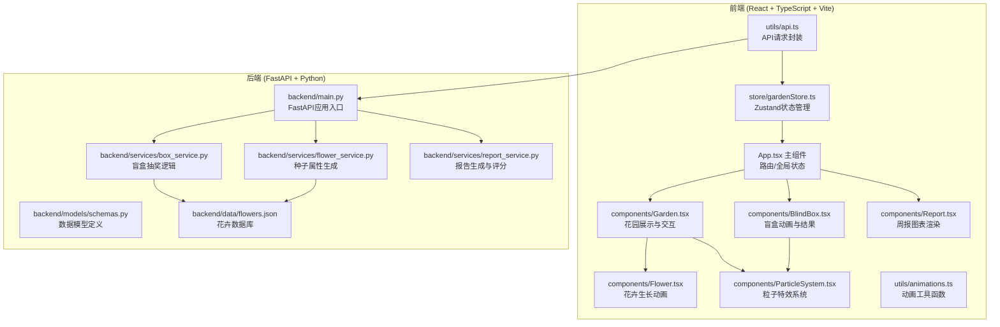
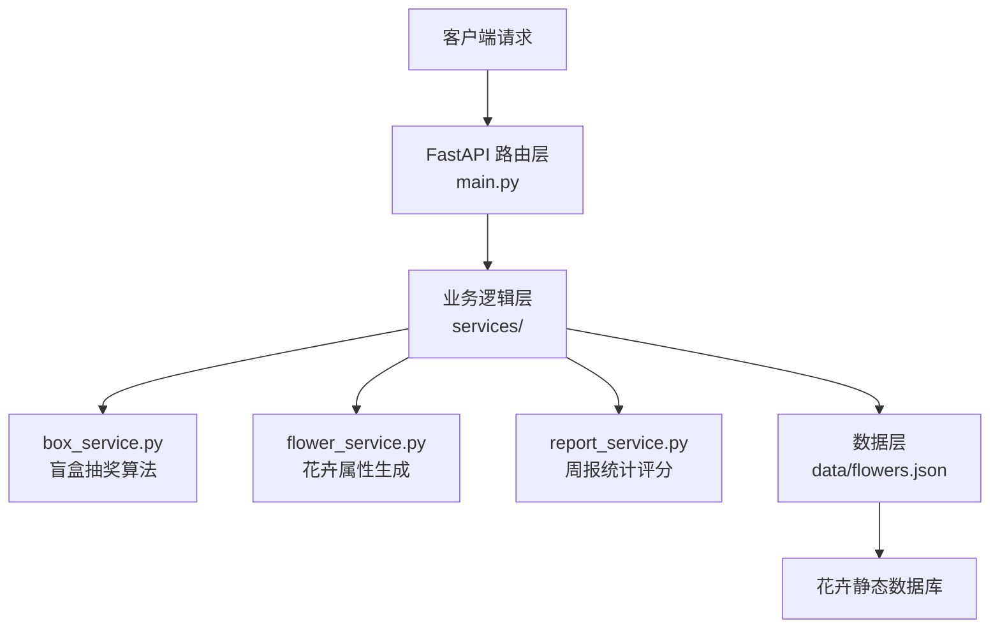
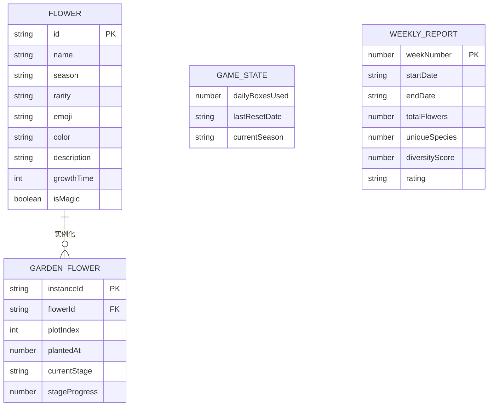

## 1. 架构设计



## 2. 技术描述

- **前端**：React@18 + TypeScript@5 + Vite@5
- **状态管理**：Zustand@4（轻量级状态管理）
- **样式方案**：TailwindCSS@3 + CSS变量 + CSS动画
- **图表库**：Recharts@2（React图表库）
- **图标库**：lucide-react@0.344
- **HTTP客户端**：内置fetch API封装
- **后端**：FastAPI@0.109 + Python@3.11
- **ASGI服务器**：Uvicorn@0.27
- **数据存储**：前端localStorage + 后端静态JSON数据
- **初始化工具**：Vite react-ts模板

## 3. 路由定义

| 路由 | 用途 |
|------|------|
| / | 花园主界面，展示花园区块和盲盒按钮 |
| /report | 时令周报页面，展示统计图表 |

## 4. API 定义

### 4.1 TypeScript 类型定义

```typescript
// 花卉/种子稀有度
type Rarity = 'common' | 'uncommon' | 'rare' | 'legendary';

// 生长阶段
type GrowthStage = 'seed' | 'sprout' | 'growing' | 'blooming' | 'seeding';

// 季节
type Season = 'spring' | 'summer' | 'autumn' | 'winter';

// 天气事件
type WeatherEvent = 'spring_rain' | 'summer_thunder' | 'autumn_wind' | 'winter_snow' | null;

// 花卉定义
interface Flower {
  id: string;
  name: string;
  season: Season;
  rarity: Rarity;
  emoji: string;
  color: string;
  description: string;
  growthTime: number; // 每阶段生长时间(ms)
  isMagic: boolean;
}

// 花园中的花
interface GardenFlower extends Flower {
  instanceId: string;
  plantedAt: number;
  currentStage: GrowthStage;
  stageProgress: number; // 0-100
  plotIndex: number;
}

// 盲盒开启结果
interface BoxResult {
  success: boolean;
  item: Flower;
  isNew: boolean;
  weatherTriggered: WeatherEvent;
  message: string;
}

// 周报数据
interface WeeklyReport {
  weekNumber: number;
  startDate: string;
  endDate: string;
  totalFlowers: number;
  uniqueSpecies: number;
  rarityDistribution: Record<Rarity, number>;
  seasonDistribution: Record<Season, number>;
  weatherEvents: WeatherEvent[];
  diversityScore: number; // 0-100
  bloomCount: number;
  topFlowers: Flower[];
  rating: 'S' | 'A' | 'B' | 'C';
}

// 游戏状态
interface GameState {
  dailyBoxesUsed: number;
  lastResetDate: string;
  gardenPlots: (GardenFlower | null)[];
  collectedFlowers: Flower[];
  weatherEvent: WeatherEvent;
  currentSeason: Season;
}
```

### 4.2 API 接口

| 方法 | 路径 | 请求参数 | 返回 | 用途 |
|------|------|----------|------|------|
| GET | /api/flowers | - | Flower[] | 获取所有花卉列表 |
| GET | /api/flowers/:id | id: string | Flower | 获取单个花卉详情 |
| POST | /api/box/open | { season: Season, state: GameState } | BoxResult | 开启盲盒抽奖 |
| POST | /api/report/generate | { flowers: GardenFlower[], weatherEvents: WeatherEvent[] } | WeeklyReport | 生成周报 |

### 4.3 请求/响应示例

#### 开启盲盒
```bash
POST /api/box/open
Content-Type: application/json

{
  "season": "spring",
  "state": {
    "dailyBoxesUsed": 2,
    "gardenPlots": [...],
    "currentSeason": "spring"
  }
}
```

响应：
```json
{
  "success": true,
  "item": {
    "id": "spring_001",
    "name": "樱花",
    "season": "spring",
    "rarity": "rare",
    "emoji": "🌸",
    "color": "#ffb7c5",
    "description": "春日最美的粉色精灵",
    "growthTime": 3000,
    "isMagic": false
  },
  "isNew": true,
  "weatherTriggered": "spring_rain",
  "message": "恭喜获得稀有樱花！春雨降临滋润花园~"
}
```

## 5. 服务器架构图



## 6. 数据模型

### 6.1 数据模型定义



### 6.2 前端本地存储结构

使用 localStorage 存储游戏状态：

```typescript
// localStorage key
const STORAGE_KEY = 'cloud_garden_state_v1';

// 存储结构
interface StoredState {
  gameState: GameState;
  lastReportDate?: string;
  reportHistory: WeeklyReport[];
}
```

## 7. 项目文件结构

```
auto320/
├── .trae/documents/
│   ├── PRD.md
│   └── technical-architecture.md
├── backend/
│   ├── main.py
│   ├── requirements.txt
│   ├── services/
│   │   ├── __init__.py
│   │   ├── box_service.py
│   │   ├── flower_service.py
│   │   └── report_service.py
│   ├── models/
│   │   ├── __init__.py
│   │   └── schemas.py
│   └── data/
│       └── flowers.json
├── src/
│   ├── App.tsx
│   ├── main.tsx
│   ├── index.css
│   ├── components/
│   │   ├── Garden.tsx
│   │   ├── BlindBox.tsx
│   │   ├── Report.tsx
│   │   ├── Flower.tsx
│   │   ├── ParticleSystem.tsx
│   │   └── Plot.tsx
│   ├── store/
│   │   └── gardenStore.ts
│   ├── utils/
│   │   ├── api.ts
│   │   ├── animations.ts
│   │   └── constants.ts
│   └── types/
│       └── index.ts
├── index.html
├── package.json
├── tsconfig.json
├── tsconfig.node.json
├── vite.config.ts
└── tailwind.config.js
```
