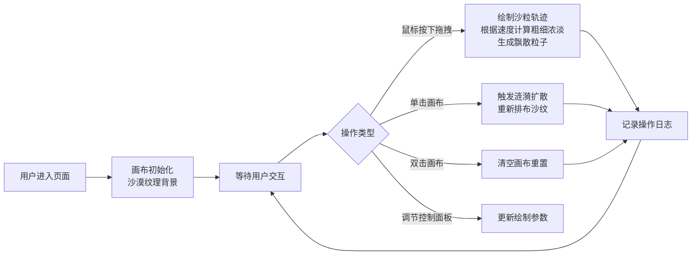

## 1. 产品概述

「纹影韵律」是一款交互式动态沙画可视化应用，让用户化身数字沙画家，通过鼠标在画布上创作流动的沙粒艺术作品。

- 核心价值：提供沉浸式的沙画创作体验，通过细腻的物理模拟和视觉反馈，让用户感受沙粒流动的韵律之美
- 目标用户：数字艺术爱好者、创意工作者、休闲娱乐用户

## 2. 核心功能

### 2.1 功能模块

1. **沙画创作画布**：核心绘制区域，支持沙粒轨迹渲染、涟漪效果、粒子特效
2. **控制面板**：调节沙粒粗细、流动速度、涟漪强度，快捷重置
3. **操作日志**：记录最近5次交互操作的类型与坐标

### 2.2 页面详情

| 页面名称 | 模块名称 | 功能描述 |
|-----------|-------------|---------------------|
| 主页面 | 沙画画布 | 鼠标拖拽绘制沙纹，速度/方向影响粗细浓淡；单击触发涟漪扩散；双击清空画布 |
| 主页面 | 控制面板 | 沙粒粗细滑块(1-20)、流动速度滑块(0.5-3)、涟漪强度开关、重置按钮 |
| 主页面 | 操作日志 | 右下角显示最近5次拖拽/点击操作的类型和坐标 |

## 3. 核心流程

## 4. 用户界面设计

### 4.1 设计风格

- **主色调**：沙黄 `#d4a76a`、棕褐 `#8b6f47`、沙漠背景 `#e8d5b7`
- **按钮风格**：磨砂玻璃质感（backdrop-filter: blur）、柔和阴影、圆角8px
- **字体**：选用优雅的衬线字体与现代无衬线字体组合，标题使用具有艺术感的字体
- **布局风格**：极简大漠风，大面积留白，画布居中占据主要视觉区域，控制面板悬浮左上角，日志面板悬浮右下角
- **动效**：沙粒飘散粒子、涟漪波纹扩散、绘制时的轻微模糊效果、按钮hover过渡动画

### 4.2 页面设计概述

| 页面名称 | 模块名称 | UI元素 |
|-----------|-------------|-------------|
| 主页面 | 沙画画布 | 沙漠纹理背景 `#e8d5b7`，Canvas占满主要区域，z-index: 0 |
| 主页面 | 控制面板 | 固定左上角，半透明玻璃质感 `rgba(139, 111, 71, 0.15)`，padding: 20px，border-radius: 12px，backdrop-filter: blur(10px)，z-index: 10 |
| 主页面 | 操作日志 | 固定右下角，半透明玻璃质感 `rgba(139, 111, 71, 0.15)`，padding: 16px，border-radius: 12px，font-size: 12px，z-index: 10 |

### 4.3 响应式设计

- 桌面端优先设计，Canvas自适应窗口大小
- 控制面板和日志面板使用固定定位，确保在各种屏幕尺寸下可见
- 滑块控件最小宽度120px，确保触控友好

### 4.4 视觉细节

- **背景纹理**：使用Canvas生成细腻的沙漠噪点纹理，而非纯色
- **沙粒效果**：绘制时使用渐变和模糊模拟真实沙粒质感，边缘带有羽化效果
- **涟漪效果**：多层同心圆扩散，带动沙粒位移，形成波纹干涉效果
- **粒子特效**：每次绘制时生成少量飘散的沙尘粒子，带有重力和衰减
