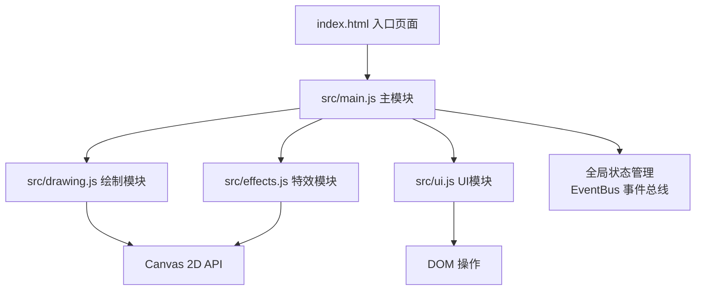

## 1. 架构设计



## 2. 技术描述

- **前端**：纯 JavaScript (ES Modules) + 原生 Canvas 2D API，无框架依赖
- **构建工具**：Vite 5.x（仅用于开发服务器和构建，不使用任何框架插件）
- **开发服务器**：Vite 内置 dev server，端口 5173
- **性能优化**：requestAnimationFrame 60fps 渲染循环，离屏 Canvas 缓存背景纹理

## 3. 目录结构

```
.
├── index.html              # 入口HTML
├── package.json            # 项目配置与脚本
├── vite.config.js          # Vite配置
└── src/
    ├── main.js             # 主模块：初始化、事件绑定、全局状态
    ├── drawing.js          # 沙粒轨迹绘制逻辑
    ├── effects.js          # 涟漪扩散、沙尘粒子特效
    └── ui.js               # 控制面板、日志面板交互
```

## 4. 模块职责定义

### 4.1 src/main.js - 主入口模块

**职责**：
- 初始化 Canvas 元素，设置尺寸与设备像素比适配
- 管理全局状态（绘制参数、操作日志、绘制历史）
- 绑定鼠标/触摸事件（mousedown, mousemove, mouseup, click, dblclick）
- 协调各模块间通信，驱动 requestAnimationFrame 渲染循环
- 暴露 EventBus 用于模块间事件通信

**核心数据结构**：
```javascript
const state = {
  canvas: null,
  ctx: null,
  isDrawing: false,
  lastPos: { x: 0, y: 0 },
  lastTime: 0,
  params: {
    grainSize: 8,      // 沙粒粗细 1-20
    flowSpeed: 1.5,    // 流动速度 0.5-3
    rippleStrength: 1  // 涟漪强度 0-1
  },
  logs: [],             // 操作日志数组（最多5条）
  particles: [],        // 沙尘粒子数组
  ripples: []           // 涟漪数组
};
```

**核心方法**：
- `init()` - 应用初始化入口
- `renderLoop(timestamp)` - 60fps 渲染循环
- `addLog(type, x, y)` - 添加操作日志

### 4.2 src/drawing.js - 绘制模块

**职责**：
- 沙粒轨迹绘制算法（根据速度计算粗细浓淡）
- 沙漠背景纹理生成
- 沙粒质感渲染（渐变、羽化、模糊）
- 绘制历史像素数据管理，支持涟漪扰动

**核心算法**：
- **速度计算**：`speed = distance / timeDelta`，速度越快线条越细、颜色越淡
- **粗细映射**：`lineWidth = baseSize * (1 - speed / maxSpeed) * 0.8 + 0.2`
- **浓淡映射**：`opacity = 0.3 + (1 - speed / maxSpeed) * 0.7`
- **方向平滑**：使用贝塞尔曲线平滑轨迹，避免锯齿

**核心方法**：
- `drawSandLine(ctx, x1, y1, x2, y2, speed, params)` - 绘制沙粒线段
- `generateDesertTexture(canvas, ctx)` - 生成沙漠背景纹理
- `perturbSand(ctx, centerX, centerY, radius, strength)` - 涟漪扰动沙纹
- `getPixelData(ctx)` - 获取当前绘制像素数据
- `setPixelData(ctx, data)` - 恢复像素数据

### 4.3 src/effects.js - 特效模块

**职责**：
- 涟漪扩散效果（多层同心圆、半径递增、透明度衰减）
- 沙尘粒子系统（重力、速度、生命周期、飘散动画）
- 模糊与发光后处理效果

**核心类**：
```javascript
class Ripple {
  constructor(x, y, strength)
  update(deltaTime)
  draw(ctx)
  isDead() // 是否生命周期结束
}

class SandParticle {
  constructor(x, y, vx, vy, size, color)
  update(deltaTime, gravity)
  draw(ctx)
  isDead()
}
```

**核心方法**：
- `createRipple(x, y, strength)` - 创建涟漪
- `createSandParticles(x, y, count, speed)` - 创建沙尘粒子
- `updateEffects(deltaTime)` - 更新所有特效
- `drawEffects(ctx)` - 绘制所有特效

### 4.4 src/ui.js - UI管理模块

**职责**：
- 控制面板（滑块、开关、按钮）的事件绑定与值同步
- 操作日志面板的DOM更新
- 参数变更时同步到全局状态

**核心方法**：
- `initControls(container, state, onParamChange, onReset)` - 初始化控制面板
- `updateLogPanel(container, logs)` - 更新日志面板
- `createGlassButton(text, onClick)` - 创建磨砂玻璃风格按钮
- `createSlider(label, min, max, step, value, onChange)` - 创建滑块控件

## 5. 事件交互流程

1. **mousedown**：设置 `isDrawing = true`，记录起始位置和时间
2. **mousemove**（绘制中）：
   - 计算移动速度和方向
   - 调用 `drawing.drawSandLine()` 绘制轨迹
   - 调用 `effects.createSandParticles()` 生成飘散粒子
   - 调用 `main.addLog()` 记录操作（每100ms采样一次）
3. **mouseup**：设置 `isDrawing = false`
4. **click**（非拖拽）：
   - 调用 `effects.createRipple()` 创建涟漪
   - 调用 `drawing.perturbSand()` 扰动沙纹
   - 调用 `main.addLog()` 记录操作
5. **dblclick**：
   - 清空画布，重新生成背景纹理
   - 调用 `main.addLog()` 记录操作
6. **滑块change**：更新 `state.params` 对应参数

## 6. 性能优化策略

- **双缓冲绘制**：使用离屏 Canvas 缓存静态背景纹理
- **帧率控制**：requestAnimationFrame 驱动，时间增量计算确保动画速度一致
- **粒子池化**：粒子对象复用，避免频繁 GC
- **脏区域渲染**：仅重绘变化区域（可选优化）
- **设备像素比适配**：`canvas.width = width * devicePixelRatio`，避免模糊

## 7. 配置文件

### vite.config.js
```javascript
export default {
  server: {
    port: 5173,
    open: true
  },
  build: {
    outDir: 'dist',
    assetsDir: 'assets'
  }
}
```

### package.json 关键配置
```json
{
  "name": "sand-rythm",
  "version": "1.0.0",
  "type": "module",
  "scripts": {
    "dev": "vite",
    "build": "vite build",
    "preview": "vite preview"
  },
  "devDependencies": {
    "vite": "^5.0.0"
  }
}
```
