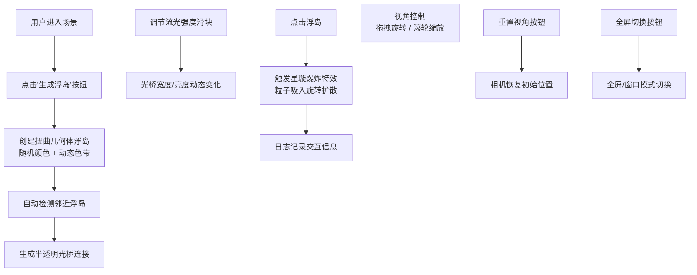

## 1. 产品概述

「星璇流光·幻境浮岛」是一款沉浸式3D交互可视化体验应用，用户作为幻境造物主，在三维空间中创造、连接和探索悬浮的彩色浮岛，体验绚丽的粒子特效和流光视觉效果。

- 核心目标：提供富有创造力和美感的3D交互体验，让用户在操作中获得艺术创造的愉悦感
- 目标用户：喜欢视觉艺术、3D交互、创意设计的用户群体
- 产品价值：结合Three.js技术与极光美学，打造令人难忘的数字艺术体验

## 2. 核心功能

### 2.1 用户角色
| 角色 | 注册方式 | 核心权限 |
|------|----------|----------|
| 幻境造物主 | 无需注册，直接使用 | 创建浮岛、调节参数、触发特效、探索场景 |

### 2.2 功能模块
1. **3D主场景**：全屏Three.js渲染，悬浮浮岛、动态光桥、粒子系统
2. **控制面板**：浮岛生成、流光强度调节、视角重置、全屏切换
3. **日志系统**：记录交互历史，展示浮岛编号、颜色值、流光值
4. **特效系统**：星璇爆炸、粒子拖尾、光晕闪烁

### 2.3 页面详情
| 页面名称 | 模块名称 | 功能描述 |
|----------|----------|----------|
| 主页面 | 3D场景渲染 | 实时渲染浮岛几何体、动态色带、半透明光桥、粒子系统 |
| 主页面 | 控制面板 | 左下角毛玻璃UI，按钮触发浮岛生成，滑块调节流光强度 |
| 主页面 | 日志面板 | 右下角半透明面板，显示最近5次交互记录 |
| 主页面 | 相机控制 | 鼠标拖拽旋转视角，滚轮缩放场景 |

## 3. 核心流程

用户进入场景 → 点击生成按钮创建随机浮岛 → 自动生成与邻近浮岛连接的光桥 → 可调节流光强度改变光桥效果 → 点击浮岛触发星璇爆炸特效 → 日志记录每次交互 → 支持视角重置和全屏切换

## 4. 用户界面设计

### 4.1 设计风格
- **主色调**：幻彩蓝 `#00d2ff`、炫光紫 `#7b2ff7`
- **背景色**：深空渐变 `#0a0a2e` → `#1a1a3e`
- **UI风格**：毛玻璃质感（backdrop-filter: blur）+ 霓虹发光边框
- **字体**：采用现代科技感字体，标题使用Orbitron，正文使用Inter
- **动效设计**：粒子拖尾、光晕闪烁、缓动过渡、星璇旋转

### 4.2 页面设计概述
| 页面名称 | 模块名称 | UI元素 |
|----------|----------|--------|
| 主页面 | 3D场景 | 深空渐变背景、扭曲几何体浮岛、动态流动色带、半透明光桥、粒子系统、星璇爆炸特效 |
| 主页面 | 控制面板 | 半透明毛玻璃卡片、霓虹边框按钮、流光强度滑块、发光图标、悬停发光效果 |
| 主页面 | 日志面板 | 半透明毛玻璃面板、编号列表、颜色色块展示、流光值可视化 |
| 主页面 | 交互反馈 | 点击涟漪、粒子拖尾、光晕脉冲、数值变化动画 |

### 4.3 响应式
- 桌面端优先设计，全屏沉浸式体验
- 移动端自适应UI布局，确保触控操作流畅
- 控制面板和日志面板在小屏幕可折叠

### 4.4 3D场景指引
- **环境**：深空渐变背景，无HDRI，保持纯净科幻感
- **光照**：环境光 + 双色点光源（蓝+紫），营造极光氛围
- **相机**：PerspectiveCamera，初始位置(0, 5, 15)，启用OrbitControls
- **构图**：浮岛随机分布在中心区域，光桥形成网络结构
- **交互**：点击浮岛触发爆炸，拖拽旋转视角，滚轮缩放
- **后处理**：Bloom泛光效果增强霓虹质感
- **性能预算**：粒子数≤2000，帧率稳定60fps

## 5. 性能指标
- 帧率：稳定60fps
- 粒子数量：≤2000颗
- 浮岛数量：动态管理，确保性能
- 响应时间：交互反馈≤100ms
