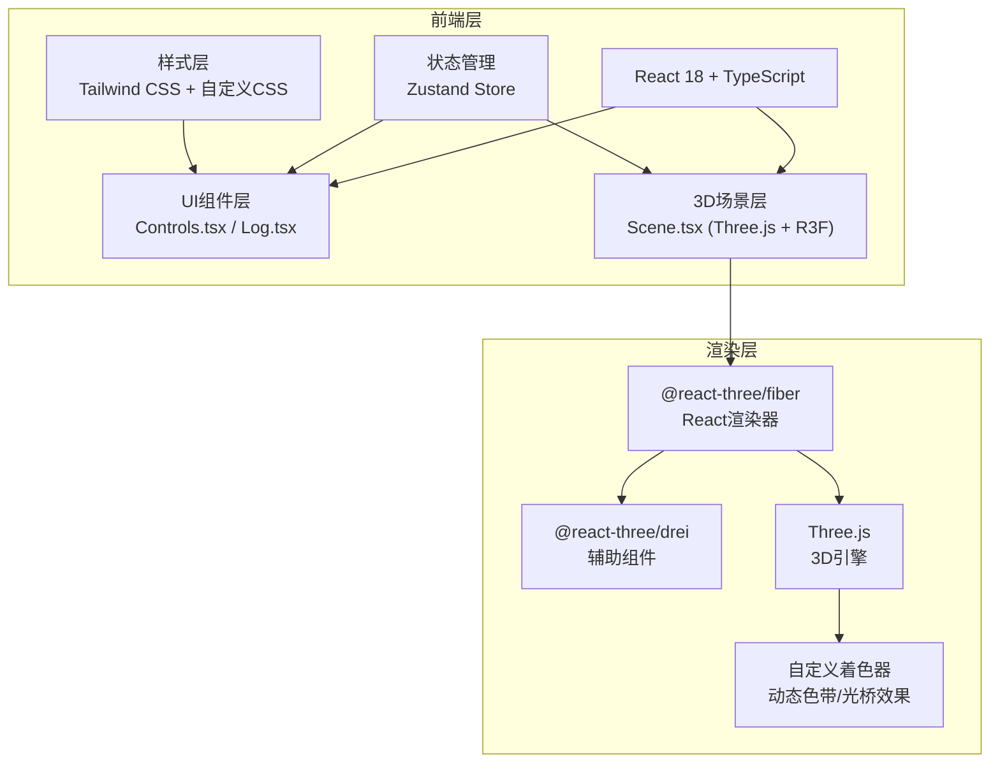

## 1. 架构设计



## 2. 技术描述

- **前端框架**：React 18 + TypeScript（strict模式）
- **构建工具**：Vite 5
- **3D引擎**：Three.js + @react-three/fiber + @react-three/drei
- **状态管理**：Zustand
- **样式方案**：Tailwind CSS 3 + 自定义CSS变量
- **图标库**：Lucide React

## 3. 项目文件结构

```
auto322/
├── package.json
├── tsconfig.json
├── vite.config.ts
├── index.html
└── src/
    ├── main.tsx              # React入口
    ├── App.tsx               # 根组件
    ├── Scene.tsx             # 3D场景主组件
    ├── Controls.tsx          # 左下角控制面板
    ├── Log.tsx               # 右下角日志面板
    ├── store/
    │   └── useSceneStore.ts  # 场景状态管理
    ├── components/
    │   ├── FloatingIsland.tsx   # 浮岛组件
    │   ├── LightBridge.tsx      # 光桥组件
    │   ├── ParticleSystem.tsx   # 粒子系统
    │   └── VortexEffect.tsx     # 星璇爆炸特效
    ├── shaders/
    │   ├── islandVertex.glsl    # 浮岛顶点着色器
    │   ├── islandFragment.glsl  # 浮岛片元着色器
    │   ├── bridgeVertex.glsl    # 光桥顶点着色器
    │   └── bridgeFragment.glsl  # 光桥片元着色器
    ├── types/
    │   └── index.ts             # 类型定义
    └── utils/
        └── colorUtils.ts        # 颜色工具函数
```

## 4. 核心类型定义

```typescript
// 浮岛数据结构
interface FloatingIsland {
  id: string;
  position: [number, number, number];
  color: string;
  scale: number;
  rotationSpeed: number;
  createdAt: number;
}

// 光桥数据结构
interface LightBridge {
  id: string;
  from: string;
  to: string;
  intensity: number;
}

// 交互日志记录
interface LogEntry {
  id: string;
  islandId: string;
  color: string;
  flowIntensity: number;
  action: 'create' | 'explode' | 'connect';
  timestamp: number;
}

// 场景状态
interface SceneState {
  islands: FloatingIsland[];
  bridges: LightBridge[];
  flowIntensity: number;
  logs: LogEntry[];
  isFullscreen: boolean;
  addIsland: (position?: [number, number, number]) => void;
  setFlowIntensity: (value: number) => void;
  explodeIsland: (id: string) => void;
  resetCamera: () => void;
  toggleFullscreen: () => void;
  addLog: (entry: Omit<LogEntry, 'id' | 'timestamp'>) => void;
}
```

## 5. 核心算法

### 5.1 浮岛生成算法
- 随机位置：在球形区域内随机分布（半径8-15单位）
- 随机颜色：在HSL色彩空间中，色相随机选取蓝紫色系附近
- 几何体：使用IcosahedronGeometry，配合噪声函数扭曲顶点
- 自动连接：计算与现有浮岛的距离，小于阈值则创建光桥

### 5.2 粒子系统管理
- 对象池模式：预分配2000个粒子，循环复用
- 粒子行为：拖尾效果使用速度衰减算法
- 星璇特效：使用极坐标方程计算螺旋运动轨迹

### 5.3 性能优化策略
- 实例化渲染（InstancedMesh）处理多个浮岛
- 粒子系统使用BufferGeometry，单次draw call
- 着色器动画在GPU端计算，减轻CPU负担
- 距离剔除（Frustum Culling）
- LOD（层次细节）根据距离切换几何体精度

## 6. 状态管理设计

使用Zustand创建单一状态树：
- `islands`：浮岛数组
- `bridges`：光桥数组
- `flowIntensity`：流光强度（0-100）
- `logs`：最近5条交互日志
- 动作方法：addIsland、setFlowIntensity、explodeIsland等

## 7. 着色器设计

### 浮岛着色器
- 顶点着色器：使用Simplex噪声扭曲顶点位置，实现呼吸动画
- 片元着色器：动态色带流动效果，使用fract和time计算

### 光桥着色器
- 顶点着色器：根据流光强度调整几何体厚度
- 片元着色器：透明度渐变 + 流动光效 + 边缘发光
