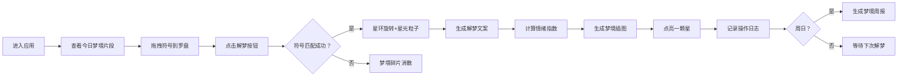

## 1. 产品概述

"灵光笔迹·梦话星球"是一款沉浸式梦境解读全栈Web应用。用户扮演梦境解读师，在虚拟星球上通过拖拽梦象符号组合每日随机生成的梦境片段，获得个性化解梦文案、情绪指数分析和AI风格化梦境插图。

- **核心价值**：通过游戏化的解梦体验，让用户探索潜意识的梦幻世界，获得心理洞察和审美愉悦
- **目标用户**：对梦境、心理学、神秘学感兴趣的年轻用户群体
- **市场定位**：融合AI生成内容、游戏化机制和艺术表现的创新解梦体验产品

## 2. 核心功能

### 2.1 用户角色

| 角色 | 注册方式 | 核心权限 |
|------|----------|----------|
| 梦境解读师 | 无需注册，本地存储 | 进行每日7次解梦机会，收集符号，查看周报 |

### 2.2 功能模块

1. **梦境罗盘区域**：梦象符号库、拖拽交互罗盘、组合检测逻辑
2. **结果展示面板**：解梦文案、情绪指数柱状图、梦境插图、动画特效
3. **星球进度系统**：每日7次机会、星图点亮、成就收集
4. **梦境周报系统**：情绪折线图、符号频率统计、成就徽章
5. **操作日志区**：实时记录解梦过程和反馈

### 2.3 页面详情

| 页面名称 | 模块名称 | 功能描述 |
|-----------|-------------|---------------------|
| 主页面 | 梦境罗盘区域 | 支持拖放梦象符号（飞行、坠落、追逐、迷路等）到罗盘的4个方位，随机生成梦境片段组合 |
| 主页面 | 结果展示面板 | 展示解梦文案、情绪指数（兴奋/焦虑/宁静）、AI梦境插图缩略图 |
| 主页面 | 星球进度区 | 显示剩余解梦次数、已点亮星星、当前日期 |
| 主页面 | 操作日志区 | 记录每次解梦的结果和系统反馈 |
| 周报弹窗 | 梦境周报 | 每周日生成，包含情绪折线图、符号频率、成就徽章 |

## 3. 核心流程

用户进入应用 → 查看今日随机梦境片段 → 拖拽梦象符号到罗盘 → 点击解梦 → 系统生成解梦结果 → 展示动画特效 → 点亮星星 → 记录日志 → 周日生成周报

## 4. 用户界面设计

### 4.1 设计风格
- **主色调**：星蓝 `#2244aa`、梦紫 `#aa44ff`
- **背景**：深空渐变，星云流动效果
- **按钮**：渐变填充，发光边框，悬停微放大
- **罗盘**：半透明毛玻璃效果，星尘粒子环绕
- **字体**：展示字体采用富有梦幻感的衬线或艺术字体，正文采用优雅的无衬线字体
- **图标**：采用星光、梦境、星座相关的emoji和符号

### 4.2 页面设计概述

| 页面名称 | 模块名称 | UI元素 |
|-----------|-------------|----------|
| 主页面 | 梦境罗盘 | 圆形罗盘分4象限，毛玻璃背景，旋转星环，拖放目标区 |
| 主页面 | 符号库 | 横向排列的梦象符号卡片，支持拖拽，悬浮发光 |
| 主页面 | 结果面板 | 卡片式布局，情绪柱状图，插图带发光边框 |
| 主页面 | 星球进度 | 7颗星星排列成弧形，点亮时有粒子特效 |
| 主页面 | 操作日志 | 半透明区域，滚动显示，新条目淡入 |
| 周报弹窗 | 周报内容 | 情绪折线图，符号频率饼图，成就徽章网格 |

### 4.3 响应式
- 桌面端优先，左右两栏布局
- 移动端适配为上下布局，罗盘区域自适应
- 触摸优化，支持移动端拖放操作

### 4.4 动画与交互
- **成功动画**：星环360°旋转，星光粒子从罗盘向外迸发，星星点亮时的脉冲效果
- **失败动画**：罗盘上的符号碎裂成像素点，随风消散
- **微交互**：按钮悬停缩放1.05倍，符号拖拽时半透明跟随，罗盘区域hover时发光增强
- **性能目标**：60fps稳定帧率，所有动画使用CSS transforms和opacity实现
