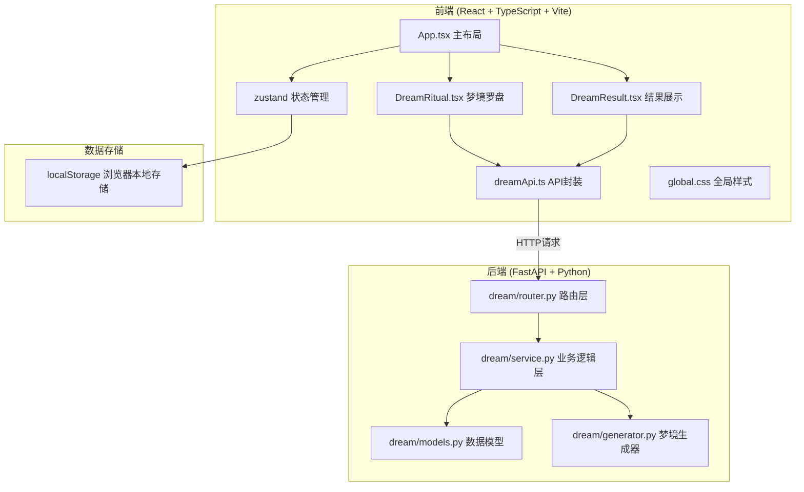

## 1. 架构设计



## 2. 技术描述

- **前端**：React@18 + TypeScript@5 + Vite@5 + zustand@4 + axios@1
- **后端**：FastAPI@0.104 + Python@3.11 + pydantic@2
- **样式**：CSS3 + CSS变量 + Tailwind CSS@3（可选增强）
- **图标**：lucide-react
- **数据存储**：localStorage（前端）+ 内存存储（后端演示用）
- **动画**：CSS transforms + CSS animations + 原生JS粒子系统

## 3. 项目结构

```
auto323/
├── frontend/                    # 前端代码
│   ├── src/
│   │   ├── components/
│   │   │   ├── DreamRitual.tsx  # 梦境罗盘拖拽组件
│   │   │   ├── DreamResult.tsx  # 结果展示组件
│   │   │   ├── StarProgress.tsx # 星星进度组件
│   │   │   ├── EmotionChart.tsx # 情绪图表组件
│   │   │   ├── WeeklyReport.tsx # 周报弹窗组件
│   │   │   └── OperationLog.tsx # 操作日志组件
│   │   ├── api/
│   │   │   └── dreamApi.ts      # API接口封装
│   │   ├── store/
│   │   │   └── useDreamStore.ts # Zustand状态管理
│   │   ├── types/
│   │   │   └── dream.ts         # 类型定义
│   │   ├── utils/
│   │   │   └── particles.ts     # 粒子系统工具
│   │   ├── styles/
│   │   │   └── global.css       # 全局样式
│   │   ├── App.tsx              # 主应用组件
│   │   └── main.tsx             # 入口文件
│   ├── index.html
│   ├── package.json
│   ├── tsconfig.json
│   └── vite.config.ts
├── backend/                     # 后端代码
│   ├── app/
│   │   ├── main.py              # FastAPI入口
│   │   ├── api/
│   │   │   └── router.py        # 路由定义
│   │   ├── services/
│   │   │   ├── dream_service.py # 解梦业务逻辑
│   │   │   └── generator.py     # 文案生成器
│   │   └── models/
│   │       └── schemas.py       # Pydantic模型
│   └── requirements.txt
└── .trae/documents/             # 项目文档
```

## 4. 前端类型定义

```typescript
// src/types/dream.ts
export interface DreamSymbol {
  id: string;
  name: string;
  emoji: string;
  category: 'flying' | 'falling' | 'chasing' | 'lost' | 'water' | 'forest' | 'star' | 'rare';
  rarity: 'common' | 'rare' | 'legendary';
  description: string;
}

export interface DreamSlot {
  id: number;
  position: 'north' | 'south' | 'east' | 'west';
  symbol: DreamSymbol | null;
}

export interface EmotionIndex {
  excitement: number;
  anxiety: number;
  peace: number;
}

export interface DreamResult {
  id: string;
  date: string;
  symbols: DreamSymbol[];
  interpretation: string;
  emotion: EmotionIndex;
  illustrationUrl: string;
  isSuccess: boolean;
  starLit: boolean;
}

export interface WeeklyReport {
  weekStart: string;
  weekEnd: string;
  totalDreams: number;
  emotionTrend: { date: string; emotion: EmotionIndex }[];
  symbolFrequency: { symbolId: string; count: number }[];
  rareCollected: string[];
  achievements: Achievement[];
}

export interface Achievement {
  id: string;
  name: string;
  description: string;
  icon: string;
  unlocked: boolean;
}
```

## 5. API 定义

### 5.1 生成梦境
- **POST** `/api/dream/generate`
- **请求体**：
```typescript
{
  date: string;
  symbols: DreamSlot[];
}
```
- **响应**：`DreamResult`

### 5.2 保存记录
- **POST** `/api/dream/save`
- **请求体**：`DreamResult`
- **响应**：`{ success: boolean }`

### 5.3 获取周报
- **GET** `/api/dream/weekly-report?weekStart=2026-06-08`
- **响应**：`WeeklyReport`

### 5.4 获取每日符号库
- **GET** `/api/dream/daily-symbols?date=2026-06-10`
- **响应**：`DreamSymbol[]`

## 6. 数据模型 (后端)

```python
# backend/app/models/schemas.py
from pydantic import BaseModel
from datetime import date
from typing import List, Optional, Dict

class DreamSymbol(BaseModel):
    id: str
    name: str
    emoji: str
    category: str
    rarity: str
    description: str

class DreamSlot(BaseModel):
    id: int
    position: str
    symbol: Optional[DreamSymbol] = None

class EmotionIndex(BaseModel):
    excitement: float
    anxiety: float
    peace: float

class DreamResult(BaseModel):
    id: str
    date: str
    symbols: List[DreamSymbol]
    interpretation: str
    emotion: EmotionIndex
    illustration_url: str
    is_success: bool
    star_lit: bool

class Achievement(BaseModel):
    id: str
    name: str
    description: str
    icon: str
    unlocked: bool

class WeeklyReport(BaseModel):
    week_start: str
    week_end: str
    total_dreams: int
    emotion_trend: List[Dict]
    symbol_frequency: List[Dict]
    rare_collected: List[str]
    achievements: List[Achievement]
```

## 7. 核心技术点

### 7.1 拖放实现
- 使用HTML5原生Drag and Drop API
- 自定义拖拽预览和放置效果
- 移动端使用Touch事件模拟拖放

### 7.2 粒子系统
- 原生Canvas实现星光粒子
- 使用requestAnimationFrame确保60fps
- 粒子池化避免频繁GC

### 7.3 状态管理
- Zustand存储全局状态（解梦记录、星星进度、每日符号）
- localStorage持久化用户数据
- 按日期重置每日解梦机会

### 7.4 动画性能
- 所有动画使用transform和opacity属性
- 避免布局抖动（layout thrashing）
- 使用will-change优化渲染层

### 7.5 情绪计算
- 基于符号组合的加权评分算法
- 不同符号类别对情绪指数有不同权重
- 稀有符号增加情绪指数极值
